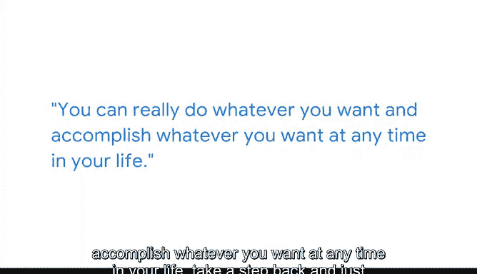

# 002：从障碍到成就 🚀

在本节课中，我们将跟随谷歌产品营销经理罗布（Rob）的分享，了解他如何克服个人障碍，从排斥数学与科学到最终成功转型为数据分析师，并进入统计学硕士项目的历程。他的故事强调了**终身学习**和**坚持自我**的重要性。

---

我叫罗布，是谷歌的一名产品营销经理。我在90年代末和21世纪初于波士顿长大。作为一名亚裔美国人，我常常因为那些标准的亚裔刻板印象而受到嘲笑，其中包括被认为擅长或热爱数学和科学。

当我进入高中时，我发现自己开始**排斥**数学和科学，并极力避免上这些课程。我转而更多地投入到人文学科甚至体育活动中，仅仅是因为我非常渴望融入群体。

---

幸运的是，我受雇于一家医疗经济咨询公司，担任文献综述专员。入职后我发现，公司还有一个专门的部门，致力于分析数以百万计的医疗记录数据，以理解和帮助测试药物或处方药对患有严重疾病患者的疗效与安全性。

以下是他们工作的核心方式：
*   **分析规模**：他们通过分析超过3000万用户的数据来完成这项工作。

当我了解到这一点时，我非常兴奋。我说，哇，这真是一个很酷的、值得进入的领域。于是我和我的经理进行了一次交谈。

---

我的经理非常支持我承担一些额外的项目，当然，前提是我要完成日常工作。我记得我会在下班后、业余时间学习。我有一本教科书，专门研读标准的数据分析和统计学知识。

此外，我还学习了名为 **`SAS编程`** 的内容，这是一种统计分析软件，我们公司的分析师都在使用。我全身心地投入到了学习中。

最终，我对此变得非常熟练，并成功转型为一名数据分析师。在担任数据分析师期间，我对理解更多的统计学和数学知识充满了热情。

---

为了深入学习，我实际上在当地一所社区学院参加了夜校课程，因为我的目标是更深入地研究统计学。最终，我幸运地申请了许多统计学硕士项目。

凭借我的背景和经验，我有幸被其中一个项目录取。我真希望当初没有太在意那些嘲笑我的人，而是坚持做自己想做的事。在某种程度上，我确实为此感到遗憾，因为我当时没有打下坚实的数理基础。

但让我感到自豪的是，作为一个成年人，我能够成功转型进入这个领域。这在我心中凸显了一个道理：**你可以在生命中的任何时候，去做任何你想做的事，并达成任何目标。**

---

退一步看，我们最终都是走在不同道路上的不同个体。慢慢来，每个人的学习方式都千差万别。

无论是通过我们提供的这些优秀的在线课程，还是通过大学项目，或是与朋友交流并合作学习，都可以。重要的是，找到最适合你的学习方式。

关键点是，**慢慢来**，做你需要做的事情去学习。你不应该给自己施加压力，或将自己与任何人比较。做你自己，这完全没问题。

---

本节课中，我们一起学习了罗布的个人经历。他的故事告诉我们，外界的刻板印象不应成为自我设限的理由，通过**主动学习**（如学习 `SAS编程` 和参加夜校）和**把握机会**，可以在任何人生阶段成功转型。最重要的是，按照自己的节奏学习，坚持做自己。