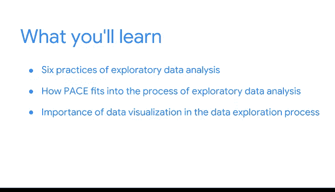

# 003：探索性数据分析基础 🎯

在本模块中，我们将学习探索性数据分析的六大实践，了解数据分析师的工作流程，并认识数据可视化在探索过程中的核心作用。这些基础知识将帮助我们学会如何用数据发现并讲述故事。

---

## 欢迎来到模块1 👋

再次问好，欢迎来到本课程的第一个模块。

在接下来的几节课中，我们将探索数据分析的基础，并了解探索性数据分析的六大实践如何帮助我们利用数据发现和讲述故事。

---

## 探索性数据分析的六大实践 📊

我们将首先讨论探索性数据分析的六大实践。

你将了解它们是什么以及它们为何重要。

以下是六大实践的简要介绍：

1.  **提出问题**：明确分析的目标和方向。
2.  **数据准备与清洗**：确保数据质量，为分析做好准备。
3.  **数据可视化**：通过图形初步探索数据模式和关系。
4.  **数据建模**：应用统计或机器学习模型深入理解数据。
5.  **得出结论**：基于分析结果形成初步见解。
6.  **传达结果**：将发现有效地讲述给他人。

---

## 数据分析师的工作流程 🔄

上一节我们介绍了六大实践，本节中我们来看看数据分析师的工作流程如何融入探索性数据分析的过程。

我们将学习数据分析师的工作流程——计划、分析、构建和执行——如何适应探索性数据分析的进程。

这个流程可以概括为以下循环：
`计划 (Plan) -> 分析 (Analyze) -> 构建 (Construct) -> 执行 (Execute)`

---

## 数据可视化的重要性 📈

最后，你将了解数据可视化在数据探索过程中的重要性。

我们将思考什么是数据可视化，以及数据专业人士如何利用它们来了解并分享数据。

数据可视化是将数据转化为图形（如**柱状图、折线图、散点图**）的过程，它能帮助人们直观地发现趋势、异常值和模式。

---

## 总结 ✨

本节课中，我们一起学习了探索性数据分析的六大实践及其重要性，了解了数据分析师“计划-分析-构建-执行”的工作流程，并认识到数据可视化是探索和沟通数据的关键工具。这些内容为后续学习如何用数据讲述故事奠定了坚实的基础。

接下来的课程将为如何使用数据讲述故事打下基础。希望你和我一样对开始学习感到兴奋。