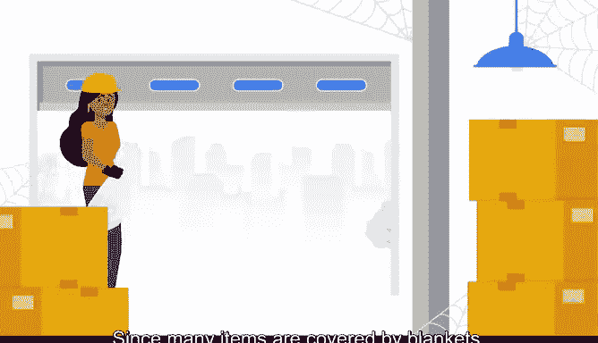
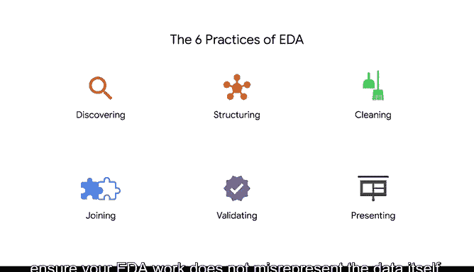

# 004：运用六大探索性数据分析实践寻找故事 📊

在本节课中，我们将学习探索性数据分析（EDA）的核心概念与六大实践。通过一个清理古董仓库的生动比喻，我们将理解数据专业人员如何像探险家一样，从原始数据中发掘故事、趋势与洞察。

想象你受雇于一家公司，任务是清理一个堆满古董的古老单间仓库。你的经理表示，这栋建筑已闲置数十年，无人知晓其历史用途。你的职责是清理仓库，并为发现的物品创建详细清单，以便拍卖。经理推测里面会有有趣的古董。由于许多物品被毯子覆盖，你无法预知房间的内容。你从房间一侧开始清理，并记录发现的物品。在探索过程中，你发现了一堆不同尺寸和形状的金属齿轮、链条和连接件。你数了数，共有47件金属零件。

你还发现了五块大金属板、12辆大型三轮车和七根金属杆等其他物品。记录这些新物品时，你开始思考它们之间是否存在关联。

这个简单的例子展示了数据专业人员如何探索数据，并在此过程中了解更多故事和趋势。当你揭开并清理眼前的事物时，数据中的独立部分将开始讲述一个更宏大的故事。当然，处理数据需要比仓库例子更多一些的技术和实践，但核心理念相同：你需要通过重新排序、分类和重塑来理解原始数据内容。在这个过程中，你会遇到许多不同的术语。**数据整理**、**数据修复**、**数据混合**和**数据清洗**都是最常见的。我们将所有这些实践合并为一个大多数数据专业人员都熟悉的术语：**探索性数据分析**，简称 **EDA**。

**探索性数据分析（EDA）** 是调查、组织和分析数据集并总结其主要特征的过程，通常采用数据整理和可视化方法。EDA的六大主要实践是：**发现**、**结构化**、**清洗**、**连接**、**验证**和**呈现**。这些实践不一定按此顺序进行。根据数据团队的需求和他们研究的数据类型，他们可能以不同的方式执行EDA。你还会发现，EDA过程通常是**迭代的**，这意味着你将多次经历这六大实践（没有特定顺序），以准备数据供进一步使用。

接下来，让我们逐一深入了解这六大实践，以便你更好地理解其含义。

## 1. 发现 🔍

发现通常是EDA的第一步实践。在此实践中，数据专业人员熟悉数据，以便开始构思如何使用它。他们会审查数据并提出相关问题。在这个阶段，数据专业人员可能会问：列标题是什么？它们代表什么含义？总共有多少个数据点？在本视频开头的旧仓库例子中，发现实践可能涉及在房间里走动并揭开覆盖物，以了解物品的数量和类型。

## 2. 结构化 🗂️

在进行一些初步发现之后，下一步是开始组织数据，这个EDA实践被称为结构化。

结构化是获取原始数据并将其组织或转换，以便更容易进行可视化、解释或建模的过程。结构化指的是根据数据集中已有的数据，对数据列进行分类和组织。例如，对于日历数据，结构化可能意味着将数据按月份或季度而非年份进行分类。回到旧仓库的比喻，结构化可能是将物品分为金属和非金属类别，并统计每种类型的总数。

在进入下一个EDA实践之前，让我们花点时间谈谈偏见。

在数据结构的背景下，偏见是指将数据组织成不能准确代表整个数据集的组别、类别或变量。大多数专家认为，完全消除数据结构中的偏见几乎是不可能的，因为每个人的想法、培训和经历都不同。然而，作为专业人员，在构建数据时尽量避免偏见非常重要。例如，假设你想知道英国有多少比例的人口拥有大学学位，但你的模型数据只包含伦敦居民。那么，在添加英国其他地区的数据之前，这些数据将被视为有偏见的。在我们的仓库例子中，避免偏见可能涉及保持分类的灵活性，随着发现越来越多的物品，可能需要创建新的类别。

## 3. 清洗 🧹

下一个EDA实践是数据清洗。

清洗是消除可能扭曲数据或降低其可用性的错误的过程。缺失值、拼写错误、重复条目或极端异常值都是在数据清洗过程中需要解决的常见问题。在仓库例子中，你可能会决定将损坏或无法使用的物品放在一个单独的箱子里，与其他物品分开。

## 4. 连接 🔗

我们将转向另一个名为“连接”的实践。

连接是通过添加来自其他数据集的值来增强或调整数据的过程。换句话说，你可以通过从其他数据源添加更多信息来为数据增加价值或上下文。例如，你可能会在发现、结构化或清洗过程中发现，现有数据不足以完成特定项目。在这种情况下，你应该通过添加更多数据来丰富它。举个例子，回想我之前谈论英国和大学学位以帮助理解偏见。在那个例子中，连接就是添加英国其他地区的数据，而不仅仅是伦敦居民的数据。回到我们的仓库比喻，想象一下博物馆经理对物品进行分类，并告诉你每件物品的制作日期。博物馆经理提供的信息就像一个不同的数据集，你可以在清点物品时将其与你自己的数据连接起来。

## 5. 验证 ✅

EDA实践列表中的下一个是验证。

验证指的是核实数据是否一致且高质量的过程。验证数据是检查拼写错误、不一致的数字或日期格式，并确保数据清洗过程没有引入更多错误的过程。数据专业人员通常使用数字工具，如 **R**、**JavaScript** 或 **Python** 来检查数据集及其数据类型中的不一致和错误。对于仓库比喻，验证可能就像利用博物馆经理的知识来了解物品的年代。

## 6. 呈现 📈

最后一个EDA实践是呈现。

呈现涉及将你清洗后的数据或数据可视化提供给他人进行分析或进一步建模。换句话说，呈现实践是分享你通过EDA学到的东西并寻求反馈，无论是通过干净的数据集还是数据可视化的形式。我们将经常使用“数据可视化”这个术语。需要明确的是，**数据可视化**是作为信息表示而创建的图表、形状、图形或仪表板。

你可能认为呈现总是在EDA过程的最后进行，然而，呈现可以出现在EDA的任何阶段。数据可视化并非呈现实践所独有，它们应该在整个EDA过程中使用。它们帮助你理解数据，并向他人指出趋势和洞察。在仓库比喻中，呈现可能意味着向你的经理展示仓库的清理进度以及发现了多少不同的物品。在工作场所，作为一名数据专业人员，呈现可能看起来像是准备视觉效果和幻灯片演示文稿与团队分享。

当你开始计划演示时，你应该考虑有视觉或听觉障碍的人，提供对数据的详细描述。你可以使用诸如替代文本、描述性文本或带字幕的数据记录等方式，以便你的听众能够自己探索数据。

我们将在后面详细讨论每个EDA实践，但关于这个过程，最重要的一点是确保你的EDA工作不会曲解数据本身。你发现的故事应该来自数据，而不是来自你的想法或数据中的偏见。你有责任以合乎道德且易于访问的方式传达你的数据。考虑仓库比喻，为了确保你以合乎道德的方式传达数据，你应该提供材料的准确数量，而不是高估古董的数量。在工作场所，合乎道德地传达数据意味着在年同比的背景下呈现销售数字，以便数据可视化中的上升和下降不会显得夸张。

完成仓库项目后，你意识到你发现了一个故事：你找到了一对布满灰尘的招牌，上面写着出售食物。突然间，你发现的物品开始作为一个整体变得有意义。这些古董似乎是一群流动食品摊贩使用的物资收藏。现在，发现一个故事的感觉如何？当然，在分享之前，你应该使用历史记录来确认这些信息。

---

在本节课中，我们一起学习了探索性数据分析（EDA）的六大核心实践：**发现**、**结构化**、**清洗**、**连接**、**验证**和**呈现**。我们通过清理古董仓库的比喻，理解了如何像处理未知物品一样，系统性地探索、整理和理解原始数据，并最终从中发掘出有价值的故事和洞察。记住，EDA是一个迭代且灵活的过程，其核心是以合乎道德且准确的方式让数据自己说话。