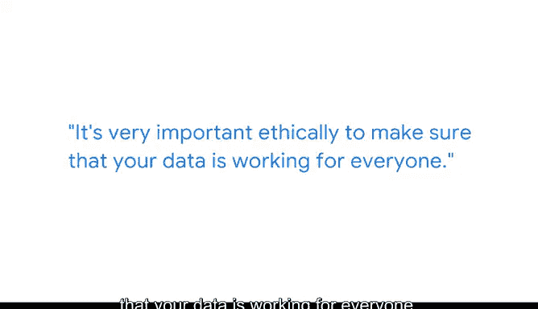

# 005：数据科学与叙事艺术 📊🎨

在本节课中，我们将跟随谷歌产品分析师本杰，学习如何将原始数据转化为深刻的洞察，并通过有效的叙事艺术将发现传达给他人。我们将重点探讨探索性数据分析的重要性、如何避免分析偏见，以及如何构建有影响力的数据故事。

## 探索性数据分析：理解你的数据 🔍

上一节我们提到了数据分析的目标，本节中我们来看看数据分析的第一步：探索性数据分析。这是分析师工作的关键部分，尤其是在面对新数据或新问题时。

首先，你必须深入审视现有数据，理解眼前的一切。这意味着你需要：

*   **理解数据来源**：数据来自哪里？
*   **理解创建目的**：数据为何被创建？
*   **识别数据内容与缺失**：数据中包含什么，不包含什么？
*   **注意重要注意事项**：数据存在哪些重要的前提或限制条件？

## 叙事艺术：让洞察产生影响力 📖

仅仅拥有洞察是不够的，叙事是将你的洞察传递给他人并真正促成改变的方式。通常，我们会制作长达数十页的报告，但真正能改变人们想法的，是你能够就正在发生的事情讲述一个简短而清晰的故事。

用数据讲故事的一个绝佳方法是思考用户、设备或使用场景的类别。例如，当你告诉人们“许多印度用户正在低端手机上使用Chrome”时，这便讲述了一个关于用户群体是谁、他们在做什么的故事。了解他们是谁以及具体情况，能让听众以不同的方式思考受众是谁以及应该构建什么样的产品。

## 保持客观：检查与分析偏见 ⚖️

为了确保分析忠于数据，我努力做的一件事是尝试检查自己的偏见，确保我呈现的是实际看到的情况。我尝试确保报告不带有偏见的一种方法是，在进行新的分析时尽可能不带先入为主的观念。

你需要知道一些事实，并根据数据加以验证。例如，你需要确认用户不会每天在手机上花费27小时，因为一天没有27小时。但同时，不要假设所有用户看起来都一样，也不要假设世界上所有地方在面对新数据时的行为都相同。

## 数据伦理：确保数据普惠所有人 🤝

从伦理上讲，确保你的数据能为所有人服务至关重要。如果你试图移除标识符，或对数据进行去个性化处理，你必须确保这项工作做得真正好且有效。

最简单的方法并不总是最好的。仅仅说“哦，我试过了”是不够的。你必须进行更深入的探索，确保数据真正实现了去标识化。

## 总结与核心特质 ✅

本节课中，我们一起学习了数据分析的核心流程：从**探索性数据分析**（`EDA = Understand(Data_Source, Purpose, Content, Caveats)`）开始理解数据，到通过**叙事艺术**（`Impact = Tell_Story(User_Categories, Insights)`）将洞察转化为影响力，同时在整个过程中保持客观并遵循**数据伦理**（`Ethical_Data = De-identify(Data) + Serve_Everyone()`）。

最后，**好奇心**是分析师最重要的特质之一。通过尝试学习新事物，你已经展现了这种好奇心。保持这份好奇心，它将引领你在数据科学领域不断发现新大陆。