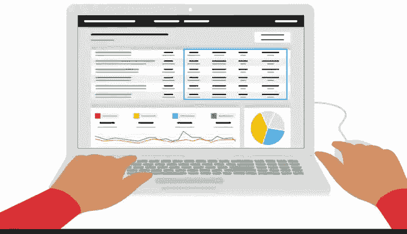

# 006：结合节奏与EDA实践 🎯

在本节课中，我们将要学习如何将PACE工作流与探索性数据分析（EDA）的六大实践相结合，以确保我们的数据分析工作始终聚焦于核心目标，避免迷失在数据的海洋中。

你是否曾走进一个房间想拿某件物品，却因分心而忘记初衷？作为数据专业人士，我们对发现数据故事的**好奇心**和**兴奋感**，也可能让我们忘记数据探索的原始目的。显然，我们希望保持这种天然的好奇心，但更重要的是，我们需要将好奇心聚焦于需要回答的问题或需要解决的难题上。

我们追求的是一种平衡的心态，即**目标明确的好奇心**。这种平衡可以通过运用PACE工作流来实现。正如你所知，PACE（计划、分析、构建、执行）是一些数据专业人士用来保持对任何给定数据集最终目标专注的工作流程。

## 结合PACE与EDA实践

上一节我们介绍了PACE工作流的基本概念，本节中我们来看看如何将其与EDA实践具体结合。

你可能会认为，既然“分析”在EDA（探索性数据分析）的名称中，那么EDA就只属于PACE工作流中的“分析”部分。事实上，**EDA适用于PACE的每一个阶段**。你会发现EDA的六大实践与PACE的其他部分都有交集。例如，“发现”实践与PACE的“计划”阶段一致，而“呈现”实践可能是PACE“执行”阶段的主要部分。

数据专业人士并非随意地从数据中寻找和讲述故事。**数据洞察力受项目目的和目标的引导**。“计划”可能来自利益相关者或管理者，你可以将其视为项目计划或公司的既定目标。

## 实践案例：聚焦目标

为了理解如何应用，让我们回顾视频中提到的办公设备公司的销售预测案例。

你的任务是基于10年的销售数据，预测未来六个月的销售业绩。当你开始EDA时，你发现提供的数据集包含的信息远超出你的需求。为了你和公司的利益，你应当只提取预测销售所需的列。

以下是预测销售所需的核心数据列：
*   销售日期
*   商品
*   价格
*   销售代表

在**数据清洗、连接和验证**过程中，你可以排除以下不相关的数据列：
*   材料成本
*   商品ID号
*   数据库成本中心编号
*   供应商名称

清洗10年、4列的数据集远比处理8列的数据集更易于管理。当然，在典型的工作场景中，当你基于原计划完成了大量EDA工作后，财务部门却说他们实际需要的是**预测利润率**而非销售目标，这并不罕见。

## 沟通与调整

任何工作场所都可能发生沟通失误，数据分析领域也不例外。如果利益相关者、工程师和数据专家对计划不明确，结果将无法讲述一个连贯或有效的故事，反而可能导致困惑、分歧和时间浪费。

以下是确保良好沟通的几个方法：
*   与所有可能涉及的人员分享PACE计划。
*   在更广泛地分享分析结果之前，先与工作小组分享分析以获取反馈。
*   在向利益相关者呈现结果前，理解他们对公司最重要的目标至关重要。

我们将在后续视频中详细讨论沟通策略。重点是，当你面对一个数据集时，要时刻提醒自己分析的**初衷**。

## 更多应用示例

让我们再次考虑办公设备公司的案例。假设你拿到两个数据集：一个包含交易ID和日期，另一个包含交易ID和总成本。你被要求预测未来六个月的销售数字。

考虑到这个任务的目的，你可能会对这两个数据集做什么？你可能会考虑EDA的**连接**实践，将两个数据集的所有数据（交易ID、日期和总成本）合并在一起。

再举一个例子，假设你拥有一家医院过去一年的治疗数据。如果目标是为来年准备材料和用品的采购订单数据，你可能会考虑哪种EDA实践？一个好的开始是运用EDA的**结构化**实践，按每种治疗所需的物品类型对数据进行分组。

## 坚守数据伦理

当数据专业人士遵循PACE这样的框架，并将该框架应用于他们执行EDA六大实践的方式时，他们就能理清优先级，并专注于实现项目目的。当然，作为数据专业人士，我们的首要任务是**准确地呈现数据本身**。

如果你公司的项目计划与数据所揭示的信息不符，你有责任将此情况告知利益相关者。让我回到办公设备公司的销售预测请求。假设你只拿到了两个特定地理区域的销售收入数据，但利益相关者要求的是全球预测。作为数据专业人士，你有责任要求获得具有全球代表性的数据来完成此任务。仅使用两个区域的数据不足以做出全球预测。时间压力、利益相关者压力或客户需求，都绝不应导致数据专业人士绕过数据的要求。**对数据的错误呈现永远是不合理的**。

## 总结

本节课中我们一起学习了如何将PACE工作流与探索性数据分析（EDA）有机结合。数据专业人士应努力使自己的工作与PACE的“计划”阶段保持一致。保持对PACE的关注有助于确定执行EDA实践的最有效方式，同时维护数据的伦理呈现。

接下来，我们将探讨PACE如何帮助指导数据可视化的发展。我们下节课再见。