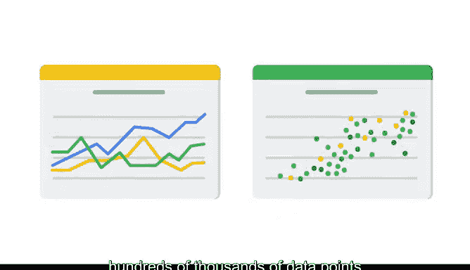

# 007：数据可视化中的节奏控制 📊

在本节课中，我们将要学习数据可视化在探索性数据分析中的核心作用，以及如何通过有效的可视化来沟通洞察、讲述数据故事，并确保其符合伦理与可访问性标准。

---

让我们回顾一个场景。你面前有一张巨大的数字表格和一份数据可视化图表，你会选择哪一个来最快速地传达数据洞察？数据可视化在快速传达复杂信息方面，远比数据表格有效得多。

现在，让我们思考这与探索性数据分析的关系。数据可视化是数据专业人员在整个工作流程中，尤其是在探索性数据分析的呈现环节，用来讲述数据故事的重要工具。

以下是数据可视化的关键作用：
*   **辅助理解**：无论处于探索性数据分析的哪个阶段，将部分或全部数据集绘制成条形图、散点图、饼图或直方图，都有助于你和他人的理解。
*   **处理大规模数据**：作为数据专业人员，你将处理的是拥有成千上万甚至数十万个数据点、跨越数月、数年乃至数十年的数据框，而非仅有几百行数据的简单、干净的数据集。
*   **揭示关系**：数据越多，你就需要创建越多的可视化来理解各个变量如何相互影响。

上一节我们介绍了数据可视化的基本作用，本节中我们来看看它在探索性数据分析中的具体应用。

当你开始审视新数据时，一个流行且有价值的策略是将其可视化。例如，在线图上可视化时间序列数据以理解周期性，或使用散点图来了解数据分布。数据可视化还能帮助你向利益相关者和其他数据专业人员解释你的数据集。

你的职责是发现需要分享的重点、趋势、偏差和故事，然后针对不同的受众，以有效的方式设计数据可视化。例如，假设你是一家电器制造商的数据专业人员，为制造团队进行分析。

在分析过程中，你发现了制造流程中的一个延迟，你需要将这一发现传达给两个不同的受众：制造主管和高管领导团队。当你分享发现时，如果没有数据可视化的帮助，一些利益相关者可能无法理解数据洞察。

数据可视化的设计方式，会向对项目不同部分有切身利益的利益相关者传达不同的信息。例如，制造主管可能需要审查按时间绘制的时间序列数据以识别制造延迟。与此同时，高管领导团队可能更关注财务影响分析。这两种数据可视化需要根据受众的需求进行不同的设计。

我们将在后续视频中详细讲解具体如何操作，但在此之前，请理解演示中文字与数据图表的平衡，会影响基于数据洞察做出的商业决策。

一份精心准备的数据可视化，可能意味着改变利益相关者想法与数据被忽视之间的天壤之别。然而，可视化也可能引起混淆，甚至歪曲数据。例如，想象一位数据专业人员开发了一个可视化图表，通过改变坐标轴的比例或图表高度与宽度的比率，使折线图看起来平坦或陡峭。

这种歪曲数据的做法与分析的本质背道而驰。因为你将是最熟悉数据及其故事的人，所以确保你的可视化不会误导受众至关重要。

再次回到制造设备的例子。如果你提供的数据可视化显示过去六个月销售额急剧增长，你的受众可能会认为公司运营状况非常好。但如果过去两年的数据显示，这六个月的激增是紧随长达18个月的衰退之后发生的，那么过去六个月的增长就有了不同的背景。仅展示最近六个月而非两年的数据，是对销售数据的歪曲。

你的数据驱动叙事是一个机会，可以呈现符合伦理、易于访问且能代表数据的事实和可视化。成为你所分析数据的道德呈现者，意味着对数据中包含和不包含的内容保持诚实和清晰。

除此之外，请记住以让所有人都能访问的方式设计你的数据可视化。例如，避免在数据可视化中搭配红色和绿色，因为这可能使色觉障碍者难以阅读。通常，蓝色和橙色是数据可视化中更好的选择。我们将在后续视频中更详细地讨论伦理和可访问性。

在其他视频中，我们将使用Tableau等数字可视化工具，以及Matplotlib、Seaborn和Plotly等Python包，来学习如何以符合伦理和可访问性的方式，在图表中使用你的数据。这些工具将成为你作为数据专业人员日常工作的一部分。

请记住，创建关于数据集的可视化将帮助你贯穿整个探索性数据分析过程。

---

通常，没有什么工具比制作精良的可视化更能讲述一个好的数据驱动故事了。

本节课中我们一起学习了数据可视化在探索性数据分析中的核心价值，包括其辅助理解、揭示关系、沟通洞察的作用，以及针对不同受众设计可视化、确保其伦理性和可访问性的重要性。