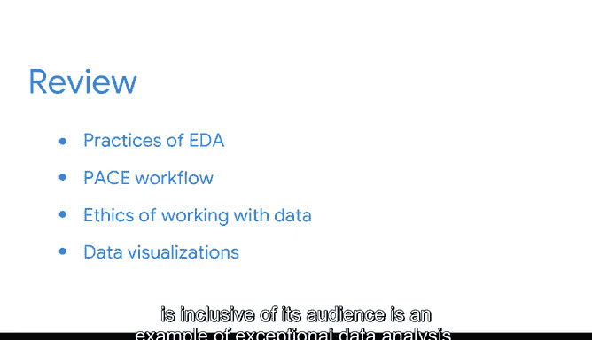

# 008：总结回顾 1 📊

在本节课中，我们将对课程前半部分的核心内容进行回顾与总结。我们探讨了如何在数据中发现故事，以及如何将数据故事有效地传达给他人。

---

我们已经深入讨论了如何在数据中发现故事，以及如何尽你所能地将这些故事讲述出来。然而，还有另一个故事贯穿于整个课程的阅读材料、视频和测验中，并且在你观看本视频时仍在继续展开。如果这一点还不够清晰，那么这个故事就是关于你——你能够坚持学习到课程的这个阶段，本身就表明了你决心成为一名数据专业人士。

我希望你不仅能受到启发去定义数据的故事，也能受到启发去定义你自己的故事。我相信你已经注意到，课程的这个部分涉及的实际编码指导非常少，这是有意为之的。数据专业人士的工作远不止编码和统计建模，课程的第一部分正反映了这一点。

---

认识到探索性数据分析如何应用于发现、塑造和讲述数据驱动的故事，这一点至关重要。如果你与职场中的数据专业人士交流，许多人会分享EDA在日常工作中的巨大益处。

因此，我们花了一些时间来讨论EDA的实践步骤，包括：**发现、结构化、清洗、合并、验证和呈现**，并回顾了这些实践的价值。

我们讨论了PACE工作流，以及它如何能应用于我们在数据中寻找故事的EDA过程。

---

你也学习了处理数据时的伦理道德，以及在我们讲述数据故事时准确呈现数据的重要性。

最后，你了解到数据可视化对于理解、构建和呈现数据故事是必不可少的。你认识到，讲述一个既能准确代表数据又能包容其受众的数据驱动故事，是卓越数据分析的一个典范。

---

然而，故事并未在此结束。在本课程中，我们还有更多概念需要学习，包括使用Python工具和代码块来辅助你进行EDA实践，以**发现、结构化和清洗原始数据**。

在本课程项目中，你将处理那些代表原始数据的数据集，这类数据很可能在你作为数据专业人士的日常职业生涯中每天都会遇到。

请记住，所有数据都蕴藏着待讲述的故事。这些故事往往隐藏得很深，需要特别好奇和坚定的专业人士去发现它们。你将要去发现的数据驱动故事，有潜力改变整个公司，甚至整个世界。

---

我期待着与你一起继续完成本课程剩余部分的学习旅程，共同发现问题、解决问题并学习新概念。我也希望，随着你学习的每一个新概念，你也能对自己的故事有更多的发现。

我们很快再见。