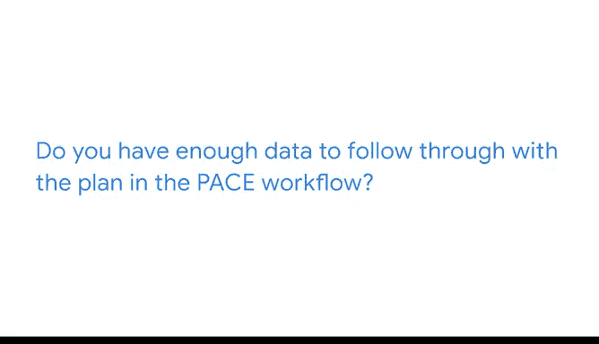

# 011：数据来源解析 📊

在本节课中，我们将学习探索性数据分析（EDA）中“发现”阶段的一个关键环节：理解你的数据。我们将重点探讨数据的来源、格式和类型，并了解如何利用这些信息来确保分析工作的顺利进行。

想象一下，你正在为朋友准备一顿饭。你有一份食谱和生食材，但这是你第一次做这道菜。你当然希望朋友们能喜欢它。第一次尝试就完美复现食谱，这个想法可能让人紧张。

信不信由你，这个烹饪的例子就像数据专业人员在EDA的“发现”实践中一样。你试图遵循的食谱相当于公司的项目计划。你手头拥有所需的一切：一个厨房（或者说，一个配备了数据分析专用服务器的数字工作空间）、生食材（或者说，数据集）。如何最好地混合、搅拌和烹饪这些食材，以做出一道让朋友们喜欢的佳肴，这取决于你。

在本视频中，让我们聚焦于“生食材”。作为数据专业人员，你将处理各种不同格式和文件类型的数据。我将与你分享最常见的数据来源、数据格式、数据类型以及一些Python函数。一旦你熟悉了数据集的来源、格式及其内部的数据类型，你就能准备好应对分析过程中可能出现的问题或挑战。

## 理解数据来源 📍

首先，当你拿到数据时，你需要知道它的来源。“数据来源”这个术语在不同语境下可能有多种含义，但就我们的目的而言，我们将数据来源定义为数据产生的位置。

了解数据来源的一个好处是知道如何以及何时联系主题专家，例如工程师或数据库所有者。这些人要么是数据的生成者，要么负责交付数据集。当你在“发现”过程中对数据有疑问时，他们就是你求助的对象。

了解数据的所有权和来源至关重要，因为通过理解数据来源及其负责人，你可以判断其可靠性。数据所有者是否有收集和存储数据的经验？数据所有者是否对数据的输出有任何经济利益？理解数据来源将帮助你讲述数据背后的故事，并就其使用做出合乎道德的决定。

确定数据来源的另一个重要部分是理解它是如何收集的。数据是通过计算机系统的报告收集的，还是从大型在线数据库中自定义选取的，或者是手动输入的数据表？了解数据的收集方式将帮助你理解EDA过程中可能出现的疑问。

例如，缺失值可能意味着许多不同的事情：可能是数据库所有者不知道或不愿意披露手动输入的数据，也可能是来自在线数据库的滞后数据或系统错误。

## 认识数据格式 📁

接下来，你需要了解数据来源的数据文件格式。作为数据专业人员，你将遇到的主要数据格式包括：表格文件、XML文件、CSV（逗号分隔值）文件、电子表格、数据库文件或JSON（JavaScript对象表示法）文件。

以下是这些文件类型的几个示例。

如果你已经学习到这个阶段，现在应该对表格文件和Excel文件很熟悉了。如你所知，它们以表格形式组织数据，数据变量按行和列排列，行代表对象，列代表数据集中对象的各个方面。

这种文件类型的优势在于能清晰地识别变量之间的模式。

CSV文件是一种简单的文本文件，可以轻松导入或存储在其他软件、平台和数据库中。它们看起来像是由逗号或其他分隔符分隔的文本和数字行。数据行由逗号分隔，而不是严格的列。

CSV文件的优势更多是从计算机科学的角度来看，它是一种易于读取的文件类型，甚至在文本编辑器中也能读取。它也易于创建和操作。在Python中，你可以使用`read_csv`函数来读取、写入和处理CSV格式的表格数据。

数据库（简称DB）是存储数据的另一种方式，通常以表、索引或字段的形式存储。数据库文件非常适合搜索和存储。它们通常需要一些结构化查询语言（SQL）的基础知识。我们将在后续章节中探讨如何从数据库中查询数据。

最后，JSON文件是以JavaScript格式保存的数据存储文件。你会发现这些文件中的信息更类似于Python代码，但使用不同的语言、函数和格式。

JSON文件中可能包含嵌套对象。你可以将嵌套对象想象成代码本身内部可展开的文件文件夹或下拉菜单。例如，一个JSON文件可能列出了食谱的配料，并且在每种配料下，你会包含嵌套信息，如重量、卡路里和价格，作为定义该配料的对象。

JSON文件有几个优点：消息体积小；几乎可以被任何编程语言读取；帮助编码者轻松区分字符串和数字。有专门用于处理JSON文件的Python库和函数。正如你之前学到的，你可以将`json` Python模块导入到你的Python笔记本中，用作JSON文件的编码器和解码器。Pandas中也有名为`read_json`和`to_json`的工具，分别用于翻译JSON文件和将对象转换为JSON格式。

作为数据专业人员，你可能还需要在其他格式中寻找数据故事，如HTML、音频文件、照片、电子邮件文本、图像或文本文件。在每种情况下，都有Python库或函数可以帮助你为研究项目发现和构建数据。

数据没有最佳格式。这取决于项目和存储类型。你只需要寻找最适合该特定数据集的格式。

## 区分数据类型 🔢

最后，理解数据的最后一个“生食材”是数据的类型。你可能已经熟悉许多不同的数据类别。作为提醒，数据有第一方、第二方和第三方之分。

第一方数据是从你自己组织内部收集的数据。
第二方数据是从组织外部收集的，但直接来自原始来源。
第三方数据是从组织外部收集并汇总的数据。

了解数据类型（无论是第一方、第二方还是第三方）将帮助你更有效地回答或寻求分析过程中可能出现的问题的答案。例如，如果第一方数据中存在缺失值，那么你组织中的某个人可以帮助你确定是否可以恢复缺失的数据。对于第三方数据，你可能需要联系一个独立的组织。

你还将熟悉不同类型的数据，如地理数据、人口统计数据、数值数据、基于时间的数据、财务数据和定性数据。作为数据专业人员，你的工作需要你理解并处理所有这些类型的数据。

了解你正在处理的数据来源、格式和类型，将帮助你回答两个非常重要的问题：

第一，根据你目前对数据的了解，它是否符合你的PA工作流程中定义的计划？
第二，你是否有足够的数据来执行PA工作流程中的计划？

如果你对其中任何一个问题的回答是“否”或“不确定”，那么你的职责就是联系数据所有者和项目利益相关者，告知他们你发现的问题。

例如，假设你被指派预测零售商下个月将接待的顾客数量。不幸的是，你只获得了利润率数据和仅两个月的顾客购买数据。因为利润率数据无助于了解回头客情况，而仅两个月的数据无法让你对预测有足够的信心，所以你应该回到数据来源。你需要过去几年的顾客购买数据才能准确预测下个月的情况。

回到数据来源并请求更多数据，将使流程中的每个人（包括你自己）都专注于作为PA工作流程一部分所制定的计划。当你作为数据专业人员工作时，保持这种专注对于识别和执行高优先级、高附加值的任务至关重要。

作为数据专业人员，你需要知道数据的含义以及如何利用它来寻找业务问题的解决方案。就像烹饪一顿饭一样，你会获得解决问题所需的工具和食材。如果食材不足，或者给你的食材无法做出一道好菜，那就需要你和你的团队一起努力解决。

## 总结 📝

本节课中，我们一起学习了在探索性数据分析的“发现”阶段，如何深入理解数据的三个核心方面：来源、格式和类型。我们了解到，明确数据来源有助于评估其可靠性和联系相关专家；熟悉各种数据格式（如CSV、JSON、数据库）及其对应的Python处理工具（如`read_csv`、`json`模块）是进行分析的基础；区分第一方、第二方和第三方等数据类型，则能帮助我们更有效地定位和解决问题。最终，所有这些知识都是为了确保我们手头的数据足以支持项目计划，并在发现问题时能够及时与团队沟通，聚焦于高价值的任务。