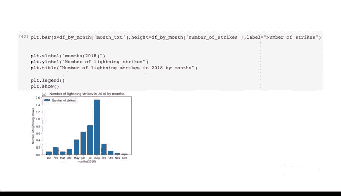

# 012：将数据转化为洞察》- 使用Python基础函数进行EDA 🐍


在本节课中，我们将学习如何使用Python的基础函数进行探索性数据分析。我们将以一个真实的数据集为例，逐步演示数据导入、初步检查、数据转换以及基础可视化的完整流程。

---

现在你已经对探索性数据分析及其重要性有了更好的理解，让我们在一个与你职业生涯中可能遇到的数据集相似的数据上进行一些探索。

美国国家海洋和大气管理局，简称NOAA，记录了北美大部分地区的每日闪电数据。假设我们的任务是对这个数据集进行EDA，以便未来用于预测该地区的闪电活动。

在本视频中，我们将使用Python对NOAA在2018年收集的数据进行EDA实践。我们将介绍数据专业人员首次接触数据集时通常会执行的前几个步骤。

让我们打开一个Jupyter Python笔记本来开始。首先，我们需要导入要分析的数据集以及计划使用的Python库。

这个准备步骤类似于画家在开始绘画前收集画笔、颜料和画架。同样，我们需要收集所有的工具和数据。

我们将使用的NOAA数据属于公共领域，但我们提供了一个文件供你下载以便跟随操作。首先，导入你计划使用的Python库和包。在我们的案例中，我们将使用`pandas`、`numpy`和`matplotlib.pyplot`。

为了节省时间并提高效率，用两个字母的缩写重命名每个库或包，分别为`pd`、`np`和`plt`。另一个节省时间的小技巧是，除了点击运行单元，你始终可以使用键盘快捷键`Ctrl+Enter`（或`Cmd+Enter`）。

你可能还记得，像`pandas`和`numpy`这样的Python包是开源的代码包，它们经过预先设计和编码，旨在帮助更高效地分析和处理数据。`matplotlib.pyplot`是一个专注于绘制图表和可视化的包。

大多数数据专业人员会在任何编码会话开始时导入所有常用的库、包和模块，但你也可以在Python笔记本中处理数据时随时导入它们。

在处理日期和时间时，`pandas`的`to_datetime`转换函数非常有帮助。我们将首先将日期列转换为日期时间格式，这会将日期对象拆分为年、月、日等独立的数据点。

这是一个好习惯，因为在你的职业生涯中，你经常需要按不同的时间段对数据进行分组，我们稍后会讲到这一点。运行完这些初始函数后，你就可以开始对这个数据集进行EDA探索实践了。

让我们从`head`方法或函数开始。`head`将返回你在参数字段中输入的行数。我们首先查看前10行数据。

```python
df.head(10)
```

现在，数据的前10行已显示在我们的笔记本中。这个数据集包含三列数据：`date`、`number_of_strikes`和`center_point_geom`。

在练习的这个阶段，我们需要清楚地理解每一列的含义。`date`和`number_of_strikes`的含义相当直接。你需要留意日期的格式，在本例中是“年月日”。你还会发现，查看日期列时，2018年几乎每天都有至少一个地点的闪电数据记录。

有些列标题是显而易见的，但有些像`center_point_geom`这样的列标题则不然。如果你在项目中对列标题的含义不确定，可以查阅NOAA提供的公共文档来确认其含义。

在本视频中，信息已提供：`center_point_geom`列指的是记录闪电的经度和纬度坐标。

我们知道了列的数量，但也想知道我们将要处理的数据有多少行。另一个很棒的EDA探索工具是`info`函数。

名为`info`的方法提供了总条目数以及各个条目的数据类型。请记住，在`pandas`中，数据类型被称为`dtypes`。

如果我们在笔记本中输入`df.info()`并运行，我们将得到这个输出。

我们的范围索引告诉我们总条目数接近350万。我们还发现，`date`和`center_point_geom`列中的数据值被归类为`object`类型，而`number_of_strikes`数据列中的数据被归类为`int64`类型。

`int64`指的是64位整数，意味着该数据类型包含介于$-2^{63}$和$2^{63}-1$之间的整数。简单来说，`int64`是一个介于负9百亿亿到正9百亿亿之间的标准整数。

在执行`info`函数时，你可能还会看到另一种`dtype`：`str`，它指的是字符串。与`object`类似，你可能已经很熟悉字符串了。字符串是一个不可变的字符或整数序列。

回到数据本身，我们现在对其规模和范围有了相当好的了解。我们知道它有三列，并且有3,040,112行。我们也知道了各列的含义。

在我们的探索实践中，还可以使用其他方法或函数。例如，`describe`、`sample`、`size`和`shape`等方法对于了解数据集都很有用。

不过对于这个数据集，从探索的角度来看，我们已经掌握了理解数据情况所需的信息。

---

接下来，让我们通过绘制第一个可视化图表来确定哪些月份的闪电次数最多。记住，你的数据有超过300万行。如果我们不做任何分类或分组，可能会导致笔记本在尝试运行代码时陷入无尽的循环。

我们已经将日期列转换为日期时间格式，这使得我们能够轻松地操作该列中的数据。我们希望将每日的闪电数据分组为更易管理的形式，例如按月分组。

因此，让我们使日期引用一年中每个月份对应的数字。即一月是1，二月是2，依此类推。我们将通过使用代码`df[‘date’].dt.month`创建`month`列来实现这一点。这里的`dt`代表`datetime`。

为了让图表更容易解读，让我们将目前是数字的月份数据转换为月份名称的缩写。我们将通过创建另一列`month_txt`来实现。

这段代码将获取字符或月份名称的字符串，并切片只包含前三个字母。在尝试将数据绘制到图表上之前，我们需要按月汇总所有地点的闪电次数。

我们可以通过使用`groupby`函数创建一个数据框来实现，其中我们将包含`month`和`month_txt`列，因为我们将使用这些列来分组和排序闪电数据。我们将使用`sum`函数将每个月的闪电次数相加。

```python
# 按月份分组并求和
df_grouped = df.groupby(['month', 'month_txt'])['number_of_strikes'].sum().reset_index()
```

---

在本视频的最后几行代码中，让我们将2018年各月的闪电次数绘制成条形图，并将各州的总闪电次数绘制在地图上。这将帮助我们更好地理解数据背后的故事。

你会发现这看起来像一大块代码，但由于我们使用的是`matplotlib.pyplot`，实际用于可视化的代码并不太难理解。

首先，我们有`plt.bar`函数，我们需要输入希望绘制的数据列：X轴首先是`month_txt`，然后是高度或Y轴，我们将填入`number_of_strikes`。接下来，我们将为条形图添加一个图例（在Python中称为`label`），我们将其输入为“Number of Strikes”。最后，我们将用X轴和Y轴标签以及可视化标题来填充条形图的细节。暂时将图例和显示参数字段留空。

运行代码后，你会看到2018年8月的闪电次数最多，而2018年11月和12月的闪电次数最少。

```python
import matplotlib.pyplot as plt

plt.figure(figsize=(10, 6))
plt.bar(df_grouped['month_txt'], df_grouped['number_of_strikes'], label='Number of Strikes')
plt.xlabel('Month')
plt.ylabel('Number of Strikes')
plt.title('Lightning Strikes by Month in 2018')
plt.legend()
plt.show()
```



---


现在你已经完成了第一次使用Python进行EDA实践的编码体验，做得非常好。我们还有很多内容要讨论，这是一个很好的开始。

在本节课中，我们一起学习了如何使用Python进行探索性数据分析的基础步骤。我们从导入必要的库和数据开始，然后使用`head`和`info`函数初步了解数据的结构和内容。接着，我们处理了日期数据，将其转换为更易分析的格式，并按月份对闪电数据进行了分组汇总。最后，我们使用`matplotlib`创建了一个简单的条形图来可视化2018年各月的闪电分布情况。这些基础操作为后续更深入的数据分析奠定了坚实的基础。