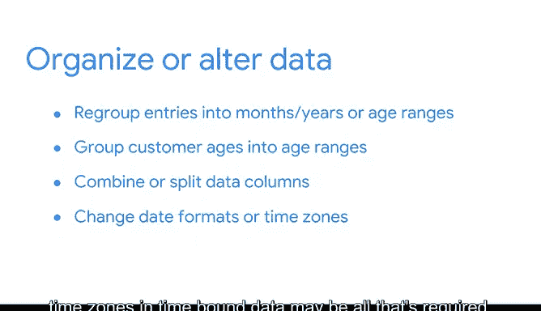

# 013：发现数据集中缺失的内容 🧩

## 概述

在本节课中，我们将学习探索性数据分析（EDA）发现过程中的关键一步：如何通过提出有意义的疑问和构建假设，来识别数据中缺失的信息，从而为后续分析奠定坚实基础。

## 从挑战中寻找新视角

我常常发现，暂时离开一个具有挑战性的项目并稍作休息，能帮助我获得对工作的新视角。我会从冰箱里拿一罐苏打水，散散步，并反思我对当前项目的已知与未知之处。

EDA的发现过程也需要类似的视角转换。在对数据进行初步探索后，我通常已对项目有了足够了解，可以基于数据提出一个假设。

**假设** 是基于证据但尚未被证实的理论或解释。数据专业人士常将假设作为持续调查或测试的起点。一旦形成假设，我便能更好地探索数据，并实现最终目标——讲述数据背后的故事。

## 回顾与衔接

到目前为止，在本课程中我们已经讨论了如何开始EDA的发现实践。你学习了如何检查数据源、数据格式和数据类型。你考虑了列标题信息和平均值，并制作了一些初步的可视化图表来呈现数据。你使用Python来确定数据的规模和范围，并学会了何时需要向数据所有者提出澄清性问题。

在理解了原始数据之后，你就为发现过程的下一步做好了准备：草拟问题清单并形成假设。

## 提出有意义的疑问

在本视频中，你将学习如何针对在PAcE工作流中概述的目标提出有意义的疑问，以更好地理解数据中缺失了什么，以及你仍需找出什么。

我喜欢的一种方法是将原始问题分解成更小的部分。

以下是你可以提出的一些问题：
*   如何将数据分解成更小的组以便更好地理解？
*   如何证明我的假设？
*   以当前形式，这些数据能否给我所需的答案？

让我们结合具体情境来思考这些问题。例如，假设你在一家国际航空公司担任数据分析师，你需要确定降低票价是否能在每周的某些天吸引更多客户。

为了解决这个问题，你可能会问：
*   哪几个月乘客流量最大？
*   哪几周、哪些日期或已知节假日乘客数量最高？
*   机票通常在何时被购买？

## 构建你的假设

接着，你会形成你的假设。在这种情况下，你的假设可能是：**我预测在正常的商业周中，周二和周三的乘客和航班数量最少。因此，如果航空公司在非节假日周的周二和周三降低票价，他们将售出更多机票。**

最终，你将通过分析数据来测试你的假设，以了解航空公司是否能在这些特定航班上通过降价吸引更多客户。

提出疑问和形成假设的目的是为了更好地理解你希望从数据中学到什么，以及你的测试结果可能揭示什么。之后，当你执行EDA的其他实践时，可以参考这些疑问和你的假设，以确定你是支持还是反驳了最初的理论。

## 制定行动计划

为了回答疑问并测试你或你的团队形成的假设，你需要一个计划。

例如，你可能需要联系拥有数据库或更熟悉数据源的领域专家，或者你可能需要进行自己的研究。换句话说，要**“不遗余力”**。这是一句关于古希腊传说的老话，意思是尽你所能去搜索，以找到你要寻找的东西。

如果你发现寻找答案的过程只带来了更多疑问，那是一件好事。每当你了解更多，你就在消除误解或误读数据的可能性。

在某些时候，你可能需要决定组织或修改数据以找到问题的答案。

例如：
*   你可能需要将条目按年或月重新分组，而不是按天或周。
*   你可能希望将客户年龄分组到年龄范围，以帮助你更有效地理解趋势。
*   有时，为了创建模型来回答问题，合并或拆分数据列是必要的。
*   其他时候，更改时间绑定数据中的日期格式或时区可能就是全部所需。

## 聚焦核心问题

例如，在你为国际航空公司的工作中，你的任务是找到实施低票价的日期，以便航空公司能吸引新乘客。想象一下，你得到的数据中票价以美元列出，但原始请求是为从欧洲出发的乘客降低票价。

你需要立即做出的一项更改就是将美元转换为欧元。对数据进行诸如格式化时间、更改单位或转换货币等小改动，都是发现过程的一部分。然而，对于你做出的每一项更改，都要专注于你被分配的问题或作为PAcE框架一部分所建立的计划。

## 总结

正如我们所讨论的，每个数据集都不同。提出疑问和形成假设需要时间和精力，但最终，回答疑问和测试你的假设将是你发现数据中隐藏故事的方式。

如果你遇到困难，暂时离开最初的发现工作，重新思考你的疑问和假设可能会有所帮助。任何已渲染的可视化、已完成的转换、已回答的疑问或已测试的假设，都必须忠实于该数据集的故事。

谁知道呢？也许你会在散步休息时找到答案。那将是多么令人耳目一新。