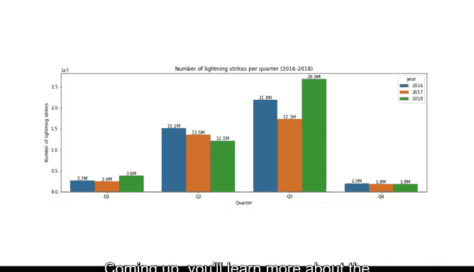

# 014：Python日期字符串操作 📅➡️📊


在本节课中，我们将学习如何处理日期时间对象和日期字符串。我们将通过Python代码练习数据的转换、操作和分组。课程结束时，我们将创建一个常用的数据可视化图表——条形图，用它来讲述数据背后的故事。

处理日期字符串通常需要将其分解为更小的部分。将日期字符串分解为日、月、年，可以让你以不同的方式对其他数据进行分组和排序，从而进行分析。操作日期和时间字符串是探索性数据分析（EDA）的一项基础技能。

在本视频中，你将学习如何将NOAA闪电数据集中的日期字符串转换为日期时间对象。我们将讨论如何将这些数据对象按时间片段（如季度和周）组合成不同的分组。

## 导入必要的库

首先，我们需要导入Python库和包。我们将导入Matplotlib和Pandas，这两个库你之前已经使用过。此外，我们还会引入Seaborn，这是一个更易用且能生成更美观图表的可视化库。

以下是需要导入的库：

```python
import matplotlib.pyplot as plt
import pandas as pd
import seaborn as sns
```

## 处理日期字符串：创建日期时间对象

正如视频开头提到的，操作日期字符串的最佳方法是将日期信息（如日、月、年）分解成部分。这使我们能够将数据分组到任何我们想要的时间序列分组中。幸运的是，有一个简单的方法可以实现这一点，那就是创建一个日期时间对象。

回顾之前的内容，NOAA数据有三列，分别提供了闪电发生的日期、闪电次数以及闪电发生的经纬度。为了操作数据中的日期列，我们首先需要将其转换为日期时间数据类型。

我们通过以下代码实现转换：

```python
df[‘date’] = pd.to_datetime(df[‘date’])
```

这个转换为我们提供了操作日期列中日期字符串的最快、最直接的路径。当前日期字符串的格式是四位数的年份，后跟一个短横线，然后是两位数的月份，再一个短横线，最后是两位数的日期。

## 创建时间分组列

由于我们的日期已转换为pandas的日期时间对象，我们可以创建任何类型的日期分组。例如，我们想按周和季度对闪电数据进行分组。

我们只需要创建一些新的列。以下代码创建了四个新列：`week`、`month`、`quarter`和`year`。

```python
df[‘week’] = df[‘date’].dt.strftime(‘%Y-W%V’)
df[‘month’] = df[‘date’].dt.strftime(‘%Y-%m’)
df[‘quarter’] = df[‘date’].dt.to_period(‘Q’).dt.strftime(‘%Y-Q%q’)
df[‘year’] = df[‘date’].dt.strftime(‘%Y’)
```

*   **`week`列**：使用`strftime`函数将日期时间数据格式化为新的字符串。参数`%Y-W%V`表示输出年份，后跟短横线和一年中的第几周（1-52）。
*   **`month`列**：参数`%Y-%m`输出四位数的年份，后跟短横线和两位数的月份。
*   **`quarter`列**：季度是三个月。许多公司将财年划分为季度，因此知道如何将数据划分为季度是一项非常有用的技能。我们使用`.dt.to_period(‘Q’)`来创建季度周期对象，然后格式化为`%Y-Q%q`的字符串。
*   **`year`列**：参数`%Y`创建一个仅包含年份的数据列。

现在，让我们使用之前学过的`head`函数快速查看我们的工作成果：

```python
print(df.head())
```

运行此代码后，我们的四个新列`week`、`month`、`quarter`和`year`就出现了，并且都按照我们讨论的格式进行了格式化。

## 可视化数据：按周分组

我们可以使用这些新的字符串来了解更多关于数据的信息。例如，假设我们想按周对闪电次数进行分组。一个员工主要在户外工作的组织可能想知道每周处理闪电的可能性。

为了做到这一点，我们需要绘制一个图表。接下来，让我们用闪电数据编写一个图表代码。

为了绘制每周的闪电次数，我们使用条形图。使用所有三年的数据会让我们的图表有点混乱，所以我们只使用2018年的数据，并将图表限制在52周，而不是156周。

我们可以通过创建一个按年份分组并按周排序数据的列来实现这一点。我们将在另一个视频中了解更多关于结构函数的信息。现在，让我们专注于绘制这个条形图。

我们将使用`plt.bar`函数来绘图：

```python
# 假设我们已经筛选了2018年的数据到 df_2018
plt.bar(df_2018[‘week’], df_2018[‘number_of_strikes’])
plt.xlabel(‘Week Number’)
plt.ylabel(‘Number of Lightning Strikes’)
plt.title(‘Number of Lightning Strikes per Week, 2018’)
plt.xticks(rotation=45, fontsize=8)
plt.show()
```

这段代码生成了一个图表，但X轴的标签都挤在一起，难以阅读。我们通过`plt.xticks`函数，将标签旋转45度，并将字体大小缩小到8，来修复这个问题。

根据我们展示2018年每月闪电次数的条形图，你可以得出结论：计划在第32至34周进行户外活动的团队可能需要一个转移到室内的备用计划。当然，这是对数据集中每个北美位置的广泛概括，但就我们的目的和一般而言，这是对我们数据的一个很好的理解。

## 可视化数据：按季度分组

对于最后一个可视化，让我们按季度绘制闪电次数。为了可视化，处理以百万为单位的数字（如25.2百万）会比处理像25，154，365这样的数字容易得多。

让我们创建一个将总闪电次数除以1百万的列：

```python
df[‘strikes_in_millions’] = df[‘number_of_strikes’].div(1000000)
```

运行这个单元格后，我们得到了一个提供以百万为单位的闪电次数的列。

接下来，我们使用`groupby`和重新索引函数按季度对闪电次数进行分组：

```python
df_by_quarter = df.groupby(‘quarter’)[‘strikes_in_millions’].sum().round(1).reindex()
```

这段代码将三年的闪电次数按季度划分。每个数字都四舍五入到第一位小数。字母`M`代表1百万。正如你很快会发现的那样，这个计算将有助于可视化。

我们将使用与之前相同的格式绘制图表：

```python
plt.bar(df_by_quarter.index, df_by_quarter[‘strikes_in_millions’])
plt.xlabel(‘Quarter’)
plt.ylabel(‘Number of Strikes (in millions)’)
plt.title(‘Number of Lightning Strikes by Quarter, 2016-2018’)
plt.show()
```

如果每个季度的条形顶部都能显示总闪电次数，那会更有帮助。为此，我们需要定义自己的函数，我们称之为`add_labels`：

```python
def add_labels(x, y):
    for i in range(len(x)):
        plt.text(i, y[i], f‘{y[i]:.1f}M’, ha=‘center’)

add_labels(df_by_quarter.index, df_by_quarter[‘strikes_in_millions’].values)
```

在展示数据可视化之前，我们还想添加一些小东西，让它更易于阅读。让我们设置图表的长度和高度为15x5，并通过定义这些数字和居中文本来使条形标签更清晰。

我们的条形图现在显示了从2016年到2018年每个季度的闪电次数。为了让信息更容易消化，让我们再做一次可视化。

以下是绘制按季度逐年分组总闪电次数的条形图的代码：

```python
# 假设我们有一个按年和季度分组的数据框 df_year_quarter
df_year_quarter = df.groupby([‘year’, ‘quarter’])[‘strikes_in_millions’].sum().unstack()

df_year_quarter.plot(kind=‘bar’, figsize=(15, 5))
plt.xlabel(‘Year’)
plt.ylabel(‘Number of Strikes (in millions)’)
plt.title(‘Number of Lightning Strikes by Quarter, Year over Year’)
plt.legend(title=‘Quarter’)
plt.show()
```

仔细查看代码，思考每个函数和参数是如何协同工作以创建这个最终精美的条形图的。每年都被分配了不同的颜色，以突出季度之间的差异。

现在，我们有了最终的图表。

## 总结

在本节课中，我们一起学习了如何将日期字符串转换为日期时间对象，这是处理时间序列数据的关键一步。我们掌握了使用`strftime`方法创建不同时间粒度（如周、月、季度和年）的新列。最后，我们运用这些技能，通过创建条形图，将NOAA闪电数据按周和季度进行了可视化分析，从而能够更直观地发现数据中的模式和趋势。



接下来，你将学习更多关于构建数据的不同方法。我们下节课再见。