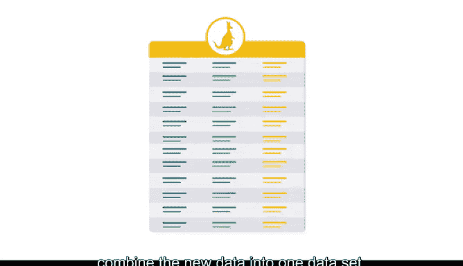

# 015：运用结构化方法建立数据秩序 📊

在本节课中，我们将学习探索性数据分析（EDA）中的结构化实践。结构化实践能帮助你以不同方式组织、收集、分离、分组和筛选数据，从而更深入地理解数据集。作为一名数据分析专业人士，掌握这些方法至关重要。

上一节我们介绍了结构化实践的重要性，本节中我们将详细探讨构成这一实践的具体方法。

以下是六种核心的结构化方法：

**1. 排序**
排序是将数据按有意义的顺序进行排列的过程。
*   **公式/代码描述**：`df.sort_values(by='column_name', ascending=True/False)`
*   例如，你有一个关于袋鼠的数据集，其中包含“育儿袋体积”这一列。你可以将这些值按升序（从小到大）或降序（从大到小）进行排序。

**2. 提取**
提取是从数据集或数据源中检索数据以供进一步处理的过程。
*   **公式/代码描述**：`df[['column_A', 'column_B']]`
*   你可以将其理解为检索整列数据。例如，从袋鼠数据集中，仅提取“育儿袋体积”和“尾巴长度”这两列数据用于分析、比较或可视化。

**3. 筛选**
筛选是根据指定参数选择数据集的较小部分，并用于查看或分析的过程。
*   **公式/代码描述**：`df[df['column'] < value]`
*   你可以将其理解为选择数据行。例如，在袋鼠数据中，筛选可以表现为仅查看那些尾巴长度小于1米的袋鼠的育儿袋数据。这有助于发现数据中有意义的组别或趋势。

**4. 切片**
切片将信息分解成更小的部分，以便从不同视角进行有效检查和分析。
*   **公式/代码描述**：`df.loc[rows_condition, columns_selection]`
*   你可以将其理解为对列和行进行“或/与”操作，是提取和筛选的结合。例如，在袋鼠数据中，如果你有三个不同区域种群的数据，而你只选取其中一个区域种群的“总体长”数据，这就是数据的一个切片。

**5. 分组**
分组，有时也称为分桶，是将变量的各个观测值聚合成组。
*   **公式/代码描述**：`df.groupby('category_column')['value_column'].mean()`
*   例如，在袋鼠的“尾巴长度”列旁边添加一个名为“总体长”的新列。然后，根据“尾巴长度”列的测量值，将所有尾巴长度分为“长”、“平均”和“短”三种类型。现在，你可以根据袋鼠尾巴长度的分组来查找和组织对应的总体长值。

**6. 合并**
合并是一种沿着指定的起始列组合两个不同数据框的方法。
*   **公式/代码描述**：`pd.merge(df1, df2, on='key_column')`
*   例如，假设我们有另一个来自不同实地研究的袋鼠信息数据集，但其参数和变量相同。我们可以使用合并或连接函数来对齐列，并将新数据合并到一个数据集中。

> 在执行筛选、排序、切片、连接和合并操作时，**必须确保不改变数据的原意**。例如，如果我们没有将袋鼠育儿袋的测量数据与匹配的袋鼠名称和ID正确合并，那么数据就不具代表性，我们的分析也将失去价值。忠于数据就是忠于数据背后的故事。

希望你现在开始理解组织和结构化数据对于分析的价值。接下来，我们将使用Python来练习这些结构化方法。

本节课中，我们一起学习了六种核心的数据结构化方法：排序、提取、筛选、切片、分组和合并。这些方法是探索性数据分析的基础，能帮助你将原始数据转化为清晰、有序的信息，为后续的深入分析和洞察发现做好准备。