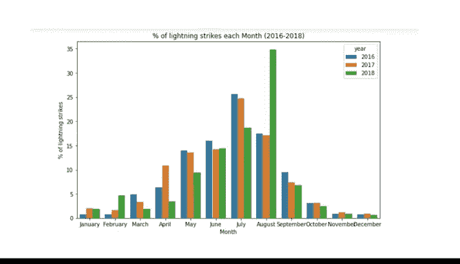

# 016：使用Python实现EDA结构化 📊


## 概述

在本节课中，我们将学习如何使用Python进行探索性数据分析中的“结构化”操作。我们将以美国国家海洋和大气管理局的闪电数据为例，演示如何通过排序、分组、合并等结构化方法，从原始数据中发现隐藏的模式和故事。

---

## 导入工具包与数据准备

在开始分析之前，我们需要导入必要的Python库。这些工具将帮助我们处理、分析和可视化数据。

```python
import pandas as pd
import numpy as np
import seaborn as sns
from datetime import datetime
import matplotlib.pyplot as plt
```

接下来，我们加载2018年的闪电数据，并将日期列转换为日期时间格式，以便后续操作。

```python
df = pd.read_csv('lightning_strikes_2018.csv')
df['date'] = pd.to_datetime(df['date'])
print(df.head())
```

运行`head`函数后，我们可以看到数据集中包含三列：`date`（日期）、`number_of_strikes`（闪电次数）和`center_point_geom`（中心点地理坐标）。

---

## 探索数据形状与重复值

上一节我们准备好了数据，本节中我们来看看数据的基本形状，并检查是否存在重复记录。

使用`df.shape`函数可以查看数据的维度。

```python
print(df.shape)
```

输出结果为`(3401012, 3)`。这意味着数据集有近340万行，但只有3列，是一个“又长又瘦”的数据集。

以下是检查重复值的步骤：
1.  使用`df.duplicated()`函数查找重复行。
2.  使用`.shape`查看移除重复值后的数据形状。

```python
print(df.duplicated().shape)
```

由于返回的形状与原始数据相同，我们知道数据中没有重复值。

---

## 数据排序与初步洞察

了解了数据的基本情况后，我们来看看如何通过排序来发现一些初步的洞察。

我们可以按闪电次数降序排列，看看哪些日期的闪电活动最频繁。

```python
df_sorted = df.sort_values(by='number_of_strikes', ascending=False)
print(df_sorted.head(10))
```

结果显示，单日最高闪电次数在2000次左右，且多发生在8月。这很可能与夏季的风暴活动有关。

---

## 按地理位置分析

除了按时间排序，我们还可以分析闪电在不同地理位置的分布情况。

以下是使用`value_counts`函数查看每个地理位置闪电次数的方法：

```python
location_counts = df['center_point_geom'].value_counts()
print(location_counts.head())
```

通过结果我们发现，一些地点平均每三天就有一次闪电，次数在100次左右；而另一些地点在整个2018年只记录到一次闪电。

为了更清晰地查看分布，我们可以展示前20个地点的数据，并添加视觉增强效果。

```python
top_20 = df['center_point_geom'].value_counts()[:20].to_frame()
top_20.columns = ['counts']
top_20.index.name = 'unique_values'
top_20.style.background_gradient()
```

数据显示，在前20个地点中，闪电次数没有出现特别突出的高值，分布相对均匀。

---

## 使用分组发现模式

上一节我们按地点进行了分析，本节中我们来看看如何按时间分组，以发现更深层的模式。分组是发现数据中隐藏故事的有力工具，例如零售店一天中最盈利的时段。

首先，我们创建两个新列：`week`（一年中的第几周）和`weekday`（星期几）。

```python
df['week'] = df['date'].dt.isocalendar().week
df['weekday'] = df['date'].dt.day_name()
print(df.head())
```

现在，我们可以按星期几分组，计算每天的平均闪电次数，看看是否存在规律。

```python
weekday_strikes = df[['weekday', 'number_of_strikes']]
weekday_means = weekday_strikes.groupby('weekday').mean()
print(weekday_means)
```

为了更直观地理解数据分布，我们绘制一个箱线图。箱线图可以展示数据的集中趋势、离散程度和偏态。

在绘图前，我们先设置星期从周一开始。

```python
weekday_order = ['Monday', 'Tuesday', 'Wednesday', 'Thursday', 'Friday', 'Saturday', 'Sunday']

g = sns.boxplot(x='weekday',
                y='number_of_strikes',
                data=df,
                order=weekday_order,
                showfliers=False) # 不显示异常值
g.set_title('Lightning Strikes per Weekday for 2018')
plt.show()
```

图表显示了一个有趣的现象：一周中每天的闪电次数中位数（箱体内的黑线）基本相同。然而，周六和周日的整体分布范围要低于工作日。这引发了一个思考：是周末的闪电真的变少了，还是数据报告在周末有所减少？

---

## 合并多年数据进行分析

为了进行更长期的分析，我们需要将多年的数据合并起来。合并意味着将两个或多个数据源组合成一个。

我们加载2016年和2017年的数据，并确保它们与2018年数据的格式一致。由于新数据没有我们之前创建的`week`和`weekday`列，我们需要在合并时处理这些差异。

以下是使用`pd.concat`函数合并三年数据并删除多余列的方法：

```python
# 假设 df_2016, df_2017 是已加载的2016和2017年数据
union_df = pd.concat([df.drop(['week', 'weekday'], axis=1), df_2016, df_2017], ignore_index=True)
```

现在，我们有了一个包含三年数据的统一数据框。

---

## 跨年度对比分析

合并数据后，我们可以进行跨年度的对比分析。首先，我们按年份汇总闪电总次数。

```python
# 为合并后的数据创建年、月列
union_df['year'] = union_df['date'].dt.year
union_df['month'] = union_df['date'].dt.month
union_df['month_text'] = union_df['date'].dt.month_name()

strikes_by_year = union_df[['year', 'number_of_strikes']].groupby('year').sum()
print(strikes_by_year)
```

我们发现2017年的闪电总次数低于2016年和2018年。由于总数不同，按月份分析每年的闪电百分比可能更有意义。

以下是计算每月闪电次数占当年总次数百分比的步骤：
1.  按年和月分组计算闪电总次数。
2.  按年计算闪电总次数。
3.  将两个结果按年份合并。
4.  计算百分比。

```python
# 1. 按年月分组
lightning_by_month = union_df.groupby(['month_text', 'year', 'month']).agg({'number_of_strikes': 'sum'}).reset_index()

# 2. 按年分组
lightning_by_year = union_df.groupby('year').agg({'number_of_strikes': 'sum'}).reset_index()
lightning_by_year.columns = ['year', 'year_total_strikes']

# 3. 合并
lightning_by_month = lightning_by_month.merge(lightning_by_year, on='year')

# 4. 计算百分比
lightning_by_month['percentage'] = (lightning_by_month['number_of_strikes'] / lightning_by_month['year_total_strikes']) * 100
```

为了更清晰地展示，我们绘制一个分组柱状图。

```python
plt.figure(figsize=(10,6))
sns.barplot(x='month_text', y='percentage', hue='year', data=lightning_by_month, order=month_order)
plt.xlabel('Month')
plt.ylabel('Percentage of Yearly Strikes (%)')
plt.title('Percentage of Lightning Strikes by Month (2016-2018)')
plt.show()
```

从图表中可以明显看出，**2018年8月**的闪电次数异常突出，占到了该年总闪电次数的三分之一以上。这提示数据分析师可能需要进一步研究该月是否有特殊的气象事件，如飓风或大型风暴。



---

## 总结

本节课中我们一起学习了如何使用Python对数据进行结构化操作，这是探索性数据分析的核心步骤。我们实践了**排序**、**分组**和**合并**等关键方法，并将2016-2018年的闪电数据整合分析。最终，我们通过可视化发现2018年8月的闪电活动异常活跃，这为后续的深入调查提供了明确的方向。掌握这些结构化技能，能帮助你从杂乱的数据中提炼出有价值的洞察和故事。