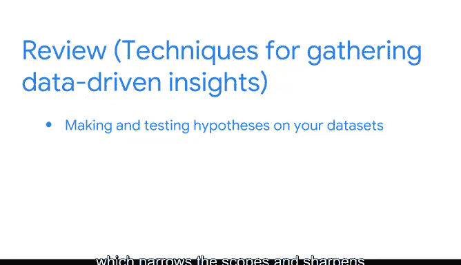

# 017：将数据转化为洞察》课程回顾 🧩

在本节课中，我们将对探索性数据分析（EDA）的核心实践进行一次全面的回顾。我们将梳理已学过的关键技能，并展望后续的学习路径。

---

你是否体验过拼图时初见全貌雏形的时刻？就像你已经连接好了边框，但距离完成仍有距离。

到目前为止，你已经学习了EDA的一些实践方法。你学会了如何**收集、分析、组织和结构化数据**。接下来，你将持续将这些碎片拼合起来，整个图景会变得越来越清晰。

## 已取得的进展 🚀

你已经取得了巨大的进步。上一节我们介绍了数据的基础知识，本节中我们来看看你已经掌握的具体技能。

以下是截至目前你已学习的关键概念：

*   **数据基础**：你学习了数据源、数据类型和数据格式，并理解了了解数据基本信息的重要性。
*   **整体理解**：我们实践了如何使用Python来获取数据集的宏观理解，例如列标题、数据类型、数据大小和形状，以及基本的可视化。
*   **日期时间处理**：在探索和发现数据的过程中，我们学习了如何在Python中进行日期和时间的转换。

## 结构化数据：从混乱到有序 🗂️

在EDA的结构化实践方面，你学会了使用各种函数从混乱中建立秩序。

以下是用于组织数据的关键Python操作：

*   **排序**：`df.sort_values()`
*   **提取**：`df[['column']]`
*   **过滤**：`df[df['column'] > value]`
*   **切片**：`df.iloc[]`
*   **连接与合并**：`pd.concat()`, `pd.merge()`
*   **分组**：`df.groupby()`

在Python中，你练习了将这些函数应用于数据集，这些数据集与你作为数据专业人士职业生涯中可能处理的非常相似。数据专业人士普遍使用这些概念。在探寻数据中隐藏的故事时，你将持续构建这些技能。

> 作为一名数据专业人士，我认为清理和组织数据集占据了90%的工作量。一旦你构建好了数据表，发现洞察和趋势就会像在公园散步一样轻松。

## 实践案例与职场技能 💼

我曾提到，我过去在医疗咨询领域担任数据分析师，需要分析大量的医疗记录数据，以帮助为重症患者推荐治疗方案。

通常，数据分布在多个不同的来源和表格中，这使得合并它们变得困难。此外，医疗记录的组织方式可能导致患者服用的药物与其对应的病症是分开记录的。

因此，为了理解患者针对哪种疾病接受了何种治疗、经历了哪些副作用以及治疗是否有效，我必须将数百个表格合并在一起。一旦完成，比较和对比不同类型的治疗及其对每位患者的影响就变得异常容易。

你已经开始学习完成类似任务所需的技能。在此过程中，你还学习了一些关键的职场技能，例如向项目利益相关者、经理和主题专家沟通更新和提出问题的时机。

## 提出与验证假设 🔍

我们也讨论了如何在数据集上提出和检验假设，这有助于缩小范围并锐化你的数据驱动故事的细节。

简而言之，你越来越理解对数据集执行EDA意味着什么。做得很好。

## 总结与展望 📈

在本节课中，我们一起回顾了探索性数据分析的核心环节：从理解数据基础，到使用Python进行宏观分析和可视化，再到通过排序、过滤、合并等操作结构化数据。我们还通过实际案例看到了这些技能如何解决复杂问题，并初步接触了提出假设这一关键步骤。

在课程的后续部分，我们将讨论如何完成数据故事的其余部分，包括学习如何处理缺失数据和异常值，以及如何制作和使用可视化来帮助讲述那个故事。我们到时再见。