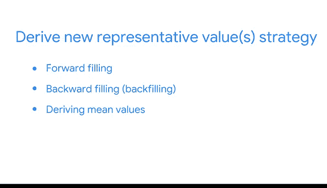

# 019：缺失数据处理方法 🧩

## 概述
在本节课中，我们将要学习数据分析中一个常见且关键的挑战：如何处理缺失数据。我们将探讨缺失数据的定义、影响，并详细介绍四种主流的处理方法。理解这些方法对于确保分析的准确性和可靠性至关重要。

## 什么是缺失数据？
上一节我们介绍了数据分析的常见场景，本节中我们来看看一个具体问题：缺失数据。

缺失数据通常被编码为 `NA`、`NaN` 或空白，它指的是数据集中某个变量没有存储值的情况。这与值为 `0` 的数据点不同，我们稍后会详细解释这一点。

数据专业人员经常面临缺失数据的挑战。每个数据集都不同，因此值缺失的原因也多种多样，从数据上传时的计算机错误到有人忘记输入都有可能。

## 缺失数据的影响
根据数据集的大小和缺失值的数量，包含“非数字”（NaN）的数据字段的影响范围可能从微不足道到非常重大。

这种影响也将决定你如何与利益相关者或客户沟通，范围从在数据可视化底部添加关于存在缺失数据的注释，到因缺失值过多而无法完成分析时进行面对面会议。

以下是一个说明缺失数据影响及其引发的伦理问题的例子。

想象你是一名数据专业人员，试图了解更多关于睡眠习惯的信息。你向100人发送了一份问卷，所有人都完成了。其中一个问题是：“你每晚是否恰好睡8小时？”答案选项是“是”、“否”或“不确定”。9人回答“是”，9人回答“否”，15人回答“不确定”。由于只有33人回答了这个问题，很难就所有100人的睡眠习惯得出明确的结论。

既然100人完成了问卷，但只有33人回答了这个问题，那么67%的回复将被视为缺失。这些缺失值极大地影响了该问题的最终数据。对于数据专业人员来说，试图用33%的回复率来推断整个人群的结论是不明智的。

如果你在工作中遇到如此高比例的缺失值，你应该沟通无法完成任何分析的情况，并提出可能的解决方案。

## 关于“0”值的挑战
在探索性数据分析中可能出现的另一个挑战是值 `0`。在某些数据集中，`0` 可能被视为缺失值，但在其他数据集中，它可能是一个合法的数据点。

在某些数据集中，`NaN` 或空白可能是一个错误（有人忘记填写），或者数据可能被留空，因为该列可能不适用于该数据点。

不确定空白是否是有意为之的数据专业人员，应该询问利益相关者或数据所有者以确认其合法性。

## 处理缺失数据的方法
每当发现缺失数据时，你都需要选择如何处理它。作为数据专业人员，你应该考虑缺失数据可能如何影响利益相关者，以及应该通知谁。

以下是四种处理缺失数据的常见方法。

1.  **请求数据所有者填补缺失值**：如果你收到的数据中存在大量缺失值，处理缺失数据的最佳方法是联系数据所有者，请求填补该数据。
2.  **删除缺失的列、行或值**：如果缺失数据的总量相对较低，或者这些值不会影响数据的商业计划，删除行或整列数据是理想的选择。但需要注意，删除非随机缺失的数据可能会使分析结果产生偏差。
3.  **创建一个“N/A”类别**：如果缺失数据本身是分类数据而非数值数据，这是一个很好的策略。例如，在睡眠问卷中，将所有未回答者归入一个名为“答案未记录”的类别。
4.  **推导新的代表性值**：对于需要预测值或预测的商业计划，此策略更有用。在此填补策略中，有多种方法可供选择，包括最常见的前向填充、后向填充、推导平均值和推导中位数。

我们将在另一个视频中讨论如何使用Python执行所有这些缺失数据操作。

## 如何选择方法
选择使用哪种方法需要经验、直觉和推理。有时，你会有机会对数据集使用多种选项。每个数据集和项目计划都不同，因此每次遇到新数据时，你都需要做出这个决定。

有时，你可能需要与同事、经理或利益相关者协商以做出决定。缺失值对你分析的影响应该是决定联系谁的决定性因素。

作为数据专业人员，你必须深思熟虑并有意识地处理缺失数据。考虑 `NaN` 的数量及其与项目计划相关的重要性，问问自己：这种方法将如何影响这个数据集？以及有哪些伦理考量？

就像棋盘游戏的场景一样，确定策略并决定计划至关重要。

## 总结
本节课中我们一起学习了缺失数据的核心概念、其对分析的影响，以及四种主要的处理方法：请求填补、删除、创建类别和推导代表值。掌握这些知识将帮助你在面对不完整的数据集时，做出明智、合乎伦理且有效的决策。