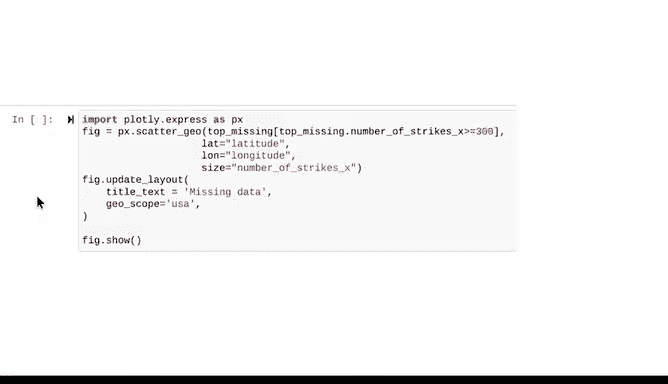

# 020：Python笔记本中的缺失数据实操 🐍


在本节课中，我们将学习如何在Python笔记本中识别和处理缺失数据。我们将使用熟悉的NOAA闪电数据集，通过比较两个不同的数据切片，掌握发现数据缺失的方法。课程内容包括导入库、检查数据、合并数据集、识别缺失值，以及通过数据可视化来理解缺失数据的影响。

---

## 导入必要的库

首先，我们需要导入一些Python库和包来帮助我们处理和分析数据。我们将使用`pandas`进行数据处理，`numpy`进行数值计算，`seaborn`和`matplotlib`进行数据可视化，以及`datetime`处理日期。

```python
import pandas as pd
import numpy as np
import seaborn as sns
from datetime import datetime
import matplotlib.pyplot as plt
```

---

## 检查第一个数据集

上一节我们导入了必要的工具，本节中我们来看看第一个数据集。这个数据集包含了2018年8月的闪电数据，列包括日期、中心点地理坐标、纬度、经度和闪电次数。

以下是检查数据集的基本步骤：

*   使用`head()`函数查看数据的前几行，了解数据结构。
*   使用`shape`属性获取数据集的维度，即行数和列数。

运行这些函数后，我们发现数据集有717,530行和5列，其中包含了我们预期的纬度和经度列。我们将这个数据框保存为`df`。

---

## 检查第二个数据集

接下来，我们查看第二个数据集。这个数据集同样来自2018年8月，但额外包含了邮政编码、城市、州名和州代码列。

以下是检查第二个数据集的步骤：

*   同样使用`head()`函数预览数据。
*   使用`shape`属性查看其维度。

我们发现，这个名为`df_zip`的数据框有323,700行和7列。这与第一个数据集的717,530行不一致，暗示数据可能存在问题。

---

## 合并数据集以识别差异

为了进一步探究，我们将两个数据框合并起来。使用`merge`函数，以“左连接”的方式，根据“日期”和“中心点地理坐标”列进行合并。

```python
df_joined = df.merge(df_zip, how='left', on=['date', 'center_point_geom'])
```

合并后，我们查看新数据框`df_joined`的前几行，发现新增的列（如邮政编码、州名）中出现了`NaN`值，这表示数据缺失。

---

## 识别缺失数据

现在数据已经合并，我们可以系统地查找缺失值。我们将使用`describe()`和`info()`函数来获取数据集的统计摘要和信息概览。

运行`df_joined.describe()`后，我们发现“闪电次数”被分成了`number_of_strikes_x`和`number_of_strikes_y`两列，后者包含了缺失数据。

为了精确找到缺失值的总数，我们使用以下代码：

```python
df_nulls = df_joined[df_joined['state_code'].isnull()]
print(df_nulls.shape)
```

这段代码筛选出`state_code`列为空的行，并打印其形状。结果显示有393,830行数据存在缺失。

此外，`df_joined.info()`提供的“非空计数”列，也清晰地指出了`zip_code`、`city`、`state`和`state_code`列存在大量缺失值。

---

## 可视化缺失数据的地理分布

识别出缺失数据后，我们通过可视化来理解其影响。地理分布图能帮助我们直观地看到缺失值主要集中在哪些区域。

首先，我们创建一个用于绘图的新数据框`top_missing`，它只包含纬度、经度和完整的闪电次数（`number_of_strikes_x`）列。我们按纬度和经度分组，并依据闪电次数的总和进行降序排序。

```python
top_missing = df_joined[['latitude', 'longitude', 'number_of_strikes_x']].groupby(['latitude', 'longitude']).sum().sort_values('number_of_strikes_x', ascending=False).reset_index()
```

为了高效绘制包含数十万个点的地图，我们使用Plotly Express库。我们创建一个地理散点图，点的大小代表闪电次数。

```python
import plotly.express as px



fig = px.scatter_geo(top_missing[top_missing['number_of_strikes_x'] > 300],
                     lat='latitude',
                     lon='longitude',
                     size='number_of_strikes_x',
                     title='缺失数据地理分布')
fig.update_geos(scope='usa') # 将地图范围限定在美国
fig.show()
```

生成的地图显示，大部分缺失数据点出现在美国边境线上或水域（如海洋、湖泊、墨西哥湾）上空。这解释了为什么这些点的“州”和“邮政编码”信息会缺失——水域没有对应的邮政编码。同时，地图上也显示陆地上存在一些缺失数据点，这类情况可能需要向数据提供方NOAA进一步核实。

---

## 总结


本节课中，我们一起学习了在Python中处理缺失数据的完整流程。我们从导入库和检查两个独立的数据集开始，通过合并它们发现了行列数的不一致。接着，我们使用`isnull()`、`describe()`和`info()`等函数精确地识别并量化了缺失数据。最后，我们通过创建地理可视化图表，直观地发现了缺失数据主要集中在水域上空这一“隐藏的故事”。这个过程表明，数据清洗不仅是技术性工作，更是探索和发现数据深层信息的重要环节。