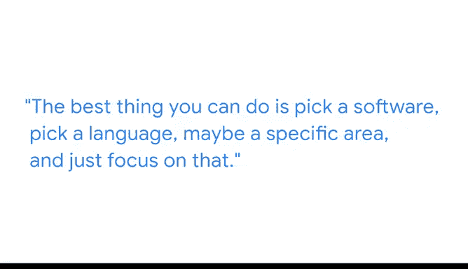

# 021：数据专业人员的日常 👨‍💻

在本节课中，我们将跟随谷歌云的客户工程师雷米，了解数据分析和机器学习领域专业人士的日常工作内容、所需技能以及职业发展建议。

---

大家好，我是雷米，是谷歌云的一名客户工程师。

客户工程师是指在某个技术领域（对我来说是数据分析和机器学习）具备专长的人。他们是该领域的专家，负责帮助客户解答问题并构建与数据分析相关的解决方案。

在进入当前领域之前，我从事过大约30种不同的工作。我曾是收银员、接待员、鸡尾酒服务员和办公室助理。坦率地说，我在那些工作中表现得并不出色。如果某项工作重复性很强，我就无法集中注意力，最终会犯一些愚蠢的错误。这也正是数据科学的魅力所在：许多繁琐和重复性的任务都由软件代劳，你可以编写脚本来自动化处理。

客户工程师的日常工作绝对没有固定模式。我通常以查看电子邮件开始一天的工作。我经常会收到来自客户或同事的、与数据相关的问题，我可以帮忙解答。同时，我也会收到大量关于新功能、产品或技术的信息邮件。我必须阅读并学习这些内容，因为我的职责就是成为为客户了解所有这些信息的人。

我通常还会参加一些会议，与我们的客户经理和客户团队合作，共同制定策略，思考如何帮助客户，并引导他们使用我们的工具实现新的目标。

我最近研究的一个新功能与我们的数据仓库BigQuery相关。你实际上可以在BigQuery内部创建机器学习模型，而无需将数据移动到任何其他地方。我有许多客户使用BigQuery机器学习，因此我现在可以去找他们，分享这个新功能，并向他们展示其实际工作原理。如果他们在使用过程中遇到问题，比如出现某种错误，我可以帮助他们排查故障。

数据领域的发展日新月异，而且本身也是一个新兴领域，这很容易让人感到不知所措。我从事这个行业已近十年，但每天仍会感到压力。你能做的最好的事情就是：选择一个软件、一门语言，或者一个特定领域，然后专注于它。先精通一件事，再以此为基础向外扩展。

---

本节课中，我们一起学习了数据专业人员（以客户工程师为例）的典型职责，包括技术支持、知识更新、客户协作与问题解决。雷米也分享了她从多样化职业背景转型到数据领域的经历，并给出了宝贵的建议：面对海量信息，初学者应专注于一个具体的工具或领域，先建立深度，再拓展广度。