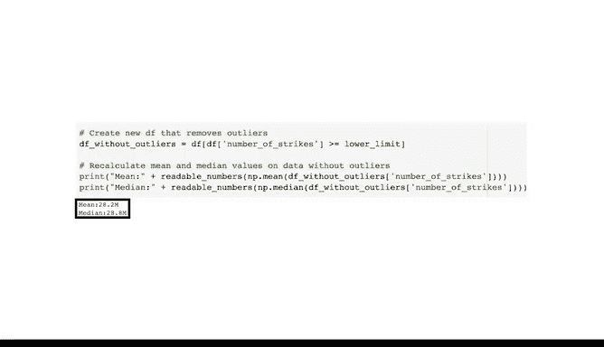

# 023：Python识别与处理异常值 📊


在本节课中，我们将学习如何使用Python识别和处理数据集中的异常值。我们将以美国33年间的闪电总数数据为例，通过计算统计指标、绘制可视化图表以及应用统计规则来定位和分析异常值。

---

## 概述

异常值是数据集中显著偏离其他观测值的点。它们可能由测量误差、数据录入错误或真实的极端事件引起。识别和处理异常值是数据清洗和准备过程中的关键步骤，能确保后续分析的准确性。

上一节我们介绍了异常值的概念类型，本节中我们来看看如何在Python中实际操作。

---

## 导入库与数据

首先，我们需要导入必要的Python库并加载数据。

```python
import pandas as pd
import numpy as np
import seaborn as sns
import matplotlib.pyplot as plt
```

我们将使用NOAA的闪电数据集，并按年份（1987-2020）汇总美国的总闪电次数。

```python
# 假设df是已加载的包含'year'和'number_of_strikes'列的数据框
df = pd.read_csv('lightning_data.csv')
df_grouped = df.groupby('year')['number_of_strikes'].sum().reset_index()
```

---

## 数据预览与格式化

查看数据的前几行有助于了解其结构。闪电总数数值较大，为了方便可视化，我们将其格式化为更易读的形式。

以下是创建格式化函数的步骤：

```python
def readable_numbers(num):
    """
    将大数字格式化为带‘M’（百万）或‘K’（千）后缀的易读字符串。
    """
    if num >= 1_000_000:
        return f'{num / 1_000_000:.1f}M'
    elif num >= 1_000:
        return f'{num / 1_000:.1f}K'
    else:
        return str(num)

# 应用函数
df_grouped['number_of_strikes_readable'] = df_grouped['number_of_strikes'].apply(readable_numbers)
print(df_grouped.head())
```

---

## 计算均值与中位数

均值是数据的平均值，中位数是排序后位于中间的值。比较两者可以初步判断数据分布的偏斜情况。

```python
mean_value = df_grouped['number_of_strikes'].mean()
median_value = df_grouped['number_of_strikes'].median()

print(f"均值: {readable_numbers(mean_value)}")
print(f"中位数: {readable_numbers(median_value)}")
```

如果均值小于中位数，数据可能向左（较小值方向）偏斜，提示我们应关注分布左侧的潜在异常值。

---

## 使用箱线图可视化异常值

箱线图能清晰展示数据的分布和异常值。它将数据分为四个四分位数，并标出落在1.5倍四分位距之外的点。

以下是绘制箱线图的代码：

```python
plt.figure(figsize=(10, 6))
sns.boxplot(x=df_grouped['number_of_strikes'])
plt.title('闪电总数箱线图')
plt.xlabel('闪电次数')
plt.show()
```

在图中，箱体（蓝色矩形）代表四分位距（IQR），其外的单独点即为潜在的异常值。

---

## 计算异常值阈值

根据统计规则，任何低于 **Q1 - 1.5 * IQR** 或高于 **Q3 + 1.5 * IQR** 的数据点通常被视为异常值。

以下是计算下限（寻找较小异常值）的步骤：

```python
Q1 = df_grouped['number_of_strikes'].quantile(0.25)
Q3 = df_grouped['number_of_strikes'].quantile(0.75)
IQR = Q3 - Q1

lower_limit = Q1 - 1.5 * IQR
print(f"异常值下限: {readable_numbers(lower_limit)}")
```

---

## 识别与审查异常值

根据计算出的下限，我们可以筛选出数据集中所有低于此阈值的年份。

```python
outliers = df_grouped[df_grouped['number_of_strikes'] < lower_limit]
print("识别出的异常值年份:")
print(outliers[['year', 'number_of_strikes_readable']])
```

为了更直观地观察异常值与整体数据的关系，我们可以绘制散点图。

```python
# 为每个点添加标签和颜色
def add_labels(x, y):
    for i, txt in enumerate(y):
        plt.text(x[i], txt, txt, ha='right')

colors = ['red' if val < lower_limit else 'blue' for val in df_grouped['number_of_strikes']]

plt.figure(figsize=(16, 8))
plt.scatter(df_grouped['year'], df_grouped['number_of_strikes'], c=colors)
plt.xlabel('年份')
plt.ylabel('闪电次数')
plt.title('年度闪电总数散点图（红色点为异常值）')
plt.xticks(rotation=45)
add_labels(df_grouped['year'], df_grouped['number_of_strikes_readable'])
plt.show()
```

---

## 深入调查异常值原因

识别出异常值后（例如1987年和2019年），需要调查其产生原因。这可能是数据记录不完整或真实极端事件所致。

以下是检查2019年数据月份的示例：

```python
# 加载2019年原始日度数据
df_2019 = df[df['year'] == 2019].copy()
df_2019['date'] = pd.to_datetime(df_2019['date'])
df_2019['month'] = df_2019['date'].dt.month
df_2019['month_text'] = df_2019['date'].dt.strftime('%b')

monthly_totals_2019 = df_2019.groupby('month_text')['number_of_strikes'].sum()
print(monthly_totals_2019)
```

如果发现2019年只有12月有数据，而其他月份缺失，那么这个异常值可能是由于数据记录不完整造成的，在分析时应考虑排除。相比之下，如果1987年每月都有数据但总数极低，则可能是一个真实的极端年份，应保留但需在分析中注明。

---

## 排除异常值后的数据

处理异常值的一种方法是将其从数据集中移除，然后重新计算统计量，观察数据分布的变化。

```python
df_no_outliers = df_grouped[df_grouped['number_of_strikes'] >= lower_limit]

new_mean = df_no_outliers['number_of_strikes'].mean()
new_median = df_no_outliers['number_of_strikes'].median()

print(f"排除异常值后的均值: {readable_numbers(new_mean)}")
print(f"排除异常值后的中位数: {readable_numbers(new_median)}")
```

排除异常值后，均值和中位数通常会更加接近，表明数据分布更为对称。

---



## 总结


本节课中我们一起学习了在Python中识别和处理异常值的完整流程。我们从计算基本的统计指标（均值、中位数）开始，利用箱线图进行可视化，并应用 **1.5倍IQR规则** 来量化异常值阈值。通过识别出特定年份（如1987和2019）后，我们进一步深入调查了数据背后的原因，并学会了根据异常值的性质（数据错误还是真实事件）决定是排除还是保留它们。最后，我们看到了排除异常值如何使数据分布更加均衡。掌握这些技能对于进行可靠的数据分析至关重要。