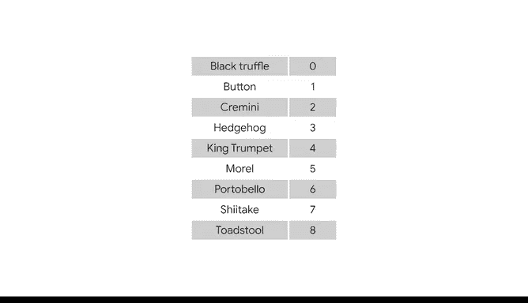

# 024：分类数据的数值化处理 🧮

在本节课中，我们将学习如何处理数据集中常见的分类数据。分类数据使用文字或类别而非数字来表示信息，这可能导致许多数据分析模型和算法无法直接处理。我们将探讨两种将分类数据转换为数值数据的主要方法：创建虚拟变量和标签编码。

## 什么是分类数据？📊

上一节我们介绍了课程背景，本节中我们来看看什么是分类数据。

分类数据是指被划分为有限数量定性组别的数据。例如，人口统计信息通常是分类数据，如职业、种族和教育程度。分类数据条目通常可以快速识别，因为它们通常用文字表示，并且可能取值的数量有限。

许多数据模型和算法处理分类数据的效果不如处理数值数据。因此，将分类数据转换为数值数据通常是了解数据集中分类值分布的最快、最有效的方法。

## 将分类数据转换为数值数据 🔄

上一节我们了解了分类数据的定义，本节中我们来看看如何将其转换为数值形式。

将分类数据转换为数值数据对于预测、分类、预测等任务通常至关重要。有多种方法可以实现这种转换，在本视频中，我们将重点介绍两种常见方法：创建虚拟变量和标签编码。

### 方法一：创建虚拟变量

以下是创建虚拟变量的核心概念和步骤。

虚拟变量是取值为0或1的变量，用于表示某个类别是否存在。你可以将其理解为：1代表“是”，0代表“否”。

在已创建虚拟变量的数据集中，对于任何被确定为“轻度”的值，相应列中会输入1。该列中的所有其他值则标记为0。其他类别和值也遵循相同的规则。

虚拟变量在统计模型和机器学习算法中特别有用。

### 方法二：标签编码

以下是标签编码的核心概念和步骤。

标签编码是一种数据转换技术，其中每个类别被分配一个唯一的数字，而不是一个定性值。

例如，假设你有一个关于蘑菇的数据集，其中有一列名为“类型”，选项包括：黑松露、克里米尼、杏鲍菇、纽扣菇、刺猬菇、羊肚菌、波特贝罗菇、毒鹅膏或茶树菇。

你可以使用标签编码将每种蘑菇类型转换为一个数字：
*   黑松露变为 `0`
*   纽扣菇变为 `1`
*   克里米尼变为 `2`
*   刺猬菇变为 `3`
*   杏鲍菇变为 `4`
*   羊肚菌变为 `5`
*   波特贝罗菇变为 `6`
*   茶树菇变为 `7`
*   毒鹅膏变为 `8`

## 为何要进行数值化转换？🤔

上一节我们介绍了两种转换方法，本节中我们来探讨其重要性。

数据专业人员使用标签编码的原因如下：
1.  **简化操作**：当所有数据都是数字时，清理、连接和分组数据会简单得多。
2.  **节省空间**：数值数据通常占用更少的存储空间。
3.  **提升性能**：当我们花时间将分类数据转换为数值数据时，算法或模型通常运行得更顺畅。

例如，假设你尝试使用蘑菇数据集运行一个预测模型，该模型试图预测新引入数据的蘑菇是波特贝罗菇的百分比概率。如果我们不先执行标签编码就尝试创建模型，该预测模型将无法运行。

当然，也会存在一些你不想执行标签编码的模型或算法。让业务需求指导你是否需要执行标签编码。

## 总结 📝

本节课中我们一起学习了如何处理分类数据。我们了解到，分类数据以文字形式存在，而许多分析工具需要数值输入。因此，我们探讨了两种关键的转换技术：**创建虚拟变量**（用0/1表示类别存在与否）和**标签编码**（为每个类别分配唯一数字）。

选择哪种模型或算法将决定你是否需要进行标签编码。正如确保使用正确的手机充电器为手机充电一样，作为数据专业人员，你需要确保你的数据已准备好供模型或算法使用。