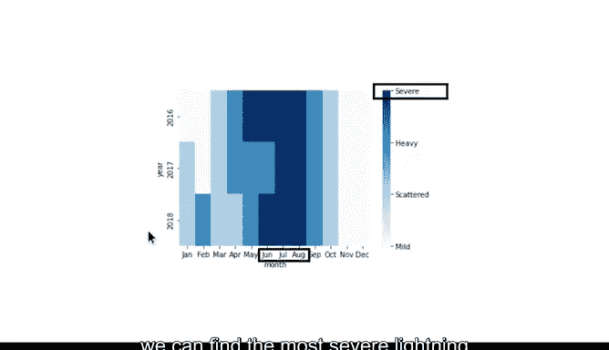

# 025：Python标签编码实现 🐍


在本节课中，我们将学习如何使用Python进行标签编码，将分类数据转换为数值数据，并利用这些数据创建直观的可视化图表。

## 概述

在之前的课程中，我们了解了标签编码的重要性，即将分类数据转换为数值数据。现在，我们将打开Python笔记本，学习如何具体实现这一过程。我们将继续使用NOAA的闪电计数数据，并专注于2016、2017和2018年的数据。

## 导入库与数据准备

首先，我们需要导入必要的Python库和包。

以下是本笔记本需要导入的库：
```python
import datetime
import pandas as pd
import seaborn as sns
from matplotlib import pyplot as plt
```

接下来，我们开始处理数据。首先，将日期列转换为日期时间格式，这会使数据操作更加方便。
```python
df['date'] = pd.to_datetime(df['date'])
```

然后，创建一个名为“Month”的列，就像我们之前所做的那样。我们将使用字符串切片功能，将月份名称缩短为前三个字母。
```python
df['month'] = df['date'].dt.strftime('%b')
```

在处理这些数据时，确保月份名称按时间顺序排列会很有帮助。因此，我们定义了一个按顺序排列的月份组。
```python
months = ['Jan', 'Feb', 'Mar', 'Apr', 'May', 'Jun', 'Jul', 'Aug', 'Sep', 'Oct', 'Nov', 'Dec']
```

在下一行代码中，我们使用pandas的`Categorical`函数，按照“month”列对“number_of_strikes”列进行分组。
```python
df['month'] = pd.Categorical(df['month'], categories=months, ordered=True)
```

因为我们有三年的数据，所以还需要创建一个列出年份的列。为此，我们使用日期时间函数`strftime`。
```python
df['year'] = df['date'].dt.strftime('%Y')
```

最后，我们创建一个名为`df_by_month`的数据框，它首先按年份，然后按月份对闪电次数进行分组，并使用`sum`方法将每个月的闪电次数相加。
```python
df_by_month = df.groupby(['year', 'month'])['number_of_strikes'].sum().reset_index()
```

当我们使用`head`函数查看数据框的顶部时，会得到前五行数据，列包括年份、月份和闪电次数。

## 创建分类变量与标签编码

现在，让我们创建一个用于分类变量的列，名为“strike_level”。在这个列中，我们将闪电总数分组或分桶到几个类别中：轻微、分散、严重和非常严重。这就是我们在Python中执行标签编码的方式。

以下是具体步骤：
```python
df_by_month['strike_level'] = pd.qcut(df_by_month['number_of_strikes'],
                                        q=4,
                                        labels=['mild', 'scattered', 'heavy', 'severe'])
```

我们使用`head`函数来查看代码如何修改数据框`df_by_month`。

为了将分类数据转换为数值数据，我们创建另一个名为“strike_level_code”的列。我们通过取“strike_level”列并添加`.cat.codes`来定义它。
```python
df_by_month['strike_level_code'] = df_by_month['strike_level'].cat.codes
```

运行这个单元格后，我们发现“mild”被分配为0，“scattered”为1，“heavy”为2，“severe”为3。这就是我们执行标签编码的方式。

## 创建虚拟变量

处理分类数据的另一个有用方法是创建虚拟变量来表示这些类别。虚拟变量是值为0或1的变量，表示某物的存在或不存在。

在Python笔记本中，我们使用pandas的`get_dummies`函数来实现这一点。
```python
dummy_df = pd.get_dummies(df_by_month['strike_level'], prefix='strike')
```

运行这个单元格后，你会发现这个函数创建了四个新列，并在任何一行中，如果闪电次数属于标记的类别，则在该行中放入1，否则为0。

## 数据可视化

现在我们有了分类数据、数值数据和虚拟变量的新列，让我们探索一下从这些分组中可能学到什么。为此，我们来绘制数据。

首先，我们创建一个名为`df_by_month_plot`的数据框。我们使用pandas的`pivot`函数来重塑数据框。
```python
df_by_month_plot = df_by_month.pivot(index='year', columns='month', values='strike_level_code')
```

接下来，我们使用热图来可视化数据。热图是一种数据可视化类型，它基于两种颜色描绘实例或一组值的大小。
```python
plt.figure(figsize=(12, 6))
sns.heatmap(df_by_month_plot, cmap='Blues', cbar_kws={'ticks': range(4)})
plt.title('Lightning Strike Severity by Month and Year')
plt.show()
```



通过热图，我们可以找到三年中所有月份中最严重的闪电月份。

## 总结


本节课中，我们一起学习了如何使用Python进行标签编码。我们首先准备了数据，然后创建了分类变量并进行了标签编码，接着生成了虚拟变量，最后通过热图可视化了数据。标签编码是数据专业人员的一项基本技能，通过Pandas和Seaborn，只需几行代码就可以实现数据的转换和可视化。