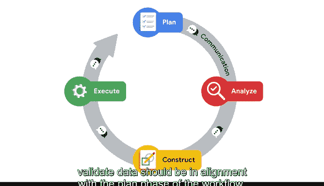

# 026：输入验证的价值 🥬

在本节课中，我们将学习探索性数据分析中的一个核心实践：**输入验证**。我们将了解它的定义、重要性、执行时机以及需要关注的关键问题。通过将数据比作烹饪中的蔬菜，我们将直观地理解为何在分析的每个阶段都需要反复检查数据。

---

## 输入验证的定义与重要性

上一节我们介绍了探索性数据分析的框架，本节中我们来看看其中一个关键实践：输入验证。

当思考输入验证以及EDA中的连接实践时，我喜欢将其比作蔬菜。请允许我解释。

在市场上挑选绿叶蔬菜和根茎类蔬菜时，你首先会检查它们是否新鲜，对吗？不仅在商店里检查，回家放入冰箱后也会检查，并且在烹饪食用前很可能还会再次确认它们是否仍然可食用。

最后，如果蔬菜因某些原因变质，或者你为某个食谱购买的数量不足，你就需要添加更多。对数据集执行EDA类似于检查蔬菜的新鲜度。你是在搜索、探索并检查数据，使其尽可能没有错误。

你应该反复检查你的数据集，以确保它们是正确的。正如我之前提到的，作为数据专业人士，你应该彻底了解你的数据集。确保你了解数据集的一种方法是验证它，正如你所记得的，这是EDA的六大实践之一。

**输入验证**是彻底分析和双重检查以确保数据完整、无错误且高质量的做法。输入验证旨在成为一种迭代实践，这意味着你应该在EDA的其他五个实践（发现、结构化、清理、连接和呈现）之间和之中反复执行它。

---

## 何时进行输入验证

通常，作为数据专业人士，你会在开始新的分析项目或熟悉新的数据源时执行输入验证。

我们将在课程后面更多地讨论如何执行输入验证。现在，我们将重点关注原因和内容。

我们为什么要花时间验证数据？我们到底在寻找什么？

当我们验证数据时，我们有助于做出更准确的业务决策，并提高复杂模型的性能。这样想：如果一位美食厨师在烹饪菜肴前不双重检查蔬菜的新鲜度，食物可能会很难吃，或者更糟，让人生病。数据也是如此。

在EDA过程中，每次操作数据后，我们越仔细地检查和重新检查数据，以后出现问题的可能性就越小。干净且经过验证的数据有助于防止未来的系统崩溃、编码问题或错误预测。

---

## 验证时需要关注什么

那么，在执行验证工作时，我们在寻找什么呢？没有两个数据集是相同的。根据类型，需要检查的事项会有所不同。

以下是验证数据时需要考虑的一些问题：

*   **数据格式是否统一？** 例如，人们的年龄是表示为单一数字（如23和47），还是在一个范围内（如18至35岁和35至50岁）？
*   **数据范围是否一致？** 例如，在金融领域，有些值是以千欧元表示，而另一些是以百万欧元表示吗？
*   **数据类型是否一致？** 例如，所有日期条目是否都以相同的格式（月、日或年）表示？

在提出这些问题或执行EDA时，你可能会发现，你获得的数据不足以回答你所承担的业务问题。

---

## 连接实践与验证的关系

例如，让我们回到视频前面所做的与美食厨师及其蔬菜的比较。想象一下，这位美食厨师正在为他们的餐厅推出一道新食谱。他们不确定这道新菜需要多少蔬菜。最终，厨师在那天进行到一半时意识到，他们没有考虑到纯素和素食菜肴中需要使用的额外蔬菜。正是在那个时候，厨师会购买更多蔬菜。

EDA中的**连接**实践与上述原则非常相似。正如你所学的，连接不同于结构化技术中的合并。在提出这些问题或执行EDA时，你可能会发现，你获得的数据不足以回答业务问题。**连接**是通过添加其他数据集的值来扩充数据的过程。

如果我们验证数据以确保格式和数据条目对齐且属于相同的数据类型，那么连接实践将最为有用。例如，在添加新蔬菜时，厨师会希望确保其质地和味道与他们全天使用的蔬菜相似，否则，菜肴可能无法达到相同的效果。

---

## 实践中的思考与协作

你需要运用自己的逻辑、常识和经验来理解应如何连接或验证你处理的每个特定数据集。不会有严格的流程来详细告诉你如何处理每个数据文件。数据科学需要大量的分析性思维和视角转换，以便在EDA和验证中做到彻底。经验和努力将是提高你分析性思维表现的最佳方式。我们也将在Python笔记本中探索示例。

让你的验证实践与PACE工作流程保持一致，也将有助于你专注于道德规范。验证应该是为了质量和正确性而清理和纠正数据。你可能不会惊讶地发现，EDA的验证实践完全符合我们PACE工作流程的分析阶段，但它也是你应该在所有四个阶段都使用的实践。

记住，PACE代表计划、分析、构建和执行。这意味着我们连接和验证数据的内容和方式应与工作流程的计划阶段保持一致。例如，如果你的任务是发现给定月份中哪一周对业务最有利，那么检查和重新检查你是否正确地将收入日期按周分组将非常重要。如果你以为自己按周对收入进行了分组，但实际上却是按天或按月进行的，那么你的分析将是无效的。

当你以这种详细程度验证数据时，它将帮助你实现PACE目标，特别是构建和执行阶段的目标。

---

## 总结与建议

在结束之前，还有一件事可以帮助你处理EDA的验证和连接方面：向你的同事和经理寻求帮助。经过同行评审的数据集是确保你检查自身偏见、保持道德关注并确保遵循PACE工作流程的最佳方式之一。

记住，验证数据就像检查你的蔬菜，以确定它们是否是食谱的正确选择。前期可能需要额外的时间，但它可能会为你省去后续的麻烦和困扰。

在本节课中，我们一起学习了输入验证的核心价值。我们了解到，验证是一个迭代过程，旨在确保数据的质量与一致性，它贯穿于数据分析的始终，并与PACE工作流程紧密结合。通过像厨师挑选食材一样谨慎地对待数据，我们可以为后续的分析和决策打下坚实的基础。