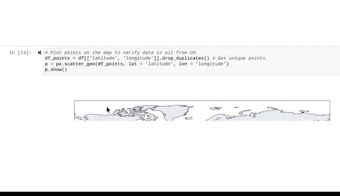

# 027：Python输入验证实践 🐍✅


在本节课中，我们将学习如何在Python中执行输入验证。输入验证是数据分析中确保数据完整、无错且高质量的关键步骤。我们将以NOAA（美国国家海洋和大气管理局）的闪电数据为例，演示如何检查错误并为数据发布做好准备。

---

## 导入必要的库

首先，我们需要导入进行输入验证所需的Python库和包。

以下是需要导入的库：

```python
import matplotlib.pyplot as plt
import pandas as pd
import plotly.express as px
import seaborn as sns
```

---

## 初步查看数据

导入所有库后，我们使用`head`函数来查看数据集的列和前五行数据。

```python
df = pd.read_csv('your_lightning_data.csv')
df.head()
```

你会发现闪电数据集包含五列，其中第四和第五列分别是经度和纬度。

---

## 检查数据类型与转换

如果我们现在使用`df.dtypes`检查数据类型，会发现“日期”列是字符串类型。与之前一样，我们需要将其转换为日期时间格式。

```python
df['date'] = pd.to_datetime(df['date'])
```

---

## 检查缺失值

输入验证应包括对缺失数据的检查。虽然我们可能在探索性数据分析的清理阶段已经做过，但验证过程本身意味着对已完成操作的复核，因此再次检查是必要且不冗余的。

```python
df.isnull().sum()
```

运行代码后，我们确认数据集中确实没有缺失值。

---

## 审查变量范围

接下来，让我们审查所有变量的范围，即检查每列的最高值、最低值以及数值的整体分布。我们将使用`describe`函数。

```python
df.describe(include='all')
```

在结果中，你可能会在“日期”列的均值、最小值、中位数和最大值等字段看到`NaN`值。这是正常的，因为日期不是可以进行平均计算的数据类型。

---

## 验证日期完整性

说到日期，让我们再次检查日期列，确认是否有任何日历日缺失。根据之前对此数据集的了解，日期列应包含每年的每一天。

我们通过创建一个完整的日历索引来验证。

```python
full_date_range = pd.date_range(start='2018-01-01', end='2018-12-31')
missing_dates = full_date_range.difference(df['date'])
print(missing_dates)
```

结果发现，2018年有几天缺失：6月连续缺失4天，9月连续缺失2天，12月连续缺失2天。这个发现值得调查或向数据提供者询问原因。鉴于缺失天数较少，你可以在最终分析报告中注明这些缺失日期，以确保任何查看你可视化结果或报告的人都知道数据不包含这些日期。

---

## 理解闪电次数分布

完成初步验证后，让我们更好地了解闪电次数的范围。我们可以使用简单的箱线图进行可视化。

```python
plt.figure(figsize=(10,6))
sns.boxplot(data=df, y='number_of_strikes')
plt.title('Distribution of Lightning Strikes')
plt.show()
```

你会发现分布非常偏斜：一年中大多数日子闪电次数少于5次，但有些日子超过2000次。为了更清晰地理解主要数据的分布，我们可以移除异常值。

```python
plt.figure(figsize=(10,6))
sns.boxplot(data=df, y='number_of_strikes', showfliers=False)
plt.title('Distribution of Lightning Strikes (Without Outliers)')
plt.show()
```

结果更容易解读。根据我们对美国、墨西哥和加勒比海地区闪电的了解，这个分布是合理的。如果最高分布都集中在2000次以上，我们可能会更怀疑数据的真实性。

---

## 验证地理坐标

最后一项输入验证是确认数据集中包含的所有纬度和经度坐标都位于美国境内。这将确保我们的地理数据没有错误。

首先，我们创建一个新的数据框，移除所有重复的坐标点。

```python
df_points = df[['latitude', 'longitude']].drop_duplicates()
```

我们移除重复点是因为不需要在地图上重复检查同一位置。运行代码后，我们得到一个只包含纬度和经度两列的新数据框，并且其中没有重复的数据点。

最后，我们将这些点绘制在地图上。一个提示是：当处理数十万个数据点在地图上绘制时，会消耗大量计算资源。为了缩短运行时间，我们使用`plotly.express`包，它旨在尽可能降低运行时间。

```python
fig = px.scatter_geo(df_points, lat='latitude', lon='longitude')
fig.show()
```

运行单元格后，由于数据量巨大，运行时间可能仍然较长，但这能有效验证地理坐标的合理性。

---



## 总结


本节课中，我们一起学习了Python中输入验证的完整流程。我们从导入库、查看数据、检查数据类型和缺失值开始，接着审查了变量范围和日期完整性，然后通过可视化理解了数据分布，最后验证了地理坐标的有效性。大多数数据专业人士都会定期进行输入验证，因此这些是必须学习的重要概念和需要练习的关键技术技能。通过本教程，希望你能够掌握为数据集执行基本输入验证的方法，确保其质量与分析结果的可靠性。