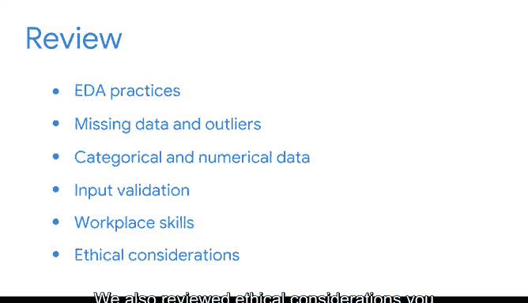

# 028：将数据转化为洞察》 🎯

在本节课中，我们将学习如何应对复杂且混乱的数据集，并掌握一系列关键策略，以纠正错误并挖掘隐藏在数据深处的故事。我们将重点探讨数据清洗、连接与验证的探索性数据分析实践，并学习如何在Python中应用这些技术。

---

数据集常常是繁忙且混乱的，其中可能同时发生着许多不同的事情。因此，确定关注重点以及如何发掘埋藏在表面之下的故事可能非常困难。

在课程的这个部分，你学习了一些重要的策略，以帮助你纠正错误并发现隐藏的数据故事。我们通过学习和实践数据清洗、连接与验证的探索性数据分析方法，集中精力寻找数据中的故事。

我们讨论了许多参与这些实践的方法。我们的重点集中在处理缺失值和异常值、将分类数据转换为数值数据，以及进行输入验证上。同时，我们提醒自己不要忘记在Python中可视化数据，以进一步加深理解。

我们讨论了在Python中识别缺失数据和异常值的方法，以及从伦理和商业角度出发，为什么找到它们至关重要。我们思考了分类数据与数值数据之间的区别，以及为什么使用Python进行转换非常重要。

至于输入验证，你学习了它是什么、为什么重要，以及如何使用Python来执行它。在此过程中，我们还讨论了一些工作技能，例如理解何时需要就缺失值与利益相关者或其他领域专家进行沟通。

我们还回顾了在执行清洗、连接和验证工作时应考虑的伦理问题。你了解到，作为PACE工作流程的一部分，这些实践在执行数据集探索性数据分析时至关重要。探索性数据分析可以是一个激动人心的过程。

通过探索性数据分析，不仅能为后续流程节省时间和精力，还能帮助你发现数据中的趋势、模式和故事。稍后，你将学习如何使用Tableau在商业环境中设计和向关键利益相关者及业务经理展示数据可视化。

与此同时，你已经掌握了一些数据专业人士几乎每天都会使用的出色技能。在Python中对数据集进行细致的探索性数据分析的能力，是数据专业人士职业生涯中必不可少的基础。

到目前为止，你的工作做得非常出色。