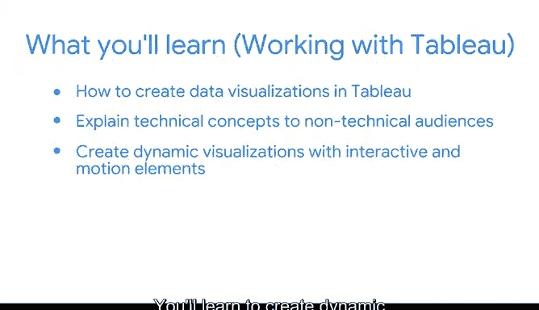

# 029：模块4导论 🎬

在本节课中，我们将学习探索性数据分析（EDA）的最后一个实践环节——数据可视化与呈现。我们将探讨如何设计有效的可视化图表，并了解其在数据分析全过程中的作用。

我们已经进入了探索性数据分（EDA）呈现环节的最终实践部分。讨论可视化和呈现，并不一定意味着它们只出现在数据探索的末尾。在整个数据分析过程中，你随时都可能为自己的数据创建可视化图表。数据可视化的实践将帮助你发现洞察，并深化你自己的理解。EDA的呈现实践是PACE框架中“分析”和“执行”两个阶段的重要组成部分。有时，你会在“分析”阶段创建可视化图表来分析数据；而在其他时候，你会将数据可视化作为执行算法的一部分来使用。

在本视频中，我们将重点讨论为呈现目的而设计数据可视化。在本课程中，我们将讨论诸如可访问性、Tableau基础、仪表板和数据可视化等概念。

你可能在谷歌数据分析师认证课程中回忆起了其中一些概念。如果你愿意，可以在继续学习前花几分钟回顾一下相关内容。

接下来，你将学习如何提升你的数据可视化技能。数据的准确呈现是成功演示最重要的方面之一。你将学习制作能精确呈现数据的可视化图表的特定技巧。

设计成功数据可视化的另一个方面是确保其具有包容性。我们将讨论一些技巧和方法，使你的数据可视化能够被多样化的受众所理解。

你还将了解数据可视化平台Tableau。Tableau是一款多功能的数据可视化软件，主要用于向企业呈现数据以提供信息并改进业务。通过学习该软件，你将学会如何创建能够讲述故事、并向非技术受众解释技术概念的数据可视化。你将学会创建具有交互和动态元素的动态可视化，并能根据不同受众的需求调整可视化效果。

我们还将讨论如何选择合适的图形或图表，在演示过程中提供背景信息，以及在呈现时选择恰当的顺序和时机。

数据专业人员经常需要创建数据可视化并进行演示。这就是为什么我们将讨论帮助你在这个领域取得成功的最重要技能。毕竟，你希望你的受众理解你的数据故事。作为一名数据专业人员，你将有机会讲述能够改变你的团队、部门、公司、行业甚至世界的数据驱动型故事。

现在，让我们开始吧。

---

**本节课总结**

在本节课中，我们一起学习了探索性数据分析（EDA）中数据可视化与呈现环节的重要性。我们了解到可视化不仅用于最终报告，也贯穿于整个分析过程，是PACE框架中“分析”和“执行”阶段的关键部分。课程介绍了提升可视化技能的要点，包括**数据的精确呈现**、**图表的可访问性设计**，以及使用**Tableau软件**创建动态、交互式图表的方法。最后，我们明确了选择合适图表、提供上下文以及把握呈现时机对于有效沟通数据故事至关重要。