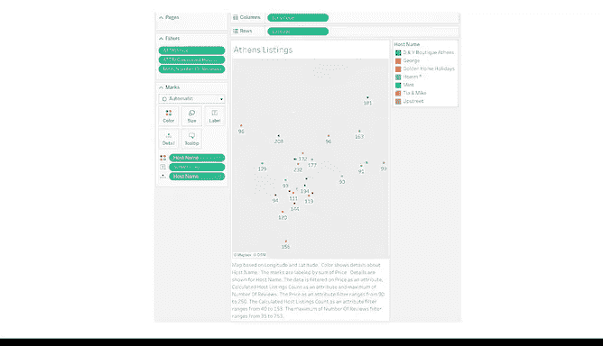

# 030：可视化生命周期 🗺️➡️📊

在本节课中，我们将学习数据可视化的生命周期。我们将通过一个具体的案例，了解如何从一个原始数据集开始，经过多次迭代和调整，最终创建出符合业务需求、清晰易懂的可视化图表。我们将重点关注决策过程，例如如何选择图表类型、应用筛选条件以及优化图表格式。

---

数据可视化通常是一个迭代过程。你设计的第一个图表可能并非最终呈现给利益相关者的版本。图表的颜色、文本、标签、比例尺和重点强调区域等各个方面，都可能为了满足不同的业务需求而进行调整。

那么，我们如何得到最终的可视化成果？在这个过程中，我们应该做出哪些决策来创建一个成功的可视化图表？

为了回答这些问题，我们将选取一个样本数据集，创建一个数据图形。然后，我们将讨论如何在此过程中调整可视化方案。这将阐明数据专业人员在为演示创建图表时所做出的决策类型。

现在，让我们开始吧。

---

## 案例背景：欧洲租房应用 🏠

假设你正在开发一款新的应用程序，该程序旨在将欧洲评分最高的出租房源和公寓汇集到一个易于访问的平台。

你的公司要求你从收集希腊雅典的最佳出租房源开始。

你需要找出那些拥有**40套或以上**房源信息的房东，并定位其出租单元的地理位置。同时，你只关注那些拥有大量好评、且租金价格在**90到250**之间的房源。这有助于明确你所需的可视化类型。

---

## 第一步：确定图表类型与工具 🗺️

由于你需要定位拥有40套或以上房源的房东的出租单元位置，因此需要一个地理地图。

此外，你需要根据分析标准筛选房源数量，以创建出租房源位置的地图。像 **Tableau** 这样的程序将是最有效的工具。

如果你熟悉Tableau，可以尝试将此数据集导入Tableau Public并亲自操作。

以下是我们的初步计划：
1.  从雅典的地图开始。
2.  将所有出租房源绘制在该地图上。
3.  使用筛选器移除不符合分析标准的房源（例如价格超出定义范围）。
4.  最后，调整格式，使我们的地图易于理解和访问。

---

## 第二步：构建基础地图 📍

我们已知最终结果需要是一张希腊雅典的房源地图。

我们从数据中导入纬度和经度，并以房东姓名作为标签，将这些房源绘制在地图上。

将数据点添加到Tableau后，我们得到了一张希腊地图，但需要对其进行优化以提升可读性。

---

## 第三步：应用筛选条件 🔍

接下来，根据我们的分析标准，筛选掉不需要的房源。

以下是具体的筛选步骤：

*   **筛选房源数量**：将结果范围缩小到仅包含拥有超过40套出租房源的房东。我们可以使用数据集中名为 `calculated_host_listings_count` 的列来实现，将数值限制为仅大于40的值。
*   **筛选价格**：我们的标准包括价格在90到250之间的房源。应用此筛选后，房源数量变得更容易管理。
*   **筛选评论数量**：我们只想保留拥有大量评论的房源。“大量”是一个相对概念，因此我们使用百分位数筛选器，仅显示总评论数排名前50%的房源。

应用这些筛选后，我们得到了一个合理数量的数据点。

---

## 第四步：优化与美化图表 🎨

现在，我们需要让图表更易于理解。

为此，我们添加一个标题，并为每个房源的房东添加颜色编码。同时，我们还为每个房源添加了价格标签。

此时，我们得到了一个符合标准的、可用的可视化图表。这是一个成功的初版。

然而，如果我们希望将此可视化图表用于正式演示，就需要确保其可访问性。

以下是优化可访问性的步骤：

*   在图下方添加描述性标题。
*   将标记点略微缩小，以便显示更多的价格标签。
*   确保所使用的颜色对色觉障碍人士友好。

经过这些调整，我们得到了最终的可视化结果。

---

## 总结与核心要点 💡

本节课中，我们一起学习了数据可视化的生命周期。

可视化的目标是满足受众的需求。在我们的案例中，你通过雅典地图成功分享了出租房源房东的地理位置信息。

但需要记住，设计可视化是一个多步骤的过程。即使完成了一个可视化图表，有时也可能需要更新它。例如，如果应用程序的业务团队决定需要不同的数据显示方式，或者你想按社区查看房源列表，就需要更新可视化方案。

这里的要点是，最终的可视化结果可能并不总是完全符合业务需求。进行调整和修正错误，是整个过程中不可或缺的一部分。关键在于保持迭代思维，根据反馈和新的信息不断优化你的可视化作品。