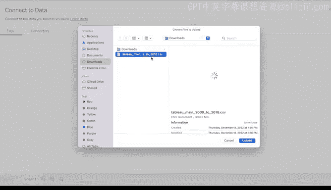
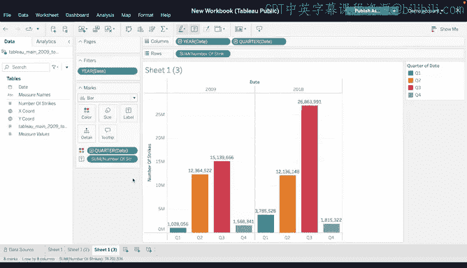

# 031：Tableau实操第一部分 📊

在本节课中，我们将学习如何登录并使用Tableau Public的免费在线版本，构建基本的数据可视化图表，并理解不同图表类型的适用场景。我们将以NOAA闪电数据集为例，逐步创建折线图、条形图等可视化作品。

---

我们讨论了Tableau的强大功能和实用性。现在，准备登录并尝试使用它。

我们将讨论如何访问免费的在线版Tableau Public，构建基本的数据可视化，并理解何时使用各种图表。你可能在谷歌数据分析证书课程中记得其中一些概念，可以回顾该课程以快速复习。

访问Tableau Public时，其界面可能与本视频中显示的不同。请记住，Tableau Public可能已更新其用户界面。这应该不是问题，因为您遵循的步骤几乎相同。

首先，访问Tableau Public网站，这是您可以从浏览器访问的免费在线版Tableau。

登录您的Tableau Public账户。

接下来，您需要在Tableau Public中访问一个新的数据源。本视频我们将再次使用NOAA闪电数据集。

在Tableau Public主页上，选择“创建可视化”，然后使用为您提供的文件从计算机上传数据源。

数据上传后，您将被重定向到Tableau的数据源界面。数据集分为四列：日期、闪电次数、X坐标和Y坐标。这些字段名称的上方或旁边有符号，代表数据集中包含的数据类型。

日期列有一个日历图标，闪电次数列有一个井号（#）表示数值列，纬度和经度（即X和Y坐标）则有地球图标。

界面上还有代表新工作表、新仪表板和新故事的选项卡。创建一个新工作表。

Tableau Public中的工作表是一个数据页面，包含数据可视化的单一视图。新工作表除了数据列外是空白的。

工作表的数据源字段已预加载了我们在数据源页面识别的列标题。一条细线将列表分为两部分，这指示了数据类型以及数据是离散的还是连续的。

Tableau将所有数据字段分为两大类数据类型：维度和度量。您可以根据Tableau分配给每个字段的图标来区分它们。

维度是用于分类和分组数据以揭示其细节的定性数据值。度量是可以聚合或用于计算的数值。

Tableau工作表数据选项卡中维度和度量列表的绿色和蓝色表示另一个方面。绿色表示数据字段是连续的。蓝色表示字段是离散的。

术语“连续”是一个数学概念，表示度量或维度具有无限且不可数的结果数量。“离散”也是一个数学概念，表示度量或维度具有有限且可数的结果数量。

通过这些定义，我们甚至可以在将数据绘制到图表之前就了解数据字段列表。

😡 请记住，Tableau可能会分配错误的数据类型。如果数据类型与其标签不匹配，您始终可以通过右键单击数据字段将数据从度量更改为维度，或从离散更改为连续。

---

上一节我们介绍了Tableau的数据类型和界面基础，本节中我们来看看如何创建第一个可视化图表：折线图。

折线图对于呈现时间序列数据或跟踪不同时间段内数据值的变化非常有用。

首先，将“日期”字段拖放到列功能区。在显示的弹出窗口中，您可以选择不同的时间片段。对于此图表，选择“年”。

接下来，将“闪电次数”字段拖放到行功能区。您现在就有了一个折线图。

现在，您知道了如何创建折线图。接下来，我们将创建一个条形图。

---

当您想要比较不同时间段的数据时，条形图非常有用。首先，使用工具栏复制您的工作表到新工作表。

在新工作表中，打开“标记”卡的下拉菜单，选择“条形”。更改数据可视化类型就是这么简单。

😡 接下来，让我们创建一个条形图来比较两个数据集。

转到“筛选器”选项卡并编辑筛选器。勾选2009年和2018年，其他年份保持未勾选状态。您将看到2009年和2018年闪电总次数的比较。

接下来，通过将“闪电次数”拖到“标记”卡中名为“标签”的方框上，为每个条形添加标签。

现在我们知道2009年和2018年闪电次数的确切差异了，分别是3010万次和4460万次。

---

对于最后一个可视化，让我们按季度比较2009年和2018年的数据。首先，再次复制工作表。😡

将“日期”拖到列功能区。Tableau会自动将季度添加到堆叠条形中，为两年划分出Q1、Q2、Q3和Q4。

为了使每个季度的并列比较更加突出，将“日期”拖到“标记”卡中的“颜色”方框上。颜色将根据年份进行调整，2009年使用原始颜色，2018年使用不同颜色。

您可以保持图表原样，或者点击下拉箭头并选择“季度”。现在，季度通过不同颜色进行分段。要确定配色方案，请决定您是想突出季度之间的差异还是年份之间的差异。

您开始发现Tableau有多么有用了。通常，数据专业人员将Tableau用于他们的探索性数据分析工作，因为它能帮助他们快速创建数据可视化。很快，您也能做到这一点。

---

本节课中我们一起学习了如何访问Tableau Public、理解其数据分类（维度与度量、连续与离散），并动手创建了折线图和用于比较分析的条形图。通过这些基础操作，您已经迈出了将原始数据转化为直观洞察的第一步。