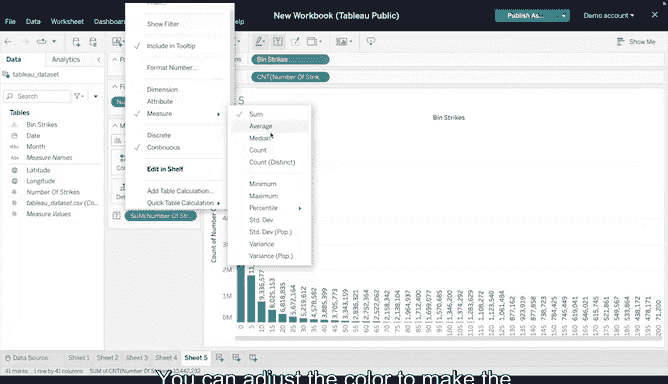

# 032：Tableau实操第二部分

在本节课中，我们将学习如何在Tableau Public中创建更复杂的数据可视化图表，包括热力图、箱线图和直方图。我们还将学习如何在可视化设计中输入计算和编写代码。

---

## 🗺️ 创建地理地图

上一节我们介绍了Tableau的基础操作。本节中，我们来看看如何利用经纬度数据创建地理地图。

首先，在Tableau Public中新建一个可视化，并上传NOAA闪电数据集。数据源页面包含日期、经度、纬度和闪电次数等列。

打开一个新的工作表以创建地理地图。这需要Tableau能用来绘制点的经纬度数据。

1.  将“经度”从数据列表拖拽到“列”字段区域。
2.  将“纬度”拖拽到“行”字段区域。

现在，我们得到了一张基础地图。接下来，过滤数据以减少需要处理的数据点。

1.  将“日期”拖拽到“筛选器”区域，并从下拉菜单中选择“年”。
2.  配置筛选器，仅选择2018年。

然后，使用颜色渐变来帮助区分地图上闪电密集区域和分散区域。

1.  将“闪电次数”拖拽到“标记”卡下的“颜色”框中。
2.  在“标记”卡的下拉菜单中，确保“密度”被选中。

此时地图效果更佳。默认颜色是蓝色，浅蓝色表示闪电较分散，深蓝色表示2018年闪电较密集的区域。要更改颜色，点击颜色方块，将其从“自动”更改为其他选项。可以尝试一两种，并考虑哪种颜色方案对你和可能有视觉障碍的观看者来说最易读。

---

## 🔥 创建热力图

在之前的视频中我们讨论过，热力图是一种用两种颜色描绘实例或一组数值大小的数据可视化。

要在Tableau Public中创建热力图，你需要一个或多个维度或一两个度量来开始。

1.  将“日期”拖拽到“行”字段，并选择“年”。
2.  需要创建一个从日期字符串中提取月份的计算字段。在“日期”下拉菜单中，点击“创建”并选择“计算字段”。
3.  在弹出的窗口中，为计算字段命名，例如输入“月份”。
4.  使用`LEFT`函数从“日期”列的字符串中提取月份名称的前三个字母。公式为：`LEFT(DATENAME('month', [Date]), 3)`。点击“确定”。

现在，左侧数据列表中会出现一个新字段。

1.  将新建的“月份”字段拖拽到“列”字段区域。
2.  将“闪电次数”拖拽到“标记”卡下的“颜色”方块中。确保在“标记”卡下拉菜单中选中了“方形”。

现在你得到了一个热力图。与密度图类似，此热力图的默认颜色也是蓝色。你可以根据需要调整热力图的颜色范围。创建可视化时，请记住考虑可访问性。

---

## 📦 创建箱线图

从之前的视频中你会记得，箱线图是一种描绘数据四分位数内数值组的集中趋势、离散程度和偏态的数据可视化。

你已学过如何在Python中创建箱线图。要在Tableau Public中创建箱线图：

1.  首先将“日期”拖拽到“行”字段区域。
2.  然后将“闪电次数”拖拽到“列”字段区域，并选择“年”。
3.  如果Tableau没有默认显示箱线图，在“标记”卡的下拉菜单中选择“圆”，然后滚动到“智能显示”选项卡，选择“盒须图”。

目前看到的内容不多，只是一条细线数据点。然而，一旦你将“日期”拖拽到“标记”卡下的“详细信息”方块中，并选择“天”，箱线图就会完整地显示出来。

对于箱线图，大多数数据专家会为中位数和均值添加参考线或注释以便展示。当然，你也可以使用“标记”卡下的“颜色”和“大小”方块来更改此箱线图中圆的颜色和大小。

---

## 📊 创建直方图

我们要创建的最后一个复杂图表是直方图。直方图是一种近似表示数据集中数值分布情况的数据可视化。

要创建直方图，首先需要创建数据桶。“数据桶”是Tableau术语，指数据值可以被分组进去的自定义数据段。数据桶是直方图的重要组成部分，因为分组决定了数据如何被分割和比较。

对于闪电数据直方图，需要将闪电总次数分组到数据桶中。

1.  点击“闪电次数”的下拉箭头，选择“创建”，然后选择“数据桶”。
2.  可以为数据桶命名，然后确定其大小。如果选择大小为50，则每50次闪电会有一个数据桶，1到50之间的任何值都将包含在该桶中。
3.  由于有数百万个闪电次数值，你应该选择一个介于5到10之间的数字作为桶大小。这将更详细地显示数值的分布。

接下来：

1.  将新建的数据桶字段拖拽到“列”字段区域。
2.  将“闪电次数”拖拽到“行”字段区域。确保行中的“闪电次数”是计数（CNT）而不是求和或平均值，这表示每个数据桶的实际计数。
3.  为了获得更多细节，将“闪电次数”拖拽到“筛选器”区域，并将数值限制在1到200之间。
4.  将“闪电次数”拖拽到“标记”卡下的“标签”方块中。确保它设置为“计数”。

你可以调整颜色以使数据可视化更易于访问。

---

## 🎯 总结

本节课中，我们一起学习了在Tableau Public中创建四种复杂的数据可视化：地理地图、热力图、箱线图和直方图。我们掌握了如何利用数据字段、筛选器、颜色标记以及创建计算字段和数据桶来构建这些图表，并始终考虑了图表的可访问性。

接下来，你将学习如何创建一系列用于演示的数据可视化。我们下节课再见。