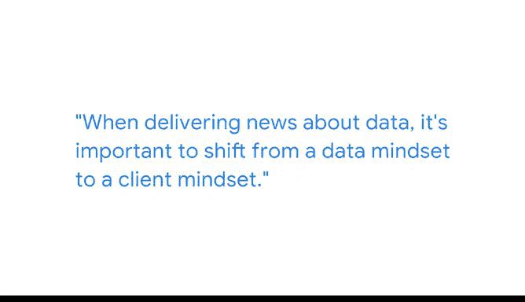

# 033：探索数据的可能性 🔍

在本节课中，我们将跟随谷歌预测建模专家德鲁，学习如何从理解数据开始，逐步深入分析，并最终将数据洞察有效地传达给客户。课程将涵盖探索性数据分析的重要性、从数据思维到客户思维的转变，以及有效沟通数据洞察的策略。

---

## 从会计师到数据分析师：我的旅程

上一节我们介绍了课程概述，本节中我们来听听德鲁的个人经历。德鲁最初学习并从事了约七年的会计工作。在金融领域工作的人通常非常擅长使用Excel，德鲁也不例外。他不断提升自己的Excel技能，并开始接触各种公式。对公式的深入探索引导他走向了编程，而编程又将他引向了数据分析领域。

## 探索性数据分析：一切的基础

在掌握了基本工具后，数据分析的第一步至关重要。探索性数据分析是数据科学的一切基础。在不首先理解数据的情况下，你无法进行任何分析。

以下是进行探索性数据分析的关键步骤：
*   首先，你需要深入数据，真正理解每一个变量是什么。
*   其次，观察数据的分布情况。
*   然后，查看初步的相关性。

在完成这些基础工作后，你可以开始进行更深入的分析，例如建立解释性模型，以研究更长期的相关性以及多个变量之间的多重相关性。

## 案例研究：洞察的价值

理解了数据分析的基础后，我们通过一个实际案例来看看洞察如何产生价值。德鲁记得一个与客户合作的项目，该客户在“独占媒体”上投入了大量资金。这种媒体形式需要巨额投资，其效果是在一天内屏蔽所有其他竞争对手的媒体曝光，让用户注意力集中在该客户身上。

然而，分析发现，“独占媒体”的投入与最终的转化率之间并没有明显的反应关系。因此，团队需要向客户传达这个发现。他们的做法是，首先找出客户可能提出的所有潜在反对意见。在获得这些输入后，团队构建了一个叙事方式。这个叙事不是简单地否定客户当前的做法，而是具有建设性的，并为客户指明了前进的方向。

## 传达数据洞察：从数据思维到客户思维

从上述案例可以看出，仅仅有分析结果是不够的。在传达数据相关的信息时，从数据思维转向客户思维至关重要。你需要将数据分析中学到的见解，与客户实际能如何运用这些见解结合起来。

以下是一些有效的沟通策略：
*   **使用可视化**：我们大量使用视觉化工具，尝试融入那些既简洁又能有效传达信息的图表。
*   **运用幽默**：幽默是吸引人的好方法，它能让信息更令人难忘。
*   **讲述个人故事**：个人故事能帮助你快速向他人传达观点。

德鲁的一位教授曾告诉他，你只有大约30秒的时间与人有效沟通，之后他们就会停止集中注意力。因此，你需要确保在这段时间内让他们记住关键信息，明确要点，并就如何利用你呈现给他们的数据，提出非常简洁的后续步骤。

---

本节课中，我们一起学习了数据分析的完整流程：从通过探索性数据分析理解数据本身，到深入分析发现洞察，最后关键的一步是站在客户的角度，运用可视化、幽默和个人故事等技巧，清晰、有建设性地传达这些洞察，并推动后续行动。记住，将数据转化为可行的洞察，才是分析的最终目的。