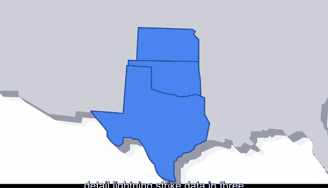
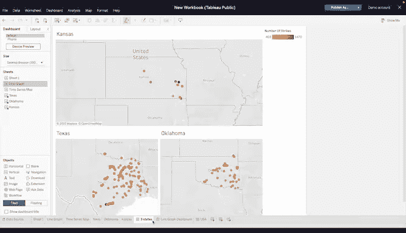
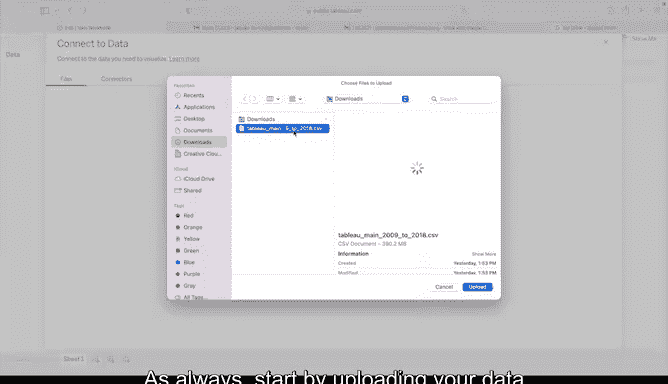
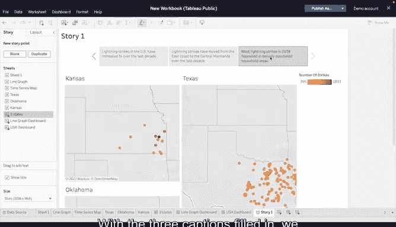

# 034：用Tableau打造引人入胜的故事 📊

在本节课中，我们将学习如何将一系列数据可视化图表组织起来，构建一个连贯、有说服力的数据故事。数据专业人员经常需要展示数据，而分享和讨论数据可视化是讲述数据故事的重要组成部分。

## 概述

通过本教程，你将创建一个系列的数据可视化图表，它们将共同讲述一个关于美国闪电活动的故事。这种方法能引导观众从一个概念过渡到下一个，并在展示每个图表时逐步构建背景信息。

首先，让我们设想一个场景。假设你为一家组织工作，该组织希望了解更多关于美国闪电活动的情况。他们要求提供一系列数据可视化图表，用以说明闪电活动随时间增加的趋势，并详细展示德克萨斯州、俄克拉荷马州和堪萨斯州三个州的闪电数据。

创建可视化图表后，你需要与组织的董事们分享。考虑到观众，你可以开始着手准备。你需要考虑在系列中组织和呈现数据可视化的三种策略。

## 组织数据可视化系列的三种策略

以下是组织和呈现数据可视化系列的三种核心策略。

*   **时间顺序法**：这种方法适用于最好以时间序列理解的数据。
*   **从一般到具体法**：这种方法帮助观众在了解问题如何影响他们之前，先考虑问题本身。
*   **从具体到一般法**：这种方法有助于强调数据在更广泛范围内可能产生的影响。

## 选择策略

让我们选择一种方法。时间顺序法或时间序列法对于考虑随时间变化的数据最有帮助。但这没有解决请求中的一个重要方面：可视化三个特定州的闪电数据。

采用从具体到一般法，演示的高潮将聚焦于整个美国，而不是德克萨斯州、俄克拉荷马州和堪萨斯州的闪电活动，这不符合组织的需求。

从一般到具体法可以让你先说明全国范围内闪电活动的增加，然后再展示每个州的具体数据。你可以先突出全国趋势，再聚焦于德克萨斯州、俄克拉荷马州和堪萨斯州的闪电数据。这符合组织的需求，因此从一般到具体法是最佳选择。

## 设计可视化图表

在开始设计可视化图表之前，你需要在Tableau Public中创建三个不同的工作表。这些工作表将在Tableau Public中构成一个故事。故事是Tableau中的一个术语，指一组组合成演示文稿的仪表板或工作表。

*   对于第一个工作表，你将创建一个折线图，显示从2009年开始闪电活动呈上升趋势。
*   对于第二个工作表，你将展示闪电活动最多的区域已从美国东海岸转移到中南部大陆。
*   对于第三个工作表，你将展示2018年德克萨斯州、俄克拉荷马州和堪萨斯州的闪电次数（这是有完整数据的最后一年）。

这三个工作表将构成故事从一般到具体的组织结构。

## 在Tableau Public中创建图表

让我们打开Tableau Public并开始设计。首先，一如既往地上传你的数据源。

### 创建折线图（全国趋势）

在第一个工作表中，我们将创建展示全国闪电活动趋势的折线图。

1.  对于“列”字段，拖入“日期”（这是一个离散维度），并为其选择“年”。
2.  对于“行”字段，将“闪电次数”度量添加到该字段。

此时应出现一个折线图。如果没有，请打开“显示我”选项卡并找到“线（离散）”选项。你会注意到这条线从2009年开始稳步上升。

接下来，我们将使数据可视化更易于解读。例如，为折线图添加两个注释。

1.  首先，在图表的起点添加“2009年：3010万次闪电”，为观众提供一个清晰的起点。
2.  然后，在相应位置添加“2018年：4500万次闪电”。

### 创建地理数据可视化（区域转移趋势）

现在，让我们创建一个地理数据可视化。由于我们希望从一般进展到具体，展示几十年来闪电活动向西移动的趋势非常重要。

为此，我们需要创建一个时间序列地图，显示自2009年以来美国每年闪电活动的位置。

1.  在新工作表中，将X坐标放入“列”字段，将Y坐标放入“行”字段。这将创建一个聚焦于美国东部和中部的映射图。如果你看到的仍然是折线图，请确保X和Y坐标都标记为连续。
2.  获得地理地图后，单击X和Y坐标的下拉菜单，选择“度量”，然后选择“平均值”。这将为我们提供美国每年平均闪电次数的可管理视图。
3.  接下来，将“日期”离散维度添加到“筛选器”和“页面”字段。为筛选方法选择“年”。“筛选器”字段允许我们创建一个动态筛选器，可用于选择仅一年的闪电数据。“页面”字段可以为每一年创建闪电活动的独特快照或页面。
4.  最后，将“闪电次数”添加到“详细信息”字段。

显示闪电活动位置的地图已经全面，我们只需要为其添加交互部分。将“年”维度放在“页面”和“筛选器”字段中，你可以在数据可视化旁边设置交互式图例，这些图例允许用户自行选择他们希望查看的年份。

### 创建州级数据快照（具体数据）

我们已经完成了演示所需的三个工作表的前两个。最后要创建的是三个中最具体的可视化：2018年德克萨斯州、俄克拉荷马州和堪萨斯州的闪电活动快照。

为此，我们将创建三个新的工作表，每个州一个。然后，我们将把三个快照放入一个仪表板中。我们将一起完成德克萨斯州的可视化，然后你可以独立创建俄克拉荷马州和堪萨斯州的可视化。

我们的德克萨斯州闪电活动地图的创建方式几乎与刚才制作的地理图表相同。

1.  将X坐标放入“列”字段，将Y坐标放入“行”字段。
2.  将“闪电次数”度量放入“详细信息”字段。
3.  这次，将“闪电次数”添加到“颜色”字段，并使颜色与闪电次数相对应。使用红色表示最多的闪电次数，黄色表示最少的闪电次数。
4.  由于我们将这些州快照限制在仅2018年，我们将“日期”拖入“筛选器”字段，选择“年”，然后取消选中除2018年以外的所有年份。
5.  最后，我们需要在Tableau Public中创建一个集。集是Tableau中的一个术语，指根据自定义条件从更大数据集中创建的自定义数据字段。

我们可以通过首先选择德克萨斯州的所有数据点来创建一个集。为此，我们将使用套索工具。你将尽可能沿着州界线围绕德克萨斯州画一圈。完成后，你会发现一个弹出窗口，选择“仅保留”，然后单击“创建集”。

将新创建的集拖到“筛选器”字段。现在，我们的地图上将只显示德克萨斯州的平均闪电活动。

## 组装故事

现在，我们可以将它们组装成一个故事。

1.  首先，添加另外两个州的工作表（俄克拉荷马州和堪萨斯州），它们以与德克萨斯州工作表相同的方式创建。
2.  然后，为这三个州创建一个仪表板，说明2018年美国闪电活动的位置。
3.  你还应该为之前创建的另外两个工作表创建仪表板：折线图和美国的交互式地图。

现在我们有了三个仪表板，我们可以在Tableau中创建一个故事。

1.  在故事的第一页，插入带有折线图的仪表板。填写标题，提供有关图表显示内容的详细信息。
2.  在故事的第二页和第三页，依次放入美国的交互式地图和包含所有三个州（德克萨斯州、俄克拉荷马州和堪萨斯州）的仪表板。

填写完三个标题后，我们就有了一个完整的故事。

## 总结

在本节课中，我们一起学习了如何运用“从一般到具体”的策略，在Tableau Public中构建一个连贯的数据故事。我们创建了三个层次的可视化图表：展示全国趋势的折线图、显示区域转移的交互式地图，以及聚焦于特定州的详细快照，并将它们组合成一个有逻辑、易于理解的演示故事。这种方法能有效地引导观众，逐步深入地理解数据背后的洞察。

接下来，你将学习如何在Tableau中创建交互式仪表板，我们很快再见。