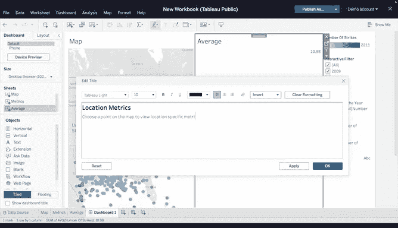

# 035：构建交互式仪表板


在本节课中，我们将学习如何将之前掌握的Tableau核心技能整合起来，创建一个功能完整的交互式仪表板。我们将以“2009年至2018年美国闪电雷击数据”为例，构建一个可以按年份和地理位置筛选、并动态展示关键指标的仪表板。

---

## 🗺️ 创建交互式闪电雷击地图

上一节我们介绍了数据准备，本节中我们来看看如何创建核心的可视化地图。

首先，打开Tableau Public并上传提供的数据源。要构建仪表板，你需要创建三个不同的工作表。

以下是创建第一个工作表——交互式地图的步骤：
1.  将 `X坐标` 和 `Y坐标` 分别拖入“列”和“行”功能区。
2.  将 `日期` 字段拖入“筛选器”区域，并选择“年”。确保勾选“显示筛选器”选项。
3.  将 `雷击次数` 字段同时拖入“标记”卡中的“颜色”和“详细信息”框。
    *   “颜色”框会根据雷击数量为地图上的点进行颜色编码。
    *   “详细信息”框将为每年的每次雷击绘制具体位置。
4.  确保两个 `雷击次数` 变量都设置为“连续”。

---

## 📈 创建动态年度指标表

地图展示了空间分布，本节中我们将创建一个能随年份动态更新的关键指标表。

这个工作表将不同于其他可视化图表，它以文本形式展示三个核心指标，而非条形图或折线图。它将位于交互式地图旁边，并在选择新年份时自动更新。

以下是创建动态指标表的步骤：
1.  在“数据”窗格的空白处右键，选择“创建计算字段”。
2.  在公式框中输入 `[雷击次数]` 并命名该字段。
3.  将这个新建的计算字段拖入“标记”卡的“工具提示”框中。
4.  在下拉菜单中，依次选择“度量”和“平均值”。重复此过程，但分别选择“总和”与“最大值”。这样就为三个指标创建了动态字段：**年度雷击总数**、**年度各地平均雷击数**和**年度单地最大雷击数**。
5.  最后，为清晰展示这些计算，转到“工作表”菜单并选择“显示标题”。输入标题“年度指标”。在标题下方，将这三个计算字段放入工具提示中。具体操作是，在编辑框中输入：
    ```
    * 总数：<SUM([雷击次数])>
    * 最大值：<MAX([雷击次数])>
    * 平均值：<AVG([雷击次数])>
    ```

---

## 🔍 创建位置详情视图

掌握了整体年度指标后，我们还需要一个视图来展示地图上单个地点的具体数据。

对于最后一个工作表，将 `雷击次数` 字段拖入“标记”卡的“文本”框中。在下拉菜单中，选择“度量”和“平均值”。这将为接下来要创建的仪表板生成一个动态字段。

---

## 🧩 整合工作表并创建交互式仪表板

现在，我们已经准备好了所有组件，本节将学习如何将它们组合成一个可交互的整体。

选择“新建仪表板”。你应该能在页面左侧的列表中找到所有已创建的工作表。
1.  首先，将包含交互式地图的工作表拖入仪表板，加载可能需要几秒钟。
2.  接着，将另外两个工作表也拖入仪表板。

在整理布局之前，我们需要为仪表板创建一个“操作”。操作是Tableau的一项工具，它允许用户通过控制选择来与可视化图表或仪表板进行交互。当从筛选器栏中选择一个年份时，所有其他字段都会随之更新。

我们将通过一个操作将三个工作表连接起来：
*   在仪表板中点击地图，选择“工作表”>“操作”。
*   在“操作”弹出窗口中，点击“添加操作”>“筛选器”。
*   在“添加筛选器操作”菜单的“源工作表”部分，从下拉列表中选择你的仪表板名称。
*   勾选你的地图工作表。
*   在“运行操作方式”下，点击“选择”。
*   在“目标工作表”部分，从下拉列表中选择你的仪表板。
*   然后从列表中选择地图工作表以及那个用于收集单个位置指标的最新完成的工作表。
*   在“清除选定内容将会”选项下，选择“显示所有值”。
*   最后，在“筛选器”部分选择“所有字段”，点击“确定”。

现在，你已经拥有了一个交互式仪表板。

在完成前，请更新文本和标题以增强可读性：
*   为筛选器图例添加标题：“交互式筛选器”。
*   为位置平均变量添加标题：“位置指标”。
*   编写简短的说明以阐明工具功能，例如：“**在地图上选择一个点以查看该位置的具体指标。**”

---

## ✅ 测试与总结



花几分钟测试你的仪表板，选择地图上不同的年份和位置，确保所有工具功能正常。

本节课中我们一起学习了如何将多个Tableau工作表整合成一个功能强大的交互式仪表板。我们掌握了创建动态地图、文本指标卡，并通过“操作”功能将它们连接起来以实现联动筛选的技巧。你在本视频中学到的这些工具和技术，将帮助你在未来的数据职业生涯中更有效地沟通和呈现想法。

祝你好运，设计愉快！😊