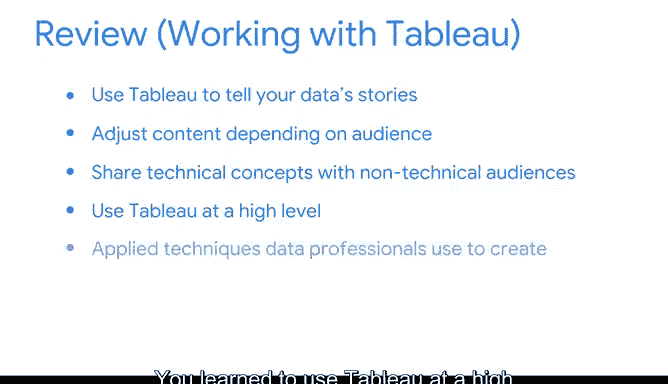

# 036：将数据转化为洞察》课程总结回顾 🎯

在本节课中，我们将回顾并总结整个课程的核心内容，梳理如何将数据转化为有效的洞察，并运用可视化工具进行清晰传达。

---

如果你要为你在本课程中学到的知识设计一个数据可视化图表，它会是什么样子？你会用折线图来绘制你随时间变化的参与度，还是会创建一个热力图，用不同颜色代表你完成的任务，以显示哪些任务耗时最少、哪些耗时最多？

无论你选择哪种可视化方式，你已经掌握了创建有效图表或可视化的技能，这些图表能让观众轻松理解。

上一节我们介绍了数据可视化的多种形式，本节中我们来看看如何将所学技能整合应用。

以下是你在本课程中掌握的核心技能：

*   **使用 Tableau Public 讲述数据故事**：你学会了使用 Tableau Public 这一强大工具，将数据转化为引人入胜的叙事。
*   **根据受众调整内容**：你掌握了根据不同的受众背景和需求，调整数据呈现内容和方式的关键技巧。
*   **与非技术受众沟通技术概念**：我们探讨了如何以最佳方式向非技术背景的听众解释复杂的技术概念和数据发现。
*   **高级 Tableau 应用**：你不仅学会了 Tableau 的基础操作，还将其应用提升到了高级水平。
*   **应用专业可视化技术**：你实践并应用了数据专业人士用来创建高效、专业可视化图表的常用技术和方法。

任何关于数据可视化的讨论，若缺少对伦理和可访问性的考量，都是不完整的。

以下是关于数据可视化伦理与可访问性的关键要点：

*   **确保数据准确性**：作为一名数据专业人士，你有责任确保可视化图表准确无误地代表底层数据，避免误导。
*   **提升可访问性**：你学习了如何让数据可视化对视觉障碍人士同样友好，例如通过使用适当的颜色对比、添加文字描述等方式。

---

本节课中我们一起学习了如何超越原始数字，将数据转化为深刻的洞察，并通过 Tableau 等工具创建出既专业又符合伦理、具备可访问性的可视化作品。恭喜你完成本阶段课程的学习，并祝你在接下来的旅程中一切顺利。