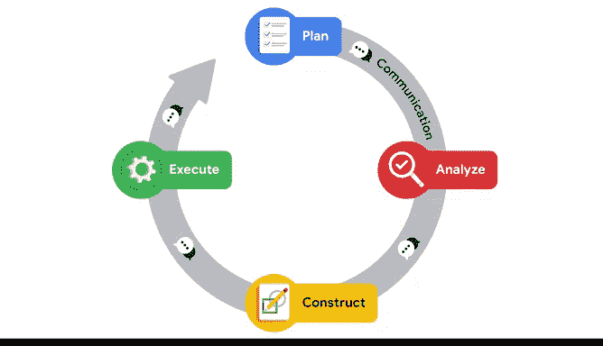

# 037：构建你的数据作品集 📁

在本节课中，我们将学习如何将课程中学到的技能整合到一个实际的作品集项目中。这个项目不仅能巩固你的数据分析能力，还能为未来的求职面试提供有力的展示材料。

---

大家好，我是Tiffany，很高兴再次与大家见面。你们在课程中已经取得了很大进展。

我回来是为了进一步介绍你们的作品集项目，以及如何在未来的求职中运用它们。请记住，你的作品集将是一系列材料的集合，用于展示你解决数据驱动问题的方法。在本课程的作品集项目中，你将展示运用数据讲述故事的知识。

对于数据专业人士而言，这是一项极其重要的职场技能。同时，它对于面试成功也至关重要。当潜在雇主评估你时，他们可能会要求你提供具体的例子，说明你过去是如何处理数据清洗、结构化和验证的。你可以利用作品集来讨论你解决过的实际数据挑战和呈现过的真实故事。

此外，一些雇主可能会要求你基于他们提供的数据集创建一个演示文稿。你在Python和Tableau中学习到的创建数据可视化的技能，将帮助你更从容、更有准备地应对这些面试，同时充实你的作品集。

---

上一节我们提到了作品集的重要性，本节中我们来看看如何通过实践来构建它。你已经了解了体验式学习，即人们通过实践来获得理解。观看讲师创建可视化是一回事，而自己动手创建可视化以扩展对概念的理解并提升向利益相关者展示的技能，则是另一回事。

这个作品集项目也是一个绝佳的机会，让你了解组织如何日常运用数据分析，并展示你讲述数据驱动故事的知识。

为了完成作品集项目，你将使用一个数据库和相应的业务场景。你需要按照指示完成一个Jupyter笔记本，展示你的探索性数据分析工作，并在Tableau中创建3到5个可视化图表来回应业务场景。完成这个项目后，你将获得一个全面的演示文稿，可以将其添加到你的数据专业人士作品集中。

在你的项目策略文档中，你还将记录所采取的步骤，这些记录可用于向未来的招聘经理解释你的工作。

---

你已经接近完成本课程，这意味着你对数据专业人士的职责理解正在加深。现在，是时候展示你所学到的东西了。这个作品集项目将帮助你练习并展示在整个课程中学到的技能。

以下是你在项目中将要实践的核心技能：

*   **展示Python中的探索性数据分析实践**：你将运用所学方法，系统地探索和理解数据。
*   **演示如何创建准确描述数据集故事的数据可视化**：你将使用Tableau等工具，将数据转化为直观、有说服力的图表。
*   **展示如何准备和记录全面的工作流程策略**：你将使用项目策略文档来规划和记录你的分析过程。

---

本节课中，我们一起学习了构建数据作品集的核心价值和具体方法。我们明确了作品集在求职中的关键作用，并概述了完成项目所需的步骤：从处理数据库和业务场景，到进行探索性数据分析和创建可视化，最终形成完整的演示文稿和项目文档。准备好运用你的Python和Tableau技能，开始这个令人兴奋的实践项目吧。