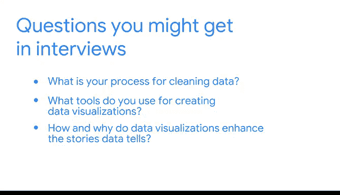

# 039：终期项目总结与职业发展建议

在本节课中，我们将总结你在数据分析项目中所完成的工作，并探讨如何将项目经验转化为职业优势，为未来的面试和职业发展做好准备。

---

## 项目成果回顾

到目前为止，你为深入理解数据及其如何推动业务变革付出了大量努力。

你完成了一个 Jupyter 笔记本，创建了可视化图表来支持你的分析，并优化了演示文稿以满足特定受众的需求。

随着你在课程中不断取得进展，请记住，记录你的学习过程与技能将有助于你在未来的面试中，向潜在雇主和招聘经理清晰地展示你的成果。

## 职业准备：沟通你的工作

你可能在本课程前面的章节中了解到，受众意识至关重要。

在面试过程中，懂得如何谈论你的工作流程、可迁移技能以及其他成就会极大地提升成功率。

在本课程中，你学习了遵循数据分析职业薪酬结构的重要性。

你练习了使用 Python 处理数据，并展示了如何组织和分析数据集，以讲述一个引人入胜的故事。

这些作品集项目旨在帮助你在就业市场上脱颖而出，而你所应用的可迁移技能则体现在你创造的具体成果中。

## 为面试问题做好准备

当你开始为未来的面试做准备时，你应该准备好回答以下类型的问题：

以下是面试中可能遇到的典型问题：

*   你清理数据的过程是怎样的？
*   你使用什么工具来创建数据可视化？
*   数据可视化如何以及为何能增强数据所讲述的故事？
*   在与非技术利益相关者分享数据故事时，首要考虑因素是什么？

当然，在应聘数据专业职位时，你可能还会被问到许多其他问题。

每一个作品集项目都将帮助你准备回答。例如，在你刚刚完成的作品集项目中，你使用了探索性数据分析流程来清理、组织和分析数据集。然后，你将数据转化为一个充满可视化的演示文稿，帮助利益相关者理解你从数据故事中发现的洞察。

别忘了，你还在你的薪酬策略文档中记录了你所有的考量、问题、流程笔记等内容。

## 后续学习展望

接下来，你将全面学习统计学在数据驱动工作中的强大力量。

然后，你将有机会运用统计分析来模拟一次 A/B 测试。

在这些课程结束时，你的作品集中将拥有丰富的成果。

---

**本节课总结**

本节课中，我们一起回顾了数据分析项目的核心产出，并学习了如何将这些实践经验系统化地整理和表达，以应对未来的职业挑战。我们强调了记录过程、提炼可迁移技能以及针对不同受众进行有效沟通的重要性，为你的职业发展奠定了坚实的基础。