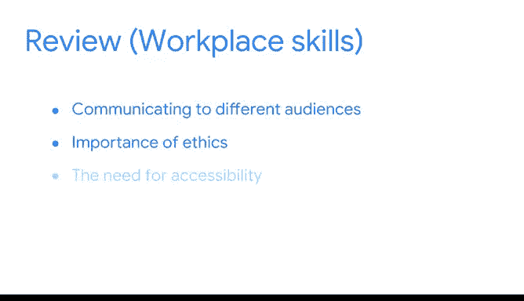

# 040：将数据转化为洞察》课程总结 🎯

在本节课中，我们将一起回顾整个课程的核心内容，总结探索性数据分析与数据可视化的关键实践与技能，并展望后续的学习路径。

---

还记得在本课程开始时，你将自己想象成一名考古学家吗？你站在古老的河床前，对岩石下可能发现的宝藏充满期待。你渴望揭开故事，揭示失落的谜团。学完本课程后，希望你在面对探索性数据分析和可视化时，能感受到与那位考古学家同样的兴奋。

正如你所学习的，探索性数据分析的六项实践有助于从数据集中发掘需要讲述的故事。在你的职业生涯中，当你进行数据发现、构建和清洗时，希望你带着决心挖掘数据，汇集重要发现，质疑自身视角，并对发现进行深入研究。此外，希望你记住另外三项实践：数据连接、验证和呈现，以完成你的探索性数据分析工作。

在本课程中，你有机会探索数据专业人士如何处理那些存在情节漏洞、令人困惑场景或缺失数据和异常值的故事。你还学习了如何使用**标签编码技术**将分类数据转换为数值数据。最后，你思考了如何设计可视化并以极具影响力的方式呈现数据。

你学习了可视化的高级概念，并开始使用 **Tableau**。在这些课程中，你学到了一些职场技能，例如针对不同受众进行沟通、道德的重要性、可访问性的必要性，以及遵循工作流程的重要性。这些技能将伴随你的整个职业生涯，从初级数据专业人士到高级数据专业人士，乃至更远。

---

在接下来的课程中，你将学习统计学、回归和机器学习中的一些核心概念。你在本课程中获得的知识，将为你学习后续课程以及你作为数据分析专业人士的职业生涯奠定基础。很高兴能指导你学习。探索性数据分析和数据可视化的实践是我所珍视的，我总是很兴奋能遇到学习这些原则的未来数据专业人士。

恭喜你完成本课程。你已经具备成为一名优秀的数据故事讲述者的潜质。愿你在探索和用数据讲述故事的过程中，始终充满兴奋与热情。😊