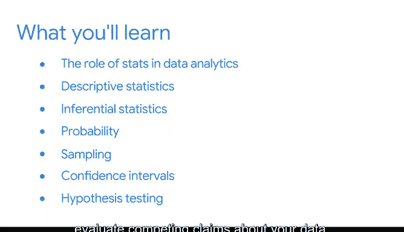

# 001：统计的力量 📊

## 概述

在本课程中，我们将学习统计学在高级数据分析中的核心作用。你将了解如何运用统计工具将数据转化为有用的知识，并学会使用描述性统计和推断性统计来总结数据、做出预测和辅助决策。

---

## 欢迎与回顾

欢迎进入高级数据分析学习之旅的下一阶段。首先，祝贺你取得的进展。你已经学习了数据专业人员如何为组织的成功做出贡献，以及他们在工作中使用的主要工具和技术。

你现在已经熟悉了Python编程语言的基本语法和功能，并且知道如何使用代码进行探索性数据分析。你可以使用数据整理来组织和清理数据，并创建数据可视化来分享重要信息。做得很好，你的分析工具箱里已经有不少工具了。

---

## 统计学的定义与重要性

接下来，我们将学习统计学。统计学是对数据的收集、分析和解释的研究。统计学（常缩写为stats）为数据专业人员提供了强大的工具和方法，用于将数据转化为有用的知识。

你已经了解了探索性数据分析及其如何帮助你总结数据的主要特征。描述性统计也能做到这一点，而这正是我们的起点。

但数据专业人员还使用统计学来做更多事情：基于可用数据的小样本，对不确定事件做出明智的预测，并对未知值做出准确的估计。这被称为推断性统计，你将在本课程中全面学习它。

例如，数据专业人员使用统计学来预测未来的销售收入、新广告活动的成功率、金融投资的回报率或新应用程序的下载量。统计分析可以告诉你哪个版本的网站能吸引更多新客户并让他们停留更长时间，或者新用户通常在公司的网站上花费三分钟后会创建账户。

从统计分析中获得的见解有助于企业领导者做出决策、解决复杂问题并改善产品和服务的性能。这就是为什么数据专业人员需求如此之高，以及数据职业领域不断增长的原因。

---

## 讲师介绍

说到数据专业人员，请允许我介绍一下自己。我叫Evan，是一名经济学家，我与谷歌的各个团队进行咨询合作。这意味着我使用统计学和其他工具来分析和解释数据，以帮助商业领袖做出明智的决策。这包括帮助他们量化不确定性，并确定是否有足够的证据来拒绝一个假设——这两点你稍后都会学到更多。我很高兴能成为你这门课程的讲师。

在开始之前，让我谈谈我自己学习统计学的经历。本科时我主修经济学和数学，然后继续攻读经济学博士学位。我专注于统计学和计量经济学（经济学的一个分支，使用统计学来分析经济问题）。在我的研究生学习期间，我曾在一家在线学习公司实习，并在一家在线零售公司担任研究员。在这些角色和经历中，我使用了许多不同的统计工具来解决问题。

我经常发现，我正在处理的问题可以用一种我不熟悉的统计方法来解决。我喜欢不断学习新方法，扩展我能处理的问题范围。这些高级方法建立在统计学概念的基础之上。在本课程中，我们将专注于这些基础知识，为你未来的职业生涯做好准备。

---

## 课程目标与结构

所以，如果你是统计学新手，欢迎你。本课程不假定你具备任何统计学先验知识。我们将从头开始，逐步讲解每个概念。

但如果你有一些统计学经验，那也很好。我们将帮助你以新的方式运用你已有的知识，使你能够将统计学知识具体应用到数据分析中。在本课程中，你将发现数据专业人员如何在日常工作中使用统计工具。

你还将学习解释发现并与利益相关者分享的策略，这些利益相关者可能不熟悉统计概念或所有技术细节。

以下是本课程的主要内容结构：

*   **统计在数据分析中的作用**：我们将从介绍统计在数据分析中的作用开始，并讨论描述性统计和推断性统计之间的区别。
*   **描述性统计**：你将学习描述性统计，如**均值**、**中位数**和**标准差**，如何帮助你快速总结并更好地理解数据。
*   **推断性统计**：然后，我们将探索如何使用推断性统计从数据中得出结论并进行预测。
*   **概率**：接下来，我们将探索概率，并发现衡量不确定性的有用方法。我们将讨论概率的基本规则，以及如何解释不同类型的概率分布，如**正态分布**、**二项分布**和**泊松分布**。
*   **抽样**：从那里，我们将转向抽样。我们将讨论什么是一个好的样本、不同抽样方法的优缺点，以及如何处理抽样分布。
*   **置信区间**：我们还将研究置信区间，它描述了估计中的不确定性。你将学习如何构建不同类型的置信区间并解释其含义。
*   **假设检验**：之后，我们将探索如何使用假设检验来比较和评估关于数据的相互竞争的主张。我们将介绍将不同检验应用于特定数据集的步骤，并演示如何解释检验结果。
*   **项目实践**：最后，你将有机会在你的下一个作品集项目中应用你的统计学知识。该作品集项目基于一个A/B测试场景，这是统计学的一个重要实际应用。在未来的工作面试中，你可以分享你的项目，作为你技能的展示，给潜在雇主留下深刻印象。

---

## 总结

我将全程指导你。请记住，你可以自己设定学习节奏，随时根据需要多次观看视频，并复习对你来说是新的主题。到课程结束时，你将拥有一个有用的统计学概念工具包，可以伴随你接下来的学习之旅和未来的职业生涯。

让我们开始吧。