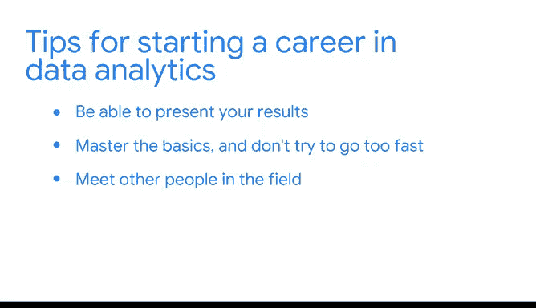

# 002：参与与连接 👨‍💼🤝

在本节课中，我们将跟随谷歌经济学家Evan的分享，了解数据分析师工作中至关重要的“参与”与“连接”技能。我们将学习如何将技术分析转化为商业价值，以及如何通过人际网络加速个人成长。

---

大家好，我是Evan，是谷歌的一名经济学家。高中时期，我的数学成绩不错，但对它并没有特别浓厚的兴趣。进入大学后，我选修了一门经济学课程，并开始对运用这个框架来观察世界和解决问题产生了极大的兴趣。

上一节我们了解了数据分析的基础，本节中我们来看看数据分析师在实际工作中如何发挥作用。

我的日常工作是与业务领导者合作，理解他们面临的问题，并协助他们构思解决方案。有时，这仅仅是就问题进行讨论和咨询，帮助他们找到出路；另一些时候，我会亲自从公司收集数据，进行分析，解决问题，并帮助他们识别那些能为决策提供信息、解决问题的有趣指标和结果。

此外，我每天也喜欢花时间研究我不熟悉的主题，进行自主学习，以确保我的技能不断增长，工具箱日益丰富。

---

在数据分析领域开启职业生涯时，一些软技能至关重要。以下是其中最关键的两项：

首先，是展示成果的能力。你可能花了大量功夫进行数据挖掘，试图寻找有价值的信息，并且可能确实有所发现。然而，能够清晰地将这些发现传达给那些并非你所研究领域的专家的人，实际上相当困难。

其次，是确保掌握基础知识，不要试图过快前进。如果遇到不理解的内容，就重新观看课程、阅读资料，务必打好基础，因为所有知识都是层层递进的。

---

如果我能给刚担任第一个数据分析角色的自己一些建议，那就是：花时间去结识该领域的其他人，与他们建立联系，并学习他们所知的一切。

我认为，这个领域的许多数据专业人士都积累了大量的知识，这些知识对于他们所在的公司、他们的特定角色、以及某些类型的问题都非常有用。这些知识存在于他们的脑海中，没有写在书里，也没有记录在手册中。

因此，你与人们交流得越多，结识的人越多，并与他们讨论你遇到的各种问题，你的成长和学习速度就会越快。你无需独自摸索、一点点解决问题，而是可以与其他人合作，他们能帮助你更快地解决这些问题，因为他们已经解决过类似问题并掌握了相关信息。

---

本节课中，我们一起学习了数据分析师工作中“参与”与“连接”的核心价值。我们了解到，将复杂分析转化为清晰的洞见、扎实掌握基础知识、以及积极构建专业网络，是推动职业成长和高效解决问题的关键。记住，数据分析不仅是技术，更是关于沟通、合作与持续学习。