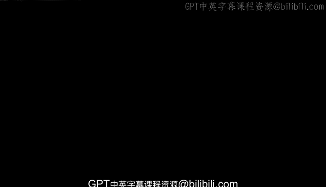
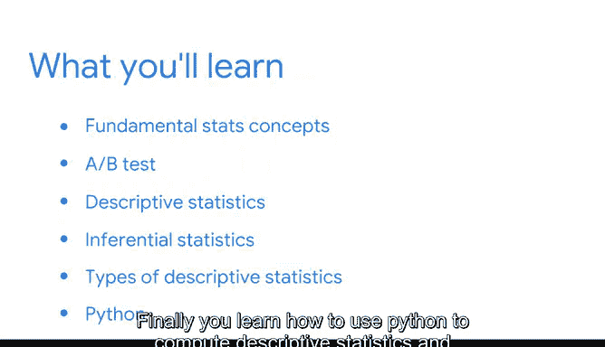

# 003：统计的力量 📊



## 概述

在本节课中，我们将要学习统计学的基本概念及其在数据分析中的核心作用。我们将探讨数据专业人员如何运用统计学从数据中获取洞见，并帮助组织解决复杂问题。课程将涵盖统计学的基础角色、描述性统计与推断性统计的区别，以及三种关键描述性统计量的应用。最后，我们将学习如何使用Python计算这些统计量。

---

## 统计学的定义与作用

统计学是研究数据收集、分析和解释的学科。它在数据驱动的工作中扮演着基础性角色。理解基本的统计学概念对于任何数据专业人员都至关重要。

上一节我们介绍了统计学的定义，本节中我们来看看统计学在实际工作中的具体应用。

---

## 统计学在实践中的应用：A/B测试

数据专业人员运用统计方法来执行A/B测试等任务。通过一个实际案例，我们可以观察到统计学如何帮助比较不同策略的效果，并基于数据做出决策。

---

## 统计学的两大类型

统计学主要分为两种类型：描述性统计和推断性统计。

以下是这两种类型的简要说明：

*   **描述性统计**：数据专业人员使用描述性统计来探索和总结数据。
*   **推断性统计**：数据专业人员使用推断性统计来得出结论并对数据进行预测。

了解了统计学的两大分支后，接下来我们深入探讨描述性统计中几种关键的度量方法。

---

## 三种描述性统计量

描述性统计可以帮助你更好地理解数据的各个方面。以下是三种重要的类型：

*   **集中趋势度量**：例如**均值（Mean）**，其公式为 `mean = sum(x) / n`，用于描述数据的中心位置。
*   **离散程度度量**：例如**标准差（Standard Deviation）**，其公式为 `std = sqrt( sum( (x - mean)^2 ) / (n-1) )`，用于描述数据的分散或波动情况。
*   **位置度量**：例如**百分位数（Percentiles）**，用于确定数据集中各值的相对位置。

---

## 使用Python计算描述性统计量

最后，你将学习如何使用Python编程语言来计算描述性统计量并总结数据。例如，使用Pandas库可以轻松计算均值、标准差等。

```python
import pandas as pd
# 假设df是一个DataFrame
mean_value = df['column_name'].mean()
std_value = df['column_name'].std()
```

---

## 总结



本节课中我们一起学习了统计学的核心定义及其在数据分析中的重要性。我们区分了描述性统计与推断性统计，并详细探讨了集中趋势、离散程度和位置度量这三种描述性统计量。最后，我们介绍了使用Python进行相关计算的基本方法。掌握这些基础概念是迈向更高级数据分析的关键一步。