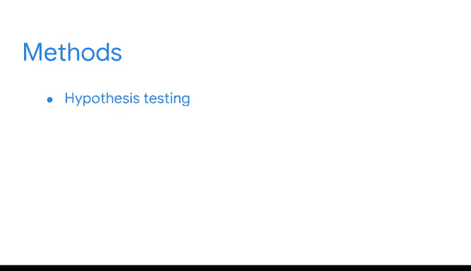

# 004：《统计的力量》- 统计学在数据科学中的角色 📊

在本节课中，我们将要学习统计学在数据科学中的核心作用，以及为什么掌握基础统计概念对每一位数据从业者都至关重要。

## 概述

之前我们了解到，统计学是研究数据的收集、分析和解释的学科。如今，人类生成和收集的数据量前所未有。当我们发送短信、在线购物或在社交媒体上发布照片时，我们都在生成新的数据。随着数据量的增长，分析和解释这些数据的需求也随之增加。这正是统计和数据驱动工作如此重要的主要原因，数据分析领域的发展速度几乎与数据本身的增长一样快。

数据从业者在商业、医学、科学、工程、政府等众多领域运用统计学来分析数据。本节视频将讨论统计学在数据科学中的角色，并解释为什么学习基础统计概念对每位数据从业者都必不可少。

## 统计学的日常应用与专业价值

数据从业者运用统计方法的力量来识别数据中有意义的模式和关系，分析和量化不确定性，从数据中生成见解，对未来做出明智的预测，并解决复杂问题。

即使你从未学习过统计学，你可能每天都在使用它。以下是几个常见的例子：

*   **天气预报**：当你看到“70%的降水概率”或“50%的降雪概率”时，这基于**概率**，即事件发生的可能性。
*   **体育数据**：你关注的板球运动员的击球率或篮球运动员的场均得分，这些数据表达了**平均值**。
*   **选举民调**：新闻报道中提及“3%的误差幅度”并说明数据是通过在线调查收集的，这里涉及**误差幅度**的概念。
*   **儿童体检**：医生告知你的孩子身高体重处于某个**百分位数**，并可能展示同年龄所有孩子的**中位数**身高和体重。

这些场景都包含了本课程中将深入学习的统计概念。所有这些统计数据都为你提供了可以应用于生活的有用知识。

## 统计学在数据科学工作中的具体应用

在专业工作中，数据从业者运用着相同的概念。例如：

*   数据专家可能使用**概率**来预测一项投资的未来回报率。
*   他们可能估算一家公司的年度**平均**销售收入。
*   他们可以计算**误差幅度**，以量化员工满意度调查的不确定性。
*   他们可能使用**百分位数**来对不同城市的房屋中位价进行排名。

在工作中，数据从业者利用统计学将数据转化为见解，帮助利益相关者做出决策。统计学是数据分析的基石，也是数据从业者所使用的最高级分析方法的基础。而这一切都始于我们正在本课程中探索的基础概念。

## 统计学：数据科学的通用语言

我们可以将统计学在数据科学中的作用，类比为语法在日常对话中的作用。当你与朋友或同事聊天时，你可能不会刻意思考词性等语法概念。如果你能进行对话，说明你已经知道如何使用名词、动词和形容词。对基础语法的了解使得使用语言成为可能，这正是其基础性所在。

同样地，对基础统计学的共同认知，使得数据从业者能够使用一种**通用语言**进行交流。学习这些基础知识最终将使你能够参与到关于更高级主题的对话中。

你将在统计学的这个基础上，构建更复杂的方法，例如：
*   **假设检验**
*   **分类**
*   **回归分析**
*   **时间序列分析**

## 总结

本节课中，我们一起学习了统计学在数据科学中的核心角色。我们了解到，统计学不仅是分析和解读海量数据的工具，更是数据从业者进行有效沟通和高级分析的共同语言。从日常生活中的概率、平均值，到专业领域中的误差幅度、百分位数，基础统计概念构成了我们从数据中提取价值、做出预测和解决复杂问题的起点。掌握这些基础知识，是迈向运用假设检验、回归分析等高级方法，并最终将数据转化为 actionable insights 的关键第一步。