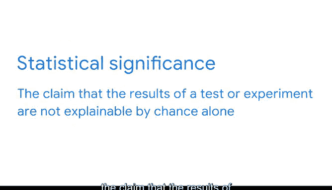

# 005：AB测试 📊

在本节课中，我们将学习统计学在商业中的一个核心应用——AB测试。我们将了解AB测试的基本概念、实施步骤，以及支撑其背后的关键统计学原理。通过一个在线商店的实例，你将看到如何利用数据驱动决策来优化产品性能。

---

## AB测试概述

当今经济以数据为核心。商业领袖希望基于证据和分析做出数据驱动的决策。利用从数据中获得的洞察来指导决策过程的公司，比不这样做的公司更可能成功。而数据专业人员正是生成这些洞察的人。他们运用统计学将数据转化为知识，并帮助利益相关者做出明智决策。本课程涵盖的所有基础统计概念都具有宝贵的实际应用价值。在本视频中，你将有机会看到统计学的实际应用。我们将探讨统计学在商业中最流行的应用之一：AB测试。

我将讨论你在本课程中学到的统计概念如何帮助你使用AB测试分析和解读数据。公司使用AB测试来评估从网站设计、移动应用程序、在线广告到营销邮件等方方面面。

---

## 什么是AB测试？🔍

AB测试是一种比较两个版本的事物以找出哪个版本表现更好的方法。

AB测试之所以流行，是因为它在许多在线应用中效果显著。例如，企业经常使用AB测试来比较网页的两个版本，以找出哪个版本能获得更多点击、购买或订阅。即使是对网页的微小改动，比如改变按钮的颜色、大小或位置，也可能增加财务收益。AB测试帮助商业领袖优化产品性能并改善客户体验。

公司使用AB测试的另一种方式是用于营销邮件。你可能会向客户列表发送两个版本的邮件，以找出哪个版本能带来更多销售额。或者，你可能会测试两个版本的在线广告，以发现访客更常点击哪一个。一旦你进行了AB测试，就可以利用数据对你的广告进行永久性更改。

---

## AB测试实例分步解析 🛒

让我们逐步解析一个AB测试的例子。

假设你经营一家在线商店，有10%的网站访客会进行购买。你想进行一次AB测试，以查明改变“加入购物车”按钮的大小是否会提高转化率（即购买产品的客户百分比）。

该测试向一组随机选择的用户展示你网页的两个版本，称为版本A和版本B。版本A是原始网页。版本B是带有更大“加入购物车”按钮的网页。测试将一半用户导向版本A，另一半导向版本B。测试运行两周。

测试结束后，对结果的统计分析表明，版本B中更大的按钮导致了购买量的增加。版本B的转化率为30%。这比版本A的10%转化率高出三倍。这是一个显著的提升。由于你的AB测试，你的公司有了一个数据驱动的理由，可以用版本B替换当前网页，并增大“加入购物车”按钮的尺寸。

---

## AB测试背后的统计学概念 📈

现在你了解了AB测试如何运作。让我们探索AB测试背后的统计概念。稍后我们将更详细地介绍每个概念。请将以下列表视为你未来统计知识的简要预览。

以下是支撑AB测试的几个核心统计学概念：

*   **样本与总体**：AB测试分析的是从访问网站的所有用户总体中抽取的一小部分用户。在统计学中，我们称这个较小的群体为**样本**。样本是更大总体的一个子集。你可以使用样本数据对整个人群进行**推断**或得出结论。数据专业人员使用**推断统计学**，基于数据样本对数据集进行推断。换句话说，统计学是一个强大的工具，可以利用已知数据预测未知结果。例如，你无法知道接下来的10万名网站访客会如何行为。但你可以观察接下来的100名访客，然后使用推断统计学来预测接下来的99,900名访客会如何行为。正如你将发现的，统计学可以帮助你准确地做出这个预测。这就是为什么通过AB测试观察样本对公司如此有价值。他们可以利用测试结果进行改进业务的变更。

*   **抽样**：从总体中选择数据子集的过程是AB测试的关键部分。在进行测试之前，你需要确定**样本量**，即测试中的用户数量。选择正确的样本量有助于你获得有效的测试结果并避免统计错误。例如，你将使用统计学来帮助你确定是需要使用1000还是10000的样本量才能准确预测客户行为。

*   **置信区间**：像任何统计测试一样，AB测试无法以100%的确定性预测用户行为。统计学能做的是构建一个**置信区间**，即描述估计值周围不确定性的一系列值。了解如何构建和解释置信区间可以帮助你基于测试样本对所有用户做出明智的决策。使用统计学，你可以量化AB测试的不确定性，并与利益相关者分享这些信息，以帮助他们解读结果。我们稍后将详细讨论如何解释置信区间。

*   **统计显著性**：测试完成后，你需要确定结果的**统计显著性**。统计显著性指的是这样一种主张：测试或实验的结果不能仅用偶然性来解释。例如，版本A和版本B之间的差异是由于随机机会，还是由于你更改了“加入购物车”按钮的事实？**假设检验**是一种统计方法，可以帮助你回答这个问题。该检验有助于量化结果是可能由于偶然性还是具有统计显著性。假设检验为你将网页更改为版本B或保持版本A不变提供了数据驱动的支持。

---

## 总结与展望 🚀

在本节课中，我们一起学习了AB测试的基本流程及其背后的核心统计学原理，包括样本与总体、抽样、置信区间和统计显著性。

软件可以帮助你计算复杂的数学问题，但对统计学的工作知识能让你正确地设计、实施和解读真实测试的结果。到本课程结束时，你将知道如何使用我们刚刚回顾的所有统计概念来分析和解读数据。事实上，你将能够在一个基于真实AB测试场景的作品集项目中运用你的统计技能。

此外，你的统计学知识将为你今后探索更高级的数据分析方法奠定基础。