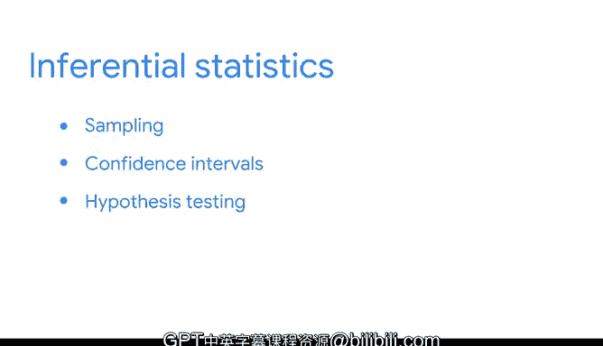

# 006：描述性统计与推断性统计 📊

在本节课中，我们将要学习统计学在数据科学中的两大支柱：**描述性统计**与**推断性统计**。我们将了解它们各自的作用、区别以及数据专业人员如何运用它们从数据中获得不同的洞见。

---

## 描述性统计 📈

上一节我们介绍了统计学的角色，本节中我们来看看第一种主要方法：描述性统计。描述性统计用于**描述**或**总结**数据集的主要特征。这种方法非常有用，因为它能让你快速理解大量数据。

例如，假设你拥有1000万人的身高数据。逐行扫描这些数据进行分析是不现实的，即使能做到，解读起来也极其困难。然而，如果你能对数据进行总结，就能立刻使其变得有意义。计算出身高的**均值**或**平均值**，就能为你提供关于数据的有效知识。阅读一个汇总值远比盯着数百万行数据高效。

描述性统计主要有两种常见形式：

以下是两种主要的描述性统计形式：

*   **可视化图表**：如图形和表格。你已学过图表如何帮助你探索、可视化和分享数据。常见的数据可视化形式包括直方图、散点图和箱线图。
*   **汇总统计量**：让你用一个单一的数字来总结数据。一个常见的例子就是**均值**。

汇总统计量又分为两大主要类型：

以下是两种主要的汇总统计量类型：

*   **集中趋势度量**：如**均值**，用于描述数据的中心位置。
    *   公式示例：`均值 = (所有数据值之和) / (数据个数)`
*   **离散程度度量**：如**标准差**，用于描述数据的**离散程度**或数据点之间的**变异量**。

像均值和标准差这样的统计量用于描述和总结数据，但数据专业人员的工作不止于此。

---

## 推断性统计 🔮

上一节我们学习了如何描述数据，本节中我们来看看如何从数据中得出结论和进行预测。为此，数据专业人员使用**推断性统计**。

推断性统计允许数据专业人员基于数据的**样本**，对**总体**数据集做出**推断**。样本所来源的数据集称为**总体**。总体包含了你感兴趣测量的所有可能元素。而**样本**是总体的一个子集。

数据专业人员使用样本来对总体进行推断。换句话说，他们利用从总体的一小部分收集到的数据，来得出关于整个总体的结论。

需要注意的是，统计总体可以指人、物体或事件。例如：
*   总体可以是某个国家的所有居民。
*   可以是太阳系中的所有行星。
*   也可以是1000次抛硬币的所有可能结果。

而样本则是这些总体中任意一个的较小群体或子集，例如部分居民、部分行星或部分抛硬币结果。

让我们看一个例子。假设你想研究美国所有大学生的音乐偏好，以了解他们是更喜欢流行、说唱、乡村、古典还是其他类型的音乐。美国大约有2000万大学生，从每个人那里收集数据成本太高且耗时太长。

相反，你可以使用一个**样本**，只调查这2000万学生中的一个子集。之后我们会讨论选择不同样本量的因素，以及更大的样本量如何影响结果。现在，假设你决定调查1000名学生，而不是2000万。然后，你就可以利用这个结果来推断所有大学生的音乐偏好。

请记住，你的样本应该能够**代表**你的总体。否则，你从样本中得出的结论将是不可靠的，并且可能存在**偏差**。一个**代表性样本**是能够准确反映总体特征的样本。例如，如果你只调查数学专业的学生或只调查学生运动员，那么你的样本就不能代表所有大学生。

---

## 参数与统计量 📝

最后，让我们回顾两个与总体和样本相对应的术语：**参数**和**统计量**。

*   **参数**是总体的一个特征。
*   **统计量**是样本的一个特征。

例如，整个长颈鹿种群的**平均身高**是一个**参数**。而随机抽取的10只长颈鹿的**平均身高**则是一个**统计量**。

正如前面提到的，收集关于大型总体中每个成员的数据是困难的（在这个例子中，要找到并测量世界上每一只长颈鹿的身高）。因此，我们使用已知的**样本统计量**值（例如100只长颈鹿的平均身高）来估计未知的**总体参数**值。

---

## 总结 ✨

本节课中我们一起学习了：

1.  **描述性统计**：用于总结和描述数据的主要特征，包括可视化图表和汇总统计量（如均值和标准差）。
2.  **推断性统计**：用于基于样本数据对总体做出推断和预测。
3.  核心概念：**总体**（所有感兴趣的元素）、**样本**（总体的子集）、**参数**（总体特征）和**统计量**（样本特征）。
4.  使用样本进行推断的关键是确保样本对总体具有**代表性**。

我们涵盖了许多关键概念，这些是后续课程学习的基础。接下来，我们将回到推断性统计的主题，更详细地探讨**抽样**，并了解常见的推断性统计方法，如**置信区间**和**假设检验**。