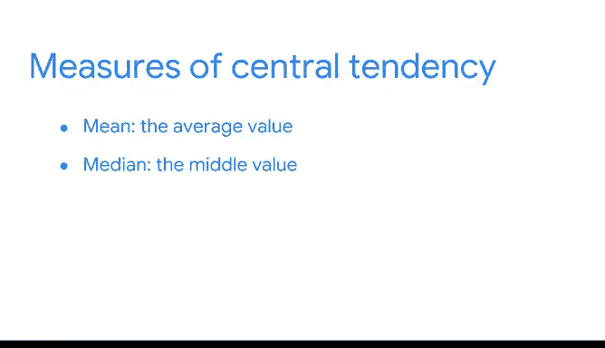

# 007：集中趋势度量 📊

在本节课中，我们将要学习如何描述数据集的“中心”。我们将介绍三种核心的集中趋势度量方法：均值、中位数和众数。理解这些概念能帮助你快速把握数据的整体结构，就像初到一座城市，先找到市中心能帮你更好地规划行程一样。

## 探索数据集的中心 🧭

每次探索一个新的数据集，都像第一次探索一座城市。在城市中，我们通常会从市中心开始旅程，以此了解自己与城市边界或地标之间的距离和方位。同理，在数据分析中，我们首先需要知道数据集的“中心”在哪里，然后了解其他数值是如何围绕这个中心分布的。测量数据集的中心和离散程度，能帮助我们快速理解其整体结构，并决定后续需要深入探索的部分。

之前的学习中，你已经了解到描述性统计包括集中趋势度量和离散程度度量。集中趋势度量是代表数据集中心的值，而离散程度度量则代表数据集的分散情况。本节课，我们将重点学习如何计算三种集中趋势度量：均值、中位数和众数。你可能在之前的课程中对这些术语有所了解，但我们将在此深入探讨它们在统计学和数据分析中的重要性，并讨论如何根据具体数据选择最合适的度量方法。

## 计算均值：数据的平均值 ➗

让我们从均值开始。均值是数据集中所有数值的平均值。

以下是计算均值的步骤：
1.  将数据集中的所有数值相加，得到总和。
2.  用总和除以数据集中数值的总个数。

例如，假设你有以下一组数值：`10, 8, 5, 7, 70`。
*   首先，将所有数值相加：`10 + 8 + 5 + 7 + 70 = 100`。
*   然后，用总和除以数值个数（5）：`100 / 5 = 20`。
*   因此，这组数据的均值或平均值是 **20**。

用公式表示，均值的计算为：
`均值 = (所有数值之和) / (数值个数)`

## 寻找中位数：数据的中间值 📏

接下来，我们看看中位数。中位数是数据集中的中间值，这意味着数据集中有一半的数值比它大，另一半比它小。

以下是寻找中位数的步骤：
1.  将数据集中的所有数值从小到大排列。
2.  如果数值个数是奇数，则中位数就是排序后位于正中间的那个数。
3.  如果数值个数是偶数，则中位数是排序后中间两个数的平均值。

以前面的数据集 `10, 8, 5, 7, 70` 为例：
*   首先，将其从小到大排列：`5, 7, 8, 10, 70`。
*   数值个数为5（奇数），正中间的值是第三个数值 **8**。因此，中位数是 **8**。

如果我们添加一个数值 `4`，数据集变为 `10, 8, 5, 7, 70, 4`：
*   排序后为：`4, 5, 7, 8, 10, 70`。
*   数值个数为6（偶数），中间的两个值是 `7` 和 `8`。
*   中位数是它们的平均值：`(7 + 8) / 2 = 7.5`。

你可能已经注意到，在我们最初的例子中，均值（20）远大于中位数（8）。这是因为数据中存在一个极端值 `70`，它显著拉高了整体平均值。这种与其他数据差异极大的值被称为**离群值**。

## 均值与中位数的选择 🤔

作为集中趋势的度量，均值和中位数适用于不同类型的数据。
*   如果数据集中存在**离群值**，**中位数**通常是衡量中心更好的指标，因为它不受极端值影响。
*   如果数据集中**没有离群值**，**均值**通常能很好地代表数据的中心。

例如，假设你想在某个社区买房，并查看了10套房子的价格来了解均价。前9套房子的价格都是10万美元，但第10套房子的价格高达100万美元（这是一个离群值）。计算均值时，总价190万美元除以10，得到平均价格为19万美元。这个均值并不能很好地代表该社区的典型房价，因为实际上10套房子中只有1套超过10万美元。而中位数价格是10万美元，它能给你一个关于该社区典型房价的更好概念。

因此，选择使用均值还是中位数，取决于你正在处理的具体数据集以及你希望从数据中获得何种洞察。

## 确定众数：最常见的值 📈

最后，我们来看众数。众数是数据集中出现频率最高的值。一个数据集可能没有众数、有一个众数或有多个众数。

以下是几个例子：
*   数据集 `1, 2, 3, 4, 5` 没有众数，因为没有重复的值。
*   数据集 `1, 3, 3, 5, 7` 的众数是 **3**，因为3是唯一出现超过一次的值。
*   数据集 `1, 2, 2, 4, 4` 有两个众数：**2** 和 **4**。

众数在处理**分类数据**时特别有用，因为它能清晰地显示哪个类别出现得最频繁。例如，一家在线零售公司进行客户满意度调查，选项为“差”、“一般”、“好”、“很好”。用条形图汇总结果后，最高的条形对应的评分（比如“差”）就是众数。这为公司提供了关于客户满意度的清晰反馈。

## 课程总结 🎯

本节课中，我们一起学习了三种衡量数据集中心的方法：
*   **均值**通过计算平均值来寻找中心。
*   **中位数**通过寻找中间值来定位中心。
*   **众数**通过识别出现频率最高的值来确定中心。

了解数据集的中心，就像了解一座城市的市中心一样，能帮助你快速把握其基本结构，并为后续的分析步骤指明方向。根据数据中是否存在离群值以及数据的类型（数值型或分类型），你可以选择最合适的度量方法来获得有价值的洞察。