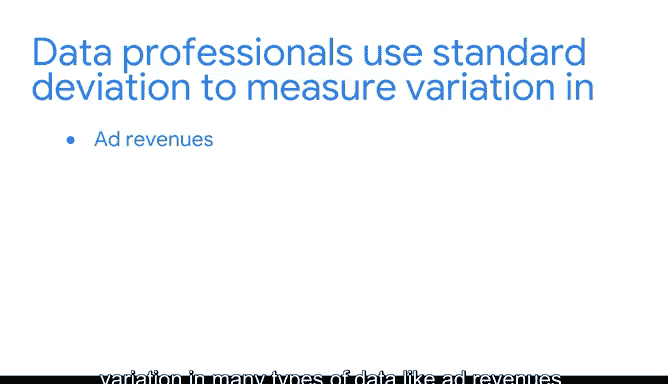

# 008：离散程度度量 📊

在本节课中，我们将要学习如何衡量数据集中数值的离散程度或变异性。了解数据的中心位置固然重要，但掌握数据围绕中心点的分散情况，才能获得对数据的完整认知。

上一节我们介绍了中心趋势的度量，如均值、中位数和众数。本节中我们来看看如何度量数据的离散程度。

## 为什么需要度量离散程度？🤔

即使数据集的中心值相同，其变异性也可能大不相同。例如，有三个小数据集，每个数据集有三个值，总和都是90，因此均值都是30（`90 / 3 = 30`）。然而，数值围绕均值的分布却截然不同：
*   第一个数据集的值（25, 30, 35）都接近均值30。
*   第三个数据集的值（5, 10, 75）则比均值分散得多。

因此，我们需要离散程度度量来量化这种差异。

## 主要的离散程度度量 📏

以下是两种关键的离散程度度量方法。

### 1. 极差

极差是数据集中最大值与最小值之间的差值。它计算简单，能快速反映数据的整体跨度。

**示例**：假设有哥斯达黎加中央谷地过去一周的每日华氏温度数据，最高温度为77度，最低温度为67度。那么极差就是 `77 - 67 = 10`度。

### 2. 标准差

标准差衡量的是数据值相对于数据集均值的分散程度。它计算的是数据点到均值的典型距离。标准差越大，数值相对于均值就越分散。

另一个相关的度量是**方差**，它是每个数据点与均值之差的平方的平均值。本质上，方差是标准差的平方。我们将在后续课程中更详细地学习方差。

为了更直观地理解离散程度，我们可以观察三个正态概率分布图。每个曲线的最高点（中心）代表均值。蓝色曲线的标准差为1，绿色为2，红色为3。蓝色曲线离散程度最小，数据点大多靠近均值，因此标准差最小。红色曲线离散程度最大，数据点离均值更远，因此标准差最大。

## 如何计算标准差？🧮

现在，让我们来探讨如何计算这些数字。

以下是**样本**标准差的计算公式：

`s = sqrt( Σ (x_i - x̄)^2 / (n - 1) )`

*   `s`：样本标准差
*   `Σ`：求和符号
*   `x_i`：数据集中的每个值
*   `x̄`：样本均值
*   `n`：样本中的数据点个数

对于初学者，这个公式可能看起来复杂。但请放心，我们将逐步解析。作为数据专业人士，你通常会用计算机进行计算。理解计算背后的概念，比死记硬背公式更重要，这能帮助你将来将统计方法应用于实际问题。

> **注意**：计算总体和样本的标准差使用不同的公式。数据专业人士通常处理样本数据，并基于样本对总体进行推断，因此我们这里回顾的是样本公式。

让我们通过计算一个小数据集 `[8, 10, 12]` 的标准差来理解这个公式。计算分为五个步骤：

1.  **求均值**：`(8 + 10 + 12) / 3 = 10`
2.  **求每个值与均值的差，并平方**：
    *   `(8 - 10)^2 = 4`
    *   `(10 - 10)^2 = 0`
    *   `(12 - 10)^2 = 4`
3.  **求平方差之和**：`4 + 0 + 4 = 8`
4.  **除以 (n - 1)**：`n = 3`，所以 `8 / (3 - 1) = 8 / 2 = 4`
5.  **取平方根**：`sqrt(4) = 2`

因此，该数据集的标准差为 **2**。

## 标准差的实际应用 🌤️

标准差在日常生活中的应用非常广泛。例如，气象学家使用标准差进行天气预报，以了解不同地区每日温度的变化情况，从而做出更准确的预测。

想象两位气象学家分别在A市和B市工作。在三月期间：
*   A市：平均温度66°F，标准差3°F。
*   B市：平均温度64°F，标准差16°F。

两个城市的平均温度相似，但B市的标准差要大得多。这意味着B市的每日温度变化更大，天气可能日间差异巨大。而在A市，天气则更为稳定。如果B市的气象学家仅依据均值预测天气，其预测误差可能高达16度。标准差为气象学家提供了一个衡量变异性的有用工具，并有助于确定其预测的可信度。

数据专业人士同样使用标准差来衡量广告收入、股票价格、员工薪资等多种类型数据的变异性。

## 总结 📝

本节课中我们一起学习了度量数据离散程度的核心概念。我们了解到，极差提供了数据范围的快速概览，而标准差则能更细致地描述数据点相对于均值的典型分散情况。掌握这些度量方法，结合上一节的中心趋势度量，我们就能对数据集形成更全面、更深入的理解。

接下来，我们将讨论一些理解数据集中数值相对位置的方法。