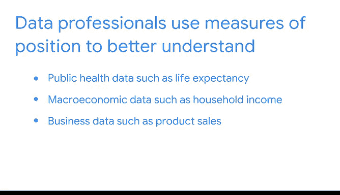

# 009：位置度量 📊

在本节课中，我们将要学习描述性统计中的**位置度量**。位置度量帮助我们理解数据集中某个值相对于其他值的位置，例如它是处于较高、较低还是中间水平。我们将重点介绍百分位数、四分位数、四分位距以及五数概括法。

---

## 描述性统计回顾

上一节我们介绍了描述数据中心趋势（如均值、中位数）和离散程度（如标准差）的工具。这些工具能帮助我们探索和理解数据集。

本节中，我们来看看**位置度量**。位置度量用于确定一个值在数据集中相对于其他值的位置。了解数据的位置，有助于我们判断某个值是高于还是低于其他值，或者它是否落在数据的下、中、上部分。

在城市中，这类似于了解不同兴趣点之间的相对位置。例如，知道艺术博物馆离城市公园有多远，或者你想去的著名餐厅是否靠近你想参观的历史古迹，都是很有用的。

---

## 百分位数 📈

**百分位数**是指低于该值的数据所占的百分比。它显示了数据集中某个特定值的相对位置或排名。

一些大学要求申请者参加标准化考试。例如，在美国，SAT和ACT是常见的考试。当学生收到考试成绩时，通常也会收到相应的百分位数。

例如，假设一个考试成绩落在第99百分位数。这意味着该分数高于99%的所有考试成绩。如果分数落在第75百分位数，则该分数高于75%的所有考试成绩。如果分数落在第50百分位数，则该分数高于一半或50%的所有考试成绩，依此类推。

百分位数对于比较不同量纲的值非常有用。例如，不同的考试可能有不同的评分系统：SAT分数范围是400到1600，ACT分数范围是1到36，而典型的学校数学或历史考试分数范围可能是0到100。

如果你只知道每个考试的原始分数，比如SAT 1000分，ACT 20分，学校考试70分，你无法进行有意义的比较。但如果你知道这三个考试成绩都落在第50百分位数，那么你就可以有意义地比较学生在不同考试中的表现了。

---

## 四分位数 🔢

你可以使用**四分位数**来大致了解值的相对位置。四分位数将数据集中的值分成四个相等的部分。

四分位数让你可以比较相对于数据四个部分的值。每个部分包含数据集中25%的值。

以下是四分位数的定义：
*   **第一四分位数（Q1）**：也称为下四分位数，是数据前半部分的中间值。**25%** 的数据点低于Q1，**75%** 高于它。
*   **第二四分位数（Q2）**：数据集的**中位数**。**50%** 的数据点低于Q2，**50%** 高于它。
*   **第三四分位数（Q3）**：数据后半部分的中间值。**75%** 的数据点低于Q3，**25%** 高于它。

请注意四分位数与百分位数之间的关系：Q1对应第25百分位数，Q2对应第50百分位数，Q3对应第75百分位数。

---

### 计算四分位数：一个例子

假设你是一支运动队的经理。你拥有显示每个球员在整个赛季中进球数的数据。你想根据进球数比较每个球员的表现。

以下是计算数据四分位数的步骤：

**第一步**：将值从小到大排列。
`[11, 12, 14, 18, 22, 23, 27, 33]`

**第二步**：找到数据集的中位数。这是第二四分位数Q2。
由于数据集中有偶数个值，中位数是两个中间值（18和22）的平均值。
`Q2 = (18 + 22) / 2 = 20`

**第三步**：找到数据集下半部分的中位数。这是下四分位数Q1。
下半部分数据：`[11, 12, 14, 18]`
`Q1 = (12 + 14) / 2 = 13`

**第四步**：找到数据集上半部分的中位数。这是上四分位数Q3。
上半部分数据：`[22, 23, 27, 33]`
`Q3 = (23 + 27) / 2 = 25`

将数据分成四分位数可以让你清楚地了解球员的表现。你现在知道，下四分位数的球员进了13个或更少的球，而上四分位数的球员进了25个或更多的球。换句话说，**下25%** 的球员进了13个或更少的球，而**上25%** 的球员进了25个或更多的球。**中间50%** 的球员进球数在13到25之间。

---

## 四分位距 📏

数据的中间50%被称为**四分位距**。四分位距是第一四分位数Q1和第三四分位数Q3之间的距离。

从技术上讲，IQR是一种离散程度的度量，因为它衡量的是数据中间一半（即中间50%）的 spread。

这等同于第25百分位数和第75百分位数之间的距离，也就是Q1和Q3之间的距离。IQR对于确定数据值的相对位置也很有用。

**公式**：`IQR = Q3 - Q1`

在这个例子中，`Q3 = 25`，`Q1 = 13`，所以 `IQR = 25 - 13 = 12`。

---

## 五数概括法 📋

最后，你可以用**五数概括法**来总结数据集中的度量划分。这五个数字包括：**最小值**、**第一四分位数**、**中位数（第二四分位数）**、**第三四分位数**和**最大值**。

对于你的运动数据，五数概括法是：`[11, 13, 20, 25, 33]`。

五数概括法很有用，因为它让你从极值到中心对数据的分布有一个整体的了解。你可以用**箱线图**将其可视化。

*   箱线图的“箱体”部分从第一四分位数延伸到第三四分位数。
*   箱体中间的垂直线是中位数。
*   箱体两侧的水平线（称为“须”）从第一四分位数延伸到最小值，以及从第三四分位数延伸到最大值。

下面的箱线图显示了进球数据。我们可以在箱线图上找到这些值并确定四分位距：
*   Q1（下四分位数）= 13
*   Q3（上四分位数）= 25
*   四分位距是箱体的长度：`25 - 13 = 12`

---

## 总结

本节课中我们一起学习了描述性统计中的**位置度量**。我们介绍了：
*   **百分位数**：用于确定一个值在数据集中的相对排名。
*   **四分位数**：将数据分为四等份，帮助我们理解数据的分布结构。
*   **四分位距**：衡量数据中间50%的离散程度。
*   **五数概括法**：通过最小值、Q1、中位数、Q3和最大值来全面描述数据分布。

数据专业人员使用位置度量（如百分位数和四分位数）来更好地理解各种数据，这可能包括公共卫生数据（如预期寿命）、经济数据（如家庭收入）、商业数据（如产品销售额）等等。

接下来，你将使用Python来计算描述性统计量并总结数据集。