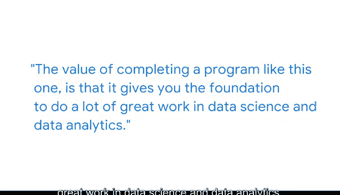

# 010：《统计的力量》- 统计学作为数据驱动解决方案的基础 📊

## 概述

在本节课中，我们将跟随谷歌云的数据科学开发者倡导者Alok，探讨统计学在数据科学领域的核心地位。我们将了解统计学如何结合数学与数据应用，为数据驱动型决策提供坚实基础，并通过一个真实案例展示统计学在解决实际问题、影响决策过程中的强大作用。

---

## 统计学：数学与数据的结合

我是Alok，在谷歌云担任数据科学开发者倡导者。我的主要工作是向开发者介绍如何使用谷歌云。

我认为，**统计学是数学与数据应用的结合**。对于数据专业人士而言，学习统计学至关重要。因为它能为你将要应用的各种技术背后的数学原理打下良好基础，并为你提供如何将这些数学知识应用于不同问题的广泛信息。

> 上一节我们明确了统计学的定义，接下来我们看看它在实际工作中的价值。

## 统计学在实践中的核心作用

我在谷歌的第一份工作，是在搜索广告团队担任数据科学家。我们**持续使用统计方法来生成洞察，从而为决策提供信息**。事实上，这基本上是这项工作的核心。

> 统计学工具如何具体解决难题呢？以下通过一个案例来说明。

## 案例研究：用统计学解释群体差异

有一次，统计学帮助影响了决策者的判断。这个项目涉及两个群体，我们称其为A组和B组。我们观察到这两个群体在某个特定指标上的行为存在很大差异。

高管们很担心：为什么它们会不同？也许差异不应该这么大。此时，统计方法至关重要。

我们不得不针对多种因素进行调整，例如：

*   **用户构成**：审视数据的不同切片。
*   **置信区间**：为我们观察到的平均差异添加置信区间。

我们发现，差异并没有我们最初看到的那么大，并且可以归因于其他因素，比如我们用户群体的构成等。

我们将这个结果呈现给高管，他们因此感到宽慰，因为差异并不大，也无需采取特定措施来改变A组和B组之间的动态。这个差异在他们看来处于合理的范围内。

> 这个案例展示了统计学的分解能力。下面我们来总结其核心价值。

## 统计学的价值与学习建议

核心理念是：**统计学为你提供一套工具**。在上述案例中，它给了我一套工具，将这个问题分解成多个部分，并开始解释我们为何会观察到这些差异。

完成像本课程这样的项目，其价值在于它能为你从事数据科学和数据分析的卓越工作奠定基础。学习一些数据课程并获得一些项目经验，能让你很好地准备去分析数据并产生影响。

无论你最终在哪个行业工作，对于正在学习过程中、或许感到挣扎的人，我能给出的最好建议是：**牢记你的最终目标**。无论是学习一项新技能，还是开启一条全新的职业道路，这都能真正成为你的优势。

尝试一步一步来。如果你稍微落后了，原谅自己，只需牢记最终目标。那就是你想要到达的地方。

---

## 总结

本节课中，我们一起学习了：
1.  **统计学的本质**：它是数学理论与数据实践应用的桥梁。
2.  **统计学的实践核心**：为数据驱动的决策提供持续、可靠的洞察。
3.  **统计学的分析能力**：通过工具（如调整**混合因素**、计算**置信区间**）将复杂问题分解，揭示数据差异背后的真实原因。
4.  **统计学的基础价值**：是从事数据科学和数据分析工作的基石。
5.  **学习心态**：面对挑战时，应循序渐进并始终聚焦最终目标。

掌握统计学，意味着你掌握了从数据中提炼真相、驱动明智决策的关键能力。