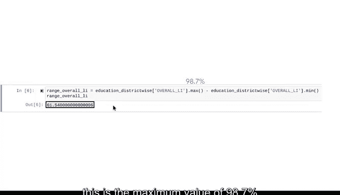

# 011：《统计的力量》- 使用Python计算描述性统计 📊


在本节课中，我们将学习如何使用Python计算描述性统计量，以探索和总结数据集的关键特征。我们将使用一个关于全国各地区识字率的数据集作为示例，通过Python代码快速获取中心趋势、离散程度和数据位置等统计信息。

---

## 数据理解与准备

上一节我们介绍了描述性统计的基本概念。本节中，我们来看看如何在实际分析前，先理解数据的背景和结构。

想象你是一位为国家教育部工作的数据分析师。你的任务是分析全国中小学（6-18岁学生）的识字率数据。数据涵盖了国家的每个州和地区。

首先，我们需要导入必要的Python库并加载数据。

```python
import numpy as np
import pandas as pd
import matplotlib.pyplot as plt
```

我们加载名为 `education_district_w` 的数据集。为数据选择能清晰说明其内容和目的的命名是一种最佳实践。

```python
education_district_w = pd.read_csv('education_district_w.csv')
```

使用 `head` 函数可以快速查看数据集的前几行，帮助我们了解数据结构。

```python
print(education_district_w.head(10))
```

数据集包含7列和680行。前五列是不同的行政单位：地区名称、州名称、区块、村庄和集群。这代表了国家将人口组织成不同规模单位的方式。

`TOT_POPULA` 列代表总人口。
`OVERALL_LI` 列代表整体识字率。

正确理解数据至关重要：每一行代表一个不同的地区，而不是一个州或村庄。因此，“村庄”列显示每个地区包含的村庄数量，“总人口”列显示每个地区的人口，“整体识字率”列显示每个地区的识字率。

---

## 计算描述性统计量

现在我们对数据有了更好的理解，接下来使用Python计算描述性统计量。

在Python中，计算描述性统计最有用的函数是 `describe`。数据专业人员使用此函数可以一次性计算许多关键统计量。

对于包含数值数据的列（如识字率），`describe` 函数会返回以下统计信息：
*   观测值数量
*   平均值
*   中位数
*   标准差
*   最小值和最大值
*   第一和第三四分位数

我们的主要兴趣是识字率。该数据包含在 `OVERALL_LI` 列中，它显示了国家每个地区的识字率。

以下是使用 `describe` 函数显示识字率关键统计量的方法：

```python
print(education_district_w['OVERALL_LI'].describe())
```

输出结果为所有地区提供了关键统计信息。`count` 类别确认数据集中有634个地区。注意，整体识字率列的观测值数量是634，但数据集的行数是680。这是因为 `describe` 函数不包含缺失值。

统计摘要提供了关于整体识字率的宝贵信息。例如，平均值有助于阐明数据集的中心。我们现在知道所有地区的平均识字率约为73%。这个信息本身很有用，也可以作为比较的基础。

了解所有地区的平均识字率有助于你理解哪些个别地区显著高于或低于平均值。这将帮助教育部决定如何分配资源以提高识字率。

请注意，输出中的25%、50%和75%类别分别指Q1、Q2和Q3。记住，Q2也是数据的中位数。

---

## 分析分类数据

`describe` 函数也可用于具有分类数据的列，例如州名称列。在这种情况下，你将获得列中所有观测值的计数，以及以下信息：唯一值的数量、最常见的值（众数）以及最常见值的频率。

使用 `describe` 函数来找出数据中有多少个州，以及哪个州包含的地区最多：

```python
print(education_district_w['state_name'].describe())
```

`unique` 类别显示数据集中有36个州。
`top` 类别显示“州21”是最常见的值，包含的地区最多。
`freq` 类别告诉你“州21”出现在75行中，这意味着它包含75个不同的地区。这就是众数。

这些信息可能有助于根据地区数量来确定哪些州需要更多的教育资源。

---

## 使用单独的函数进行深入计算

`describe` 函数非常有用，因为它可以一次性显示各种关键统计量。Python也有用于单独统计量的函数，例如 `mean`、`median`、`std`、`min` 和 `max`。你在之前的课程中曾使用 `mean` 和 `median` 函数来检测异常值。

如果你想基于描述性统计进行进一步的计算，这些单独的函数也很有用。

例如，你可以同时使用 `min` 和 `max` 函数来计算数据的极差。极差将显示所有地区中最高和最低识字率之间的差异。

要计算极差，请使用 `max` 和 `min` 函数，从最高识字率中减去最低识字率：

```python
range_overall_li = education_district_w['OVERALL_LI'].max() - education_district_w['OVERALL_LI'].min()
print(range_overall_li)
```

所有地区识字率的极差约为61.5个百分点。这是最大值98.7%减去最小值37.2%的结果。

这个巨大的差异告诉你，有些地区的识字率远高于其他地区。在接下来的视频中，你将持续分析这些数据，并可以发现哪些地区的识字率最低。这将帮助政府更好地了解全国范围内的识字率情况，并在此基础上建设成功的教育计划。



---

## 总结

本节课中我们一起学习了如何使用Python高效地计算描述性统计量。我们首先导入并理解了识字率数据集的结构，然后使用 `describe()` 函数一次性获取了中心趋势、离散度和位置等多方面统计摘要。此外，我们还学习了如何对分类数据使用 `describe()`，以及如何利用单独的统计函数（如 `max()` 和 `min()`）进行更深入的计算，例如求取数据的极差。


使用描述性统计来总结你的数据集是分析过程中重要的早期步骤，它能让你对数据有一个基本的理解，为后续更深入的分析奠定基础。