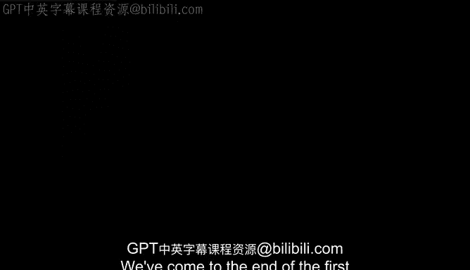
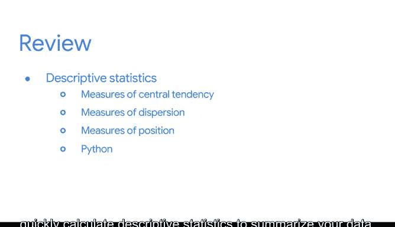

# 012：第一单元总结 📊



在本节课中，我们将对《统计的力量》第一单元的核心内容进行回顾与总结。我们已经学习了数据专业人员如何运用统计学从数据中获取洞见，以支持商业决策和解决复杂问题。

---

## 课程内容回顾

上一节我们介绍了描述性统计和推断性统计的基本应用。本节中，我们来具体看看本单元涵盖的关键知识点。

以下是本单元学习的主要内容列表：

*   **统计学的两大分支**：**描述性统计**用于探索和总结数据；**推断性统计**用于从数据中得出结论并进行预测。
*   **描述性统计的核心概念**：包括**集中趋势度量**、**离散程度度量**和**位置度量**。
*   **Python分析工具**：Python是进行统计分析的强大工具，可用于快速探索数据集并计算描述性统计量。

---

## 关键概念详解

### 统计学的类型
数据专业人员使用**描述性统计**来探索和总结数据。他们使用**推断性统计**来对数据得出结论并进行预测。

### 描述性统计量
在描述性统计部分，我们学习了集中趋势度量、离散程度度量和位置度量。例如，集中趋势可以用均值公式 `mean = sum(x) / n` 来计算。

### Python的应用
最后，我们了解到Python是进行统计分析的强大工具。你可以使用Python来探索数据集，并快速计算描述性统计量以总结数据。例如，使用Pandas库可以轻松计算均值：
```python
import pandas as pd
data.mean()
```

---

## 学习建议与下一步

你可以运用这些技能来更好地理解未来职业生涯中可能遇到的任何新数据。

接下来，你需要准备一次分级评估。建议查阅列出了所有新术语的阅读材料，并随时重温涵盖关键概念的讲解视频、阅读材料和其他资源。

截至目前，你的学习进展值得祝贺。我们很快会再次相见。

---

## 总结



本节课中，我们一起回顾了《统计的力量》第一单元的核心内容：统计学的两大类型、描述性统计的主要度量方法，以及利用Python进行高效数据分析的基本方法。这些基础知识将为你后续的深入学习奠定坚实的起点。