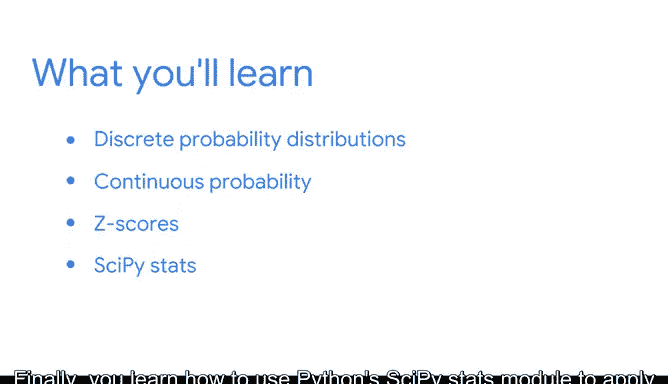

# 013：概率基础

在本节课中，我们将学习概率的基本概念及其在数据分析中的应用。概率是数学的一个分支，用于衡量和量化不确定性。数据专业人员使用概率帮助决策者在不确定情况下做出数据驱动的决策。

上一节我们介绍了描述性统计，本节中我们来看看概率如何帮助我们理解不确定性。

## 🎯 概率的定义与类型

概率使用数学来描述事件发生的可能性。例如，明天下雨或中彩票的机会。

数据专业人员使用所有可用数据，基于概率做出合理预测。例如，假设你与一家大型航空航天公司的利益相关者合作。他们需要决定是否投资新技术以改进喷气发动机的生产流程。作为数据专业人员，你可以估计新技术产生积极影响的概率，并预测其潜在成本和收益。利益相关者可以利用这些信息做出对组织最有利的明智决策。

我们将从回顾两种主要概率类型开始：客观概率和主观概率。

## 📐 基本概率规则

以下是概率计算中的三个基本规则：

1.  **补集规则**：事件不发生的概率等于1减去事件发生的概率。公式为：`P(非A) = 1 - P(A)`
2.  **加法规则**：两个事件至少有一个发生的概率。对于互斥事件，公式为：`P(A或B) = P(A) + P(B)`
3.  **乘法规则**：两个事件同时发生的概率。对于独立事件，公式为：`P(A且B) = P(A) * P(B)`

## 🔗 条件概率与贝叶斯定理

接下来，我们将讨论条件概率以及如何描述相关事件之间的关系。

条件概率是指在已知另一个事件发生的情况下，某个事件发生的概率。我们将学习**贝叶斯定理**，这是条件概率的一个关键公式，也是更高级贝叶斯分析的基础。其基本形式为：
`P(A|B) = [P(B|A) * P(A)] / P(B)`

## 📊 概率分布

概率分布描述了随机事件可能结果的似然性，可以分为离散型和连续型。

以下是两种主要的概率分布类型：

1.  **离散概率分布**：例如二项分布和泊松分布。它们可以帮助你对特定类型的数据进行建模。
2.  **连续概率分布**：我们将重点探讨**正态分布**，这是所有统计学中使用最广泛的分布。你将了解其主要特征以及它如何应用于许多不同的数据集。

## 📈 Z分数与正态分布

我们还将讨论Z分数如何帮助你更好地理解数据值与标准正态分布之间的关系。Z分数的计算公式为：
`Z = (X - μ) / σ`
其中，`X`是数据值，`μ`是均值，`σ`是标准差。

## 💻 Python应用

最后，你将学习如何使用Python的`SciPy`统计模块将概率分布应用于你的数据。

---

本节课中我们一起学习了概率的核心概念，包括其定义、基本规则、条件概率、贝叶斯定理以及各种概率分布。掌握这些知识是进行高级统计分析和数据驱动决策的基础。

准备好开始学习概率后，请加入下一个视频。