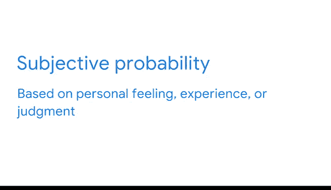

# 014：客观概率与主观概率 📊

在本节课中，我们将学习概率的基本概念，特别是区分**客观概率**与**主观概率**。概率是衡量和量化不确定性的工具，能帮助我们基于不确定的结果做出明智的决策。无论是决定今日的穿着，还是预测产品销售，概率都扮演着核心角色。

---

## 什么是概率？

概率帮助你度量和量化不确定性，并就不确定的结果做出明智决策。

例如，你可以使用概率来决定某一天的穿着。今天的天气预报说，基于现有数据，有70%的概率会下雪。根据这个信息，你决定戴上帽子、手套并穿上雪地靴。当雪落下时，你得以保持温暖和干燥。

数据专业人员可能使用概率来预测一家公司在特定时间段内销售一定数量产品的可能性、一项金融投资将获得正回报的可能性、一位政治候选人将赢得选举的可能性，或者一项医学测试的准确性。

---

## 客观概率

上一节我们介绍了概率的基本作用，本节中我们来看看概率的主要类型之一：**客观概率**。客观概率基于统计数据、实验和数学测量。

数据专业人员使用客观概率来分析和解释数据。客观概率有两种类型：**古典概率**和**经验概率**。

### 古典概率

古典概率基于对具有**等可能结果**的事件的正式推理。

要计算一个事件的古典概率，你可以用**期望结果的数量**除以**所有可能结果的总数**。

**公式：**
`P(事件) = 期望结果数 / 所有可能结果总数`

以下是两个古典概率的例子：

*   **抛硬币**：当你抛一枚硬币时，结果要么是正面，要么是反面（“正面”和“反面”是通常用来指代硬币两面的术语）。只有两种可能的结果，且两种结果的可能性相等。因此，得到正面的概率是二分之一，即50%。得到反面的概率也是如此。
*   **抽扑克牌**：一副标准扑克牌有52张牌。抽一张牌时，你抽到牌堆中任何一张特定牌（无论是红桃A、梅花10还是黑桃4）的概率是52分之1，约等于1.9%。

### 经验概率

然而，大多数事件更为复杂，并不具有等可能的结果。例如，天气通常不是50%的概率下雨或下雪，明天可能有80%的概率下雨，20%的概率是其他结果。

当古典概率适用于具有等可能结果的事件时，数据专业人员则需要使用**经验概率**来描述更复杂的事件。

经验概率基于**实验或历史数据**。它表示一个事件基于先前实验结果或过去事件而发生的可能性。

要计算经验概率，你可以用**特定事件发生的次数**除以**事件发生的总次数**。

**公式：**
`P(事件) = 事件发生次数 / 总试验次数`

例如，假设你进行了一项有100人参与的味觉测试，以了解他们是更喜欢草莓味还是薄荷巧克力片味的冰淇淋。你想知道一个人更喜欢草莓味冰淇淋的概率。

你的味觉测试显示，有80人更喜欢草莓味冰淇淋。要计算概率，你将“更喜欢草莓味冰淇淋”这个事件发生的次数（80）除以总事件次数（100）。80除以100等于0.8，即80%。

因此，一个人比起薄荷巧克力片味更偏好草莓味冰淇淋的概率是80%。

---

## 概率与推断统计

之前我们学习了推断统计，以及数据专业人员如何使用样本数据对更大的总体进行推断或预测。推断统计同样使用概率。

例如，一家零售公司可能会调查100名具有代表性的客户样本，以预测其所有客户的购物偏好。数据专业人员依赖**经验概率**来帮助他们基于样本数据做出准确的预测。

另一个例子是网站的A/B测试。你测试一部分用户样本，以预测所有用户未来的行为。假设样本用户更喜欢绿色的“行动号召”按钮，而不是蓝色的。你可以从这些数据中推断，未来更大的用户群体很可能也共享这种偏好。

A/B测试让你能够基于**经验概率**对未来用户做出合理的预测。这种概率可以帮助在线企业做出更明智的决策并增加销售额。

---

## 主观概率

在了解了基于数据和计算的客观概率后，我们来看看另一种类型：**主观概率**。主观概率的结果基于**个人感觉、经验或判断**。

这种类型的概率不涉及正式计算、统计分析或科学实验。

例如，你可能有一种强烈的感觉，认为某匹马会赢得赛马比赛，或者你最喜欢的球队会赢得冠军赛。你可能有充分的理由支持你的信念，但你的理由是个人化的或主观的。

你的信念并非基于统计分析或科学实验。因此，一个事件的主观概率可能因人而异，差异很大。

---

## 区分概率类型的重要性

当你评估一个预测或做出决策时，了解主观概率和客观概率之间的区别非常重要。

例如，一家汽车公司的首席执行官可能自信地认为，使用一项新技术来制造他们的皮卡将能降低成本并增加利润。

但如果他们的预测仅仅基于个人感觉或**主观概率**，那么这个预测可能并不可靠。

基于统计分析或**客观概率**的数据科学，可以帮助准确预测新技术的潜在影响，并帮助首席执行官就是否采用该技术做出明智的、数据驱动的决策。

---

## 总结

本节课中我们一起学习了概率的两种主要类型：
1.  **客观概率**：基于数据、实验和数学计算，包括**古典概率**（用于等可能事件）和**经验概率**（用于基于历史数据的事件）。
2.  **主观概率**：基于个人感觉、经验或判断，缺乏统一的客观计算基础。

理解并正确应用这两种概率，是进行有效数据分析和做出可靠决策的关键。接下来，我们将探讨概率的一些基本概念。