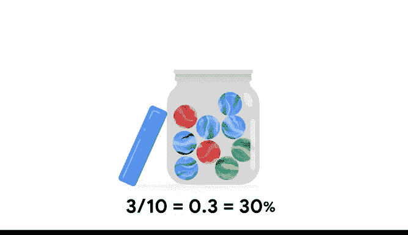

# 015：概率原理 🎲

## 概述

在本节课中，我们将学习概率的基本概念。概率是数学中用于处理不确定性或确定事件发生可能性的工具。我们将讨论概率的数学定义，并学习如何计算单一随机事件的概率。

---

## 概率的基本概念

最近，你了解到概率使用数学来处理不确定性，或确定事件发生的可能性。

在本次视频中，你将学习一些概率的基本概念。

我们将讨论概率的数学定义以及如何计算单一随机事件的概率。

首先，我想为你提供一些关于本课程部分将使用的示例类型的背景信息。

我们将继续引用诸如抛硬币、掷骰子和抽牌这类事件的例子。这样做有几个原因。一是历史原因。现代概率论起源于16和17世纪对机会游戏的分析。

其次，也是更重要的，这些事件具有明确定义的结果，并且大多数人都熟悉。它们只是基本概率概念的绝佳示例。这就是为什么它们被世界各地的统计学课程所使用。

在本课程后期，我们将探讨更复杂事件的概率，例如你未来作为数据专业人员将遇到的那些事件。

---

## 概率的数学定义

现在，让我们来谈谈概率的基本概念。

首先，事件发生的概率表示为一个介于0和1之间的数字。

如果事件的概率等于0，则该事件发生的可能性为0%。

如果事件的概率等于1，则该事件发生的可能性为100%。

在0和1之间还有许多可能性。如果事件的概率等于0.5，则该事件发生或不发生的可能性各为50%。

如果事件的概率接近零，则该事件发生的可能性很小。

如果事件的概率接近一，则该事件发生的可能性很大。

例如，如果某只股票今年上涨的概率是0.05或5%，那么你可能不想购买它。如果概率是0.95或95%，那么它可能是一项不错的投资。

---

## 随机事件与随机实验

概率衡量随机事件的可能性。随机事件的结果无法确定地预测。

在抛硬币或掷骰子之前，你并不知道结果。硬币可能正面朝上或反面朝上，骰子可能显示1到6之间的任何数字。

这些是统计学家所称的**随机实验**的例子，也称为统计实验。

**随机实验**是一个其结果无法确定预测的过程。

所有随机实验都有三个共同点：
*   实验可以有多个可能的结果。
*   你可以提前表示每个可能的结果。
*   实验的结果取决于机会。

让我们以抛硬币为例。
*   存在多个可能的结果。
*   你可以提前表示每个可能的结果：正面或反面。
*   结果取决于机会。在你实际抛掷硬币之前，你无法知道是正面还是反面。

或者想想掷一个六面骰子。
*   存在多个可能的结果。
*   所有结果都可以提前表示：1、2、3、4、5和6。
*   任何一次掷骰的结果都取决于机会。在你掷出骰子之前，你无法知道会出现哪个数字。

---

## 概率的计算方法

为了计算随机实验的概率，你将期望结果的数量除以可能结果的总数。

你可能还记得，这也是**古典概率**的公式：

**P(事件) = 期望结果数 / 总可能结果数**

所以，抛硬币得到正面的概率是2次机会中的1次。即 **1 / 2 = 0.5** 或 50%。

掷骰子得到数字2的概率是6次机会中的1次。即 **1 / 6 ≈ 0.167** 或约16.7%。

---

## 应用示例：抽弹珠

现在，让我们进行一个不同的随机实验。

想象一个罐子里装有10颗弹珠。其中2颗是红色，3颗是绿色，5颗是蓝色。

你决定从罐子里取出一颗弹珠。你想知道弹珠是绿色的概率。

首先，计算可能结果的数量。你有同等机会选择10颗弹珠中的任何一颗。

接下来，找出这些结果中有多少符合你的期望：即选择绿色弹珠的机会。

在总共10颗弹珠中，有3颗是绿色的。

因此，选择绿色弹珠的概率是10次中的3次，即 **3 / 10 = 0.3**。换句话说，你有30%的机会选择到绿色弹珠。

---

## 总结

本节课中，我们一起学习了概率的基本原理。我们定义了概率是介于0和1之间的数字，用于量化事件发生的可能性。我们探讨了随机实验的概念及其三个特征。最重要的是，我们掌握了计算单一随机事件概率的核心公式：**P(事件) = 期望结果数 / 总可能结果数**，并通过抛硬币、掷骰子和抽弹珠的例子进行了实践。这些知识将作为未来学习更复杂概率计算的基础。