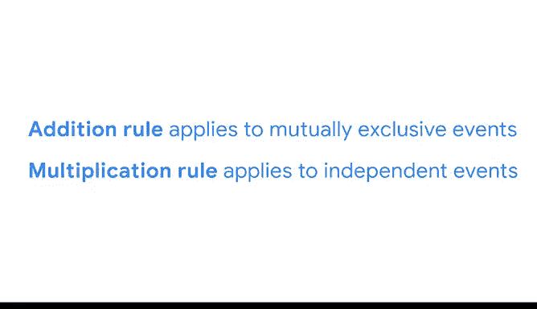

# 016：《统计的力量》课程笔记 📊

## 课程16：概率与事件的基本规则

在本节课中，我们将学习概率论中的三个基本规则：补集规则、加法规则和乘法规则。这些规则是处理多个事件概率计算的基础，对于未来的数据分析工作至关重要。我们还将区分两种不同类型的事件：互斥事件与独立事件，并学习如何为它们计算概率。

---

### 概率符号表示法

为了更高效地沟通概率概念，我们首先需要了解标准的概率符号表示法。

*   字母 **P** 表示事件的概率。
*   如果你处理两个事件，可以将一个事件标记为 **A**，另一个标记为 **B**。
*   事件A的概率记作 **P(A)**。
*   事件B的概率记作 **P(B)**。
*   如果你想表示事件A**不发生**的概率，可以在A后面加上一个撇号，记作 **P(A')**，也可以读作“非A的概率”。

---

### 规则一：补集规则

在统计学中，一个事件的**补集**是指该事件**不发生**的情况。例如，要么下雨，要么不下雨；要么中彩票，要么不中彩票。下雨的补集是不下雨，中奖的补集是不中奖。

补集规则的核心在于：一个事件发生的概率和它不发生的概率之和必须等于1。概率为1意味着100%的确定性。另一种理解方式是，两个互斥事件（发生或不发生）的概率之和为100%。

补集规则的公式是：
**P(A') = 1 - P(A)**

例如，如果天气预报说明天有30%的概率下雨，即 P(下雨) = 0.3。那么明天下雨的概率是：
**P(不下雨) = 1 - P(下雨) = 1 - 0.3 = 0.7**
所以，不下雨的概率是70%。

---

### 互斥事件与加法规则

补集规则和接下来要介绍的加法规则都适用于**互斥事件**。

**互斥事件**是指两个事件**不可能同时发生**。例如，你不可能同时访问阿根廷和中国，也不可能同时向左转和向右转。

**加法规则**指出：如果事件A和事件B是互斥的，那么事件A**或**事件B发生的概率，等于它们各自概率的和。
公式为：
**P(A 或 B) = P(A) + P(B)**

让我们通过一个掷骰子的例子来理解。假设你想知道，在单次投掷一个六面骰子时，掷出2点**或**4点的概率是多少。

这两个事件是互斥的，因为你一次只能掷出一个数字。掷出任何特定数字的概率是1/6。

以下是计算步骤：
1.  P(掷出2) = 1/6
2.  P(掷出4) = 1/6
3.  根据加法规则：P(2 或 4) = 1/6 + 1/6 = 2/6 = 1/3

因此，掷出2点或4点的概率是三分之一，约等于33%。

---

### 独立事件与乘法规则

上一节我们介绍了用于互斥事件的加法规则，本节中我们来看看如何处理独立事件。

如果**一个事件的发生不会改变另一个事件发生的概率**，那么这两个事件就是**独立事件**。这意味着一个事件的结果不会影响另一个事件的结果。例如，从图书馆借书不会影响明天的天气；早上喝咖啡不会影响下午邮件的投递。

**乘法规则**指出：如果事件A和事件B是独立的，那么事件A**和**事件B**同时**发生的概率，等于它们各自概率的乘积。
公式为：
**P(A 且 B) = P(A) × P(B)**

让我们看一个连续抛硬币的例子。假设你想知道，第一次抛硬币得到**反面**，**并且**第二次抛硬币得到**正面**的概率。

首先，判断事件类型：两次抛硬币是独立事件，第一次的结果不会影响第二次。每次抛硬币得到正面或反面的概率始终是1/2（50%）。因此，我们使用乘法规则。

以下是计算步骤：
1.  P(第一次反面) = 0.5
2.  P(第二次正面) = 0.5
3.  根据乘法规则：P(第一次反面 且 第二次正面) = 0.5 × 0.5 = 0.25

所以，第一次得到反面且第二次得到正面的概率是25%。

---

### 规则对比与总结

为了帮助记忆，让我们对比一下加法规则和乘法规则的区别。清楚这些区别有助于你在不同场景下正确应用规则。

以下是两种规则的核心区别：
*   **计算方式**：加法规则是**求和**概率；乘法规则是**求积**概率。
*   **适用事件**：加法规则适用于**互斥事件**（不能同时发生）；乘法规则适用于**独立事件**（互不影响）。
*   **逻辑关系**：加法规则用于计算事件A**或**事件B发生的概率；乘法规则用于计算事件A**和**事件B**同时**发生的概率。

---

### 课程总结

本节课中，我们一起学习了概率论的三个基本规则：
1.  **补集规则**：用于计算事件不发生的概率，公式为 `P(A') = 1 - P(A)`。
2.  **加法规则**：用于计算**互斥事件**中任一事件发生的概率，公式为 `P(A 或 B) = P(A) + P(B)`。
3.  **乘法规则**：用于计算**独立事件**同时发生的概率，公式为 `P(A 且 B) = P(A) × P(B)`。

这些规则为我们描述和分析互斥或独立的事件提供了强大的工具。在接下来的视频中，我们将探讨**条件概率**，它适用于另一种事件类型——相关事件。